Бондарев Игорь, 8Е21.

Для 1 лабораторной работы по CV необходимо реализовать базовый минимум операций над изображениями
Входное изображение в формате RGB. Использовать методы OpenCV для реализации операций нельзя. Допустимы только методы cv2.imread() и cv2.imshow(). Все методы должны быть реализованы вручную.

1. Фильтры
<br>1.1 Медианный фильтр
<br>1.2 Фильтр гаусса

2. Морфологические операции
<br>2.1 Эрозия
<br>2.2 Дилатация

3. Прочие операции
<br>3.1 пороговая бинаризация (для rgb и grayscale изображения)
<br>3.2 выравнивание гистограммы
<br>3.3 поворот изображений на угол кратный 90 градусов

    
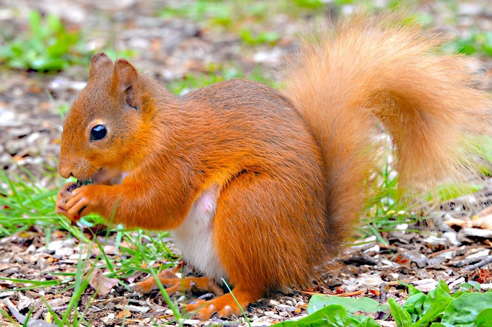


## Подготовка изображения и вспомогательные операции

Цветное изображение загружается через OpenCV. Для работы с яркостью реализован перевод в оттенки серого по фотометрической формуле.

### Перевод в оттенки серого

```python
def rgb_to_grayscale(image_rgb):
    if len(image_rgb.shape) == 2:
        return image_rgb.copy()
    height, width, _ = image_rgb.shape
    gray = np.zeros((height, width), dtype=np.uint8)
    for r in range(height):
        for c in range(width):
            R, G, B = image_rgb[r, c]
            val = 0.299 * R + 0.587 * G + 0.114 * B
            gray[r, c] = int(round(val))
    return gray
```

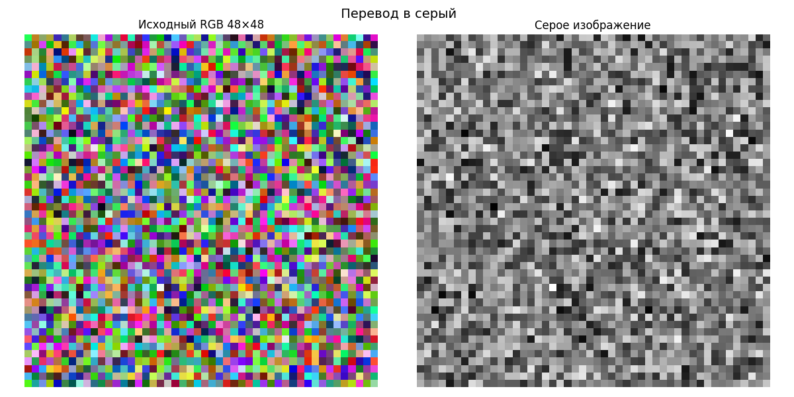

###  Паддинг (дополнение краёв)

При свёрточных и морфологических операциях окно фильтра должно полностью находиться внутри изображения. Чтобы итоговый размер не уменьшался, края дополняются (padding). Реализованы два режима:

- edge – крайние пиксели копируются наружу (зеркальное продолжение границы);

- constant – добавляются нули (чёрные пиксели).

```python
def pad_image(image, pad_size, mode='edge'):
    if len(image.shape) == 2:
        return np.pad(image, pad_size, mode=mode)
    else:
        padded = np.zeros((image.shape[0]+2*pad_size, image.shape[1]+2*pad_size, image.shape[2]),
                          dtype=image.dtype)
        for ch in range(image.shape[2]):
            padded[:,:,ch] = np.pad(image[:,:,ch], pad_size, mode=mode)
        return padded
```

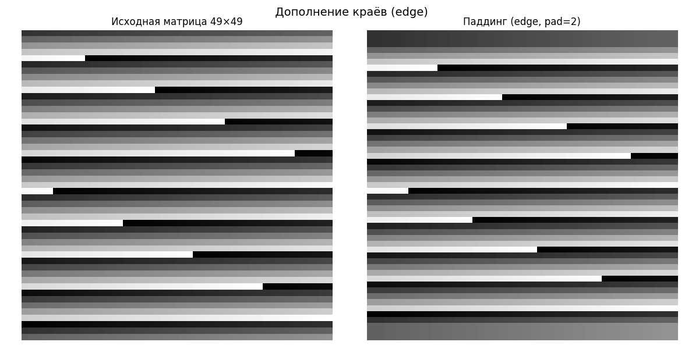
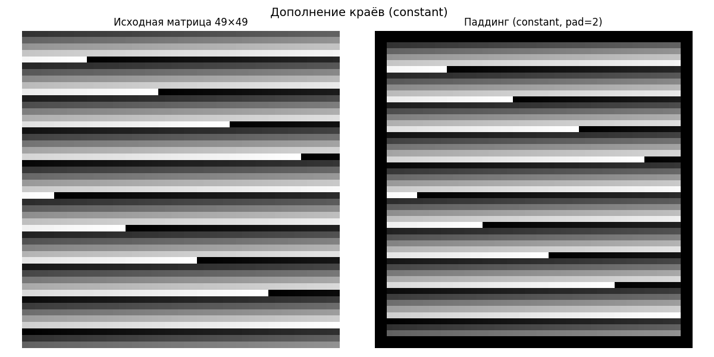

# 1. ФИЛЬТРЫ

### 1.1 Медианный фильтр

Медианный фильтр предназначен для подавления импульсных шумов. В отличие от линейного усреднения он не размывает границы, потому что медиана выбирает одно из реальных значений окрестности, а не вычисляет среднее.
<p>
Возьмём массив x = [2 80 6 3] и окно размером 3.
Чтобы не терять краевые элементы, сначала зеркально расширим массив: [2 2 80 6 3 3]

- окно (2 2 80), сортируем: (2 2 80), медиана = 2
- окно (2 80 6), сортируем: (2 6 80), медиана = 6
- окно (80 6 3), сортируем: (2 6 80), медиана = 6
- окно (6 3 3), сортируем: (3 3 6), медиана = 3

Выход: [2, 6, 6, 3]. Выброс 80 полностью убран, а перепад стал плавнее.

Для изображения мы действуем квадратным окном kernel_size × kernel_size (нечётным). Для каждого пикселя:

1. Извлекаем значения всех пикселей под окном.
2. Разворачиваем их в одномерный массив.
3. Находим медиану (np.median).
4. Присваиваем центральному пикселю.

```python
def median_filter(image, kernel_size=3):
    if kernel_size % 2 == 0:
        raise ValueError("Размер ядра должен быть нечётным")
    if len(image.shape) == 2:
        pad = kernel_size // 2
        padded = pad_image(image, pad)
        filtered = np.zeros_like(image)
        h, w = image.shape
        for i in range(h):
            for j in range(w):
                window = padded[i:i+kernel_size, j:j+kernel_size].flatten()
                filtered[i, j] = np.median(window)
        return filtered.astype(np.uint8)
    else:
        result = np.zeros_like(image)
        for ch in range(3):
            result[:,:,ch] = median_filter(image[:,:,ch], kernel_size)
        return result
```

Цветное изображение обрабатывается поканально: та же процедура применяется к R, G и B по отдельности.

Результат на реальном фото (ядро 5×5):

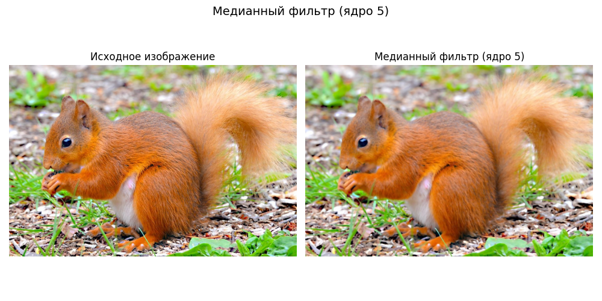

Синтетический тест (ядро 3×3, матрица 49×49)

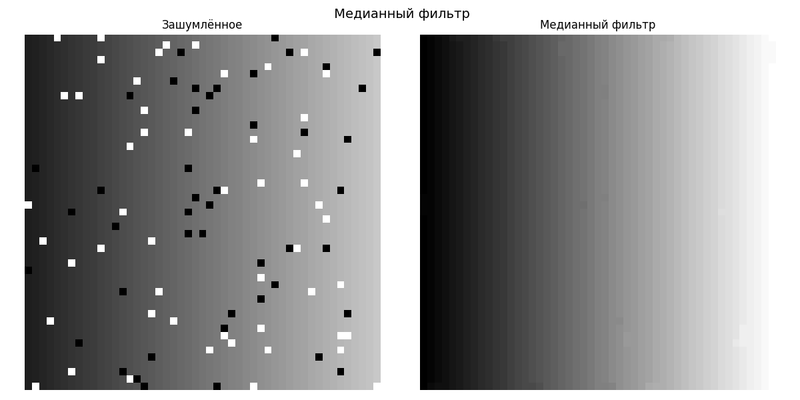


### 1.2 Фильтр гаусса

Фильтр Гаусса (размытие по Гауссу) – это низкочастотный фильтр, подавляющий мелкие детали и высокочастотный шум. В основе лежит двумерная функция Гаусса:

```text
G(x,y) = (1/(2πσ²)) * exp(-(x² + y²) / (2σ²))
```

Но для вычислений мы пользуемся свойством сепарабельности: двумерную свёртку можно заменить последовательной одномерной свёрткой по строкам и столбцам. Это значительно ускоряет вычисления.

#### Построение одномерного ядра

Для размера size (нечётного) и параметра σ генерируем ядро, веса которого убывают по кривой Гаусса, и нормализуем так, чтобы сумма весов была равна 1.


```python
def gaussian_kernel(size, sigma):
    kernel = np.zeros(size, dtype=np.float32)
    center = size // 2
    sum_val = 0.0
    for i in range(size):
        x = i - center
        kernel[i] = math.exp(-(x**2) / (2 * sigma**2))
        sum_val += kernel[i]
    return kernel / sum_val
```

Пример весов ядра размера 5 с σ=1.0:
[0.054, 0.244, 0.403, 0.244, 0.054]

Сначала свёртка по горизонтали (для каждой строки), затем по вертикали (для каждого столбца). На каждом шаге для пикселя вычисляется взвешенная сумма соседей с весами из ядра. Цветное изображение обрабатывается поканально.


```python
def gaussian_filter(image, kernel_size=5, sigma=1.0):
    if kernel_size % 2 == 0:
        raise ValueError("Размер ядра должен быть нечётным")
    kernel = gaussian_kernel(kernel_size, sigma)
    pad = kernel_size // 2
    if len(image.shape) == 2:
        padded = pad_image(image, pad)
        h, w = image.shape
        temp = np.zeros_like(image, dtype=np.float32)
        for i in range(h):
            for j in range(w):
                window = padded[i+pad, j:j+kernel_size]
                temp[i, j] = np.sum(window * kernel)
        padded2 = pad_image(temp, pad)
        result = np.zeros_like(image, dtype=np.float32)
        for i in range(h):
            for j in range(w):
                window = padded2[i:i+kernel_size, j+pad]
                result[i, j] = np.sum(window * kernel)
        return np.clip(result, 0, 255).astype(np.uint8)
    else:
        result = np.zeros_like(image, dtype=np.float32)
        for ch in range(3):
            result[:,:,ch] = gaussian_filter(image[:,:,ch], kernel_size, sigma)
        return result.astype(np.uint8)
```


Результат на реальном фото (σ=1.5, ядро 5×5):

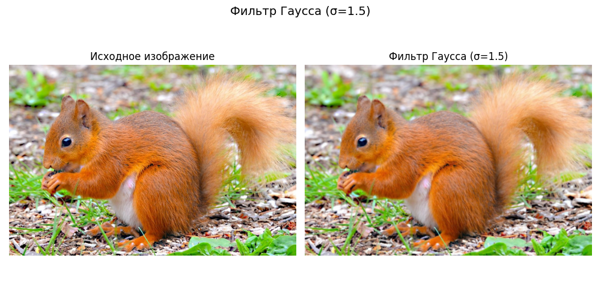
    
Синтетический тест:

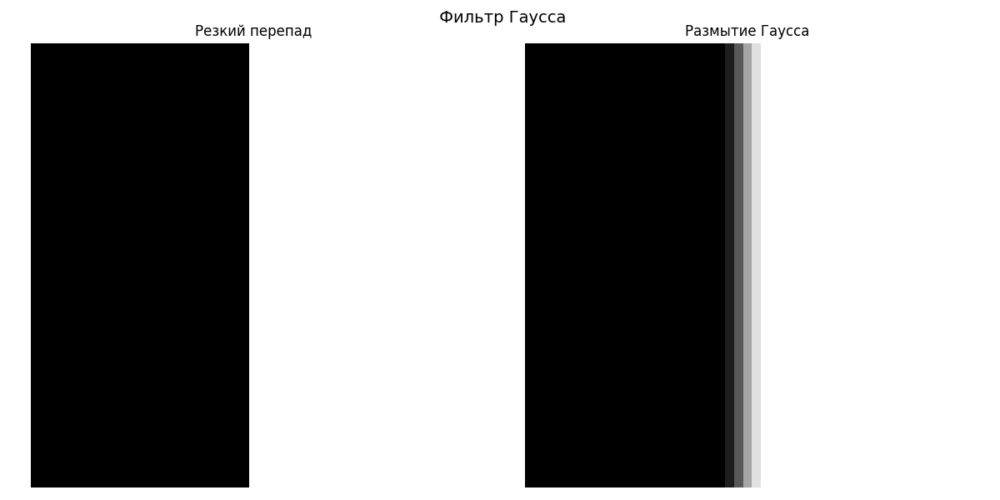


# 2. Морфологические операции

### 2.1 Эрозия

Значение выходного пикселя является минимальным значением всех пикселей в окружении. В бинарном изображении пиксель установлен в 0 если какой-либо из соседних пикселей имеет значение 0. Эрозия «съедает» белые области. Центральный пиксель становится белым (255) только в том случае, если все пиксели под структурным элементом (окном) – белые.


```python
def erosion_binary(binary_image, kernel_size=3):
    if kernel_size % 2 == 0:
        raise ValueError("Размер ядра должен быть нечётным")
    pad = kernel_size // 2
    padded = pad_image(binary_image, pad, mode='constant')
    h, w = binary_image.shape
    eroded = np.zeros_like(binary_image)
    for i in range(h):
        for j in range(w):
            window = padded[i:i+kernel_size, j:j+kernel_size]
            if np.all(window == 255):
                eroded[i, j] = 255
    return eroded
```

Мелкие белые точки и тонкие линии исчезают, объекты уменьшаются.

Пример на реальном фото (ядро 3×3):

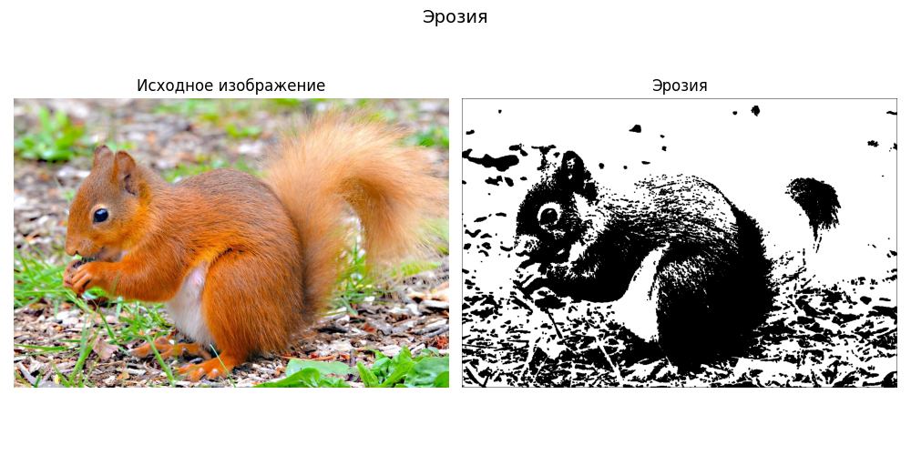

Синтетический тест: белый квадрат 45×45 на чёрном фоне, ядро 3×3:

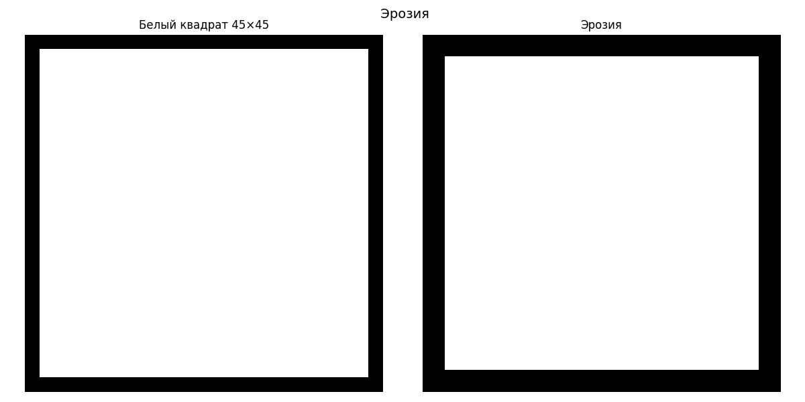

### 2.2 Дилатация

Значение выходного пикселя является максимальным значением всех пикселей в окружении. В бинарном изображении пиксель установлен в 1 если какой-либо из соседних пикселей имеет значение 1. Дилатация – операция, обратная эрозии. Она расширяет белые области. Центральный пиксель становится белым, если хотя бы один пиксель в окне белый.


```python
def dilation_binary(binary_image, kernel_size=3):
    if kernel_size % 2 == 0:
        raise ValueError("Размер ядра должен быть нечётным")
    pad = kernel_size // 2
    padded = pad_image(binary_image, pad, mode='constant')
    h, w = binary_image.shape
    dilated = np.zeros_like(binary_image)
    for i in range(h):
        for j in range(w):
            window = padded[i:i+kernel_size, j:j+kernel_size]
            if np.any(window == 255):
                dilated[i, j] = 255
    return dilated
```

Пример на реальном фото:

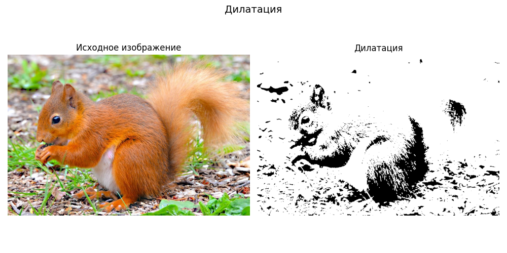

Синтетический тест: одиночная белая точка в центре чёрного поля, ядро 3×3:

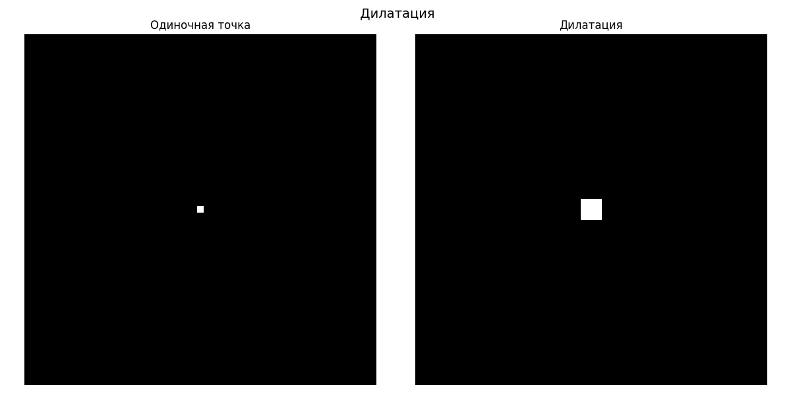


# 3. Прочие операции

### 3.1 Пороговая бинаризация

Бинаризация преобразует полутоновое (или цветное) изображение в строго двухцветное. Для каждого пикселя сравнивается его яркость с заданным порогом threshold. Если яркость больше порога – пиксель становится белым (255), иначе чёрным (0). Цветное изображение сначала переводится в серый, чтобы решение принималось только по яркости.

```python
def threshold_binarize(image, threshold):
    if len(image.shape) == 2:
        binary = np.zeros_like(image)
        binary[image > threshold] = 255
        return binary
    else:
        gray = rgb_to_grayscale(image)
        return threshold_binarize(gray, threshold)
```

Бинаризация цветного RGB (порог 127):


Синтетический пример – горизонтальный градиент яркости от 30 до 220, порог=100:

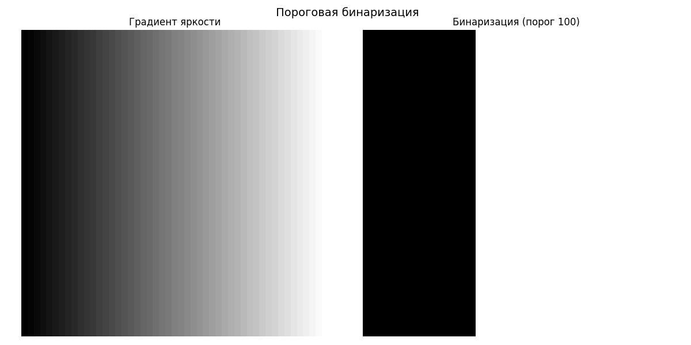


### 3.2 Выравнивание гистограммы

Выравнивание гистограммы предназначено для улучшения контраста. Если яркости сконцентрированы в узком диапазоне (например, снимок слишком тёмный), метод «растягивает» гистограмму на весь диапазон 0–255.

1. Строим гистограмму h(k) – количество пикселей с яркостью k.
2. Вычисляем кумулятивную функцию распределения (CDF) – накопленную сумму гистограммы.
3. Нормализуем CDF так, чтобы минимальное значение стало 0, а максимальное – 255.
4. Преобразуем яркость каждого пикселя: s = cdf_normalized[r], где r – исходная яркость.

```python
def histogram_equalization(image):
    if len(image.shape) == 2:
        hist, _ = np.histogram(image.flatten(), bins=256, range=(0, 256))
        cdf = hist.cumsum()
        cdf_normalized = (cdf - cdf.min()) * 255 / (cdf.max() - cdf.min())
        cdf_normalized = cdf_normalized.astype(np.uint8)
        equalized = cdf_normalized[image]
        return equalized.astype(np.uint8)
    else:
        result = np.zeros_like(image)
        for ch in range(3):
            result[:,:,ch] = histogram_equalization(image[:,:,ch])
        return result
```

Пример на реальном фото:

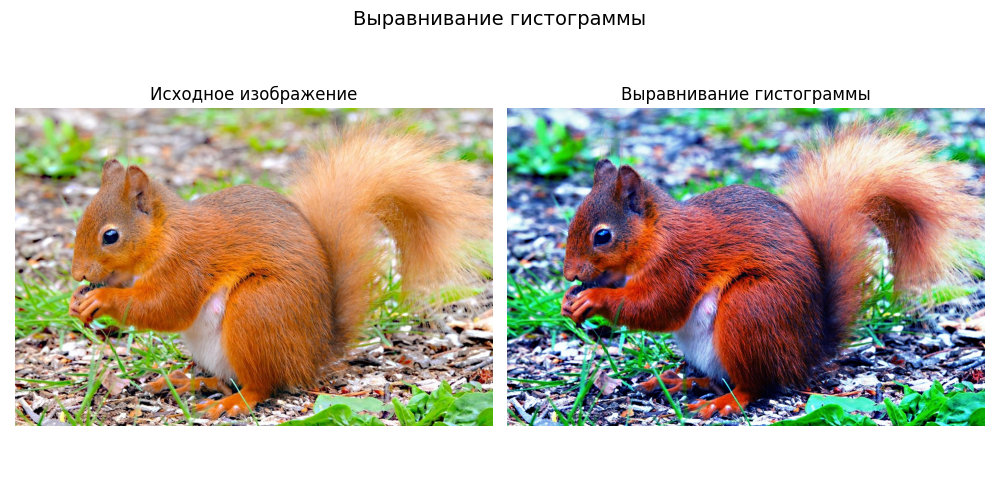


### 3.3 Поворот на угол, кратный 90°

Поворот на 90°, 180°, 270° осуществляется без интерполяции, поскольку координаты пикселей просто переставляются. Согласно заданию, запрещено использовать готовые функции OpenCV, поэтому реализация, состоит из двух элементарных операций:

- Транспонирование – строки становятся столбцами;
- Отражение строк – каждая строка переворачивается справа налево.

Эти два действия и дают поворот на 90° по часовой стрелке. Поворот на 180° – это два таких поворота подряд, на 270° – три.

Ниже приведена полная ручная реализация функции rotate_90. Она работает как с одноканальными, так и с RGB изображениями.

```python
def rotate_90_manual_single(image_2d, times=1):
    times = times % 4
    if times == 0:
        return image_2d.copy()
    rotated = image_2d.copy()
    for _ in range(times):
        h, w = rotated.shape
        transposed = np.zeros((w, h), dtype=rotated.dtype)
        for i in range(h):
            for j in range(w):
                transposed[j, i] = rotated[i, j]
        flipped = np.zeros_like(transposed)
        for i in range(transposed.shape[0]):
            flipped[i, :] = transposed[i, ::-1]
        rotated = flipped
    return rotated

def rotate_90(image, times=1):
    times = times % 4
    if times == 0:
        return image.copy()
    
    if len(image.shape) == 2:
        return rotate_90_manual_single(image, times)
    else:
        channels = []
        for ch in range(image.shape[2]):
            rotated_ch = rotate_90_manual_single(image[:, :, ch], times)
            channels.append(rotated_ch)
        return np.stack(channels, axis=2)
```

Примеры поворотов реального фото:
Поворот на 90°:
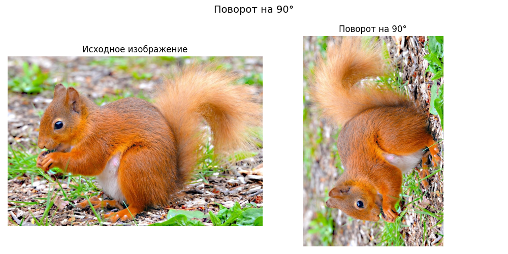

Поворот на 180°:
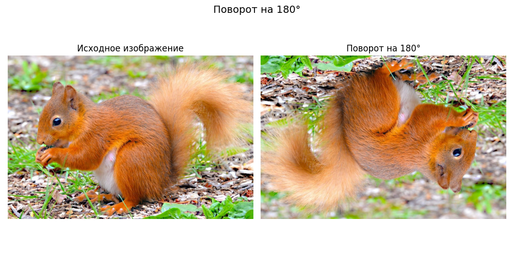


# Вывод

Все получилось. Кто сдох - тот лох. Кто дочитал - красавчик. Передохни и иди читай вторую лабу.

Костин Арсений, 8Е21, вариант 3.

Лабораторная работа №2. Визуальная одометрия (навигация)
Цель: Разработать систему визуальной одометрии (навигации) по группе фотографий.
Ход работы: сделайте не менее 8 фото с переносом камеры или ноутбука по квадрату (то есть двиньте сначала вправо, потом вперед, потом влево, потом назад и обратно в начальную точку). Используя данные фотографии реализуйте следующее:
<p> 1.	Определите на каждой фотографии ключевые точки </p>
<p>2.	Отфильтруйте самые наилучшие применяю адаптивный радиус и локальные максимумы, не забудьте так же выровнять по яркости изображения.</p>
<p>3.	Постройте по каждой точке дескриптор (можете использовать любой, рекомендуется SIFT)</p>
<p>4.	Сопоставьте два соседних изображения на предмет соответствия ключевых точек. То есть определите пары одинаковых точек.</p>
<p>5.	Постройте модель преобразования изображений, учитывайте только поворот и сдвиг.</p>
<p>6.	С учетом полученных моделей постройте траекторию движения камеры.</p>
<p>Проверка работоспособности: будет осуществляться на специальной группе фото, предоставленных преподавателем. Траектория движения, для которых недоступна.</p>
<p>В процессе выполнения вы можете использовать готовые функции по погрузке данных, перевода в цветовые пространства, фильтрации, для построения прямых и траекторий. Функции 1-6 описанные выше должны быть реализованы самостоятельно.</p>


```python
import numpy as np
import cv2
import matplotlib
import matplotlib.pyplot as plt
import random
#from PIL import Image
from IPython.display import Image
%matplotlib inline
import math
import lab1_functions as lb1
import os
print(os.getcwd())
print(os.listdir())
```

    /home/ars/cv-labs-sem8/lab1
    ['sequence5.jpeg', 'lab1_functions.py', 'sample_image2.png', 'lab2.py', 'sequence4.jpeg', '__pycache__', 'doodles.ipynb', 'lab1.py', 'lab1.ipynb', 'sequence6.jpeg', 'sample_image3.png', 'sequence8.jpeg', 'sample_image.jpg', 'histfunc.png', 'gpt-stripfunctions.py', 'sequence3.jpeg', 'sample_image4.jpg', 'output.gif', 'sequence7.jpeg', 'sample_image5.jpg', 'gaussfunc.png', 'sequence1.jpeg', 'gradient.png', 'harris1.png', 'sequence2.jpeg', 'lab2.ipynb']


# 2.1 Загрузить изображения

Приступим, импортируем сделанные изображения:


```python
image1=cv2.cvtColor(cv2.imread('sequence1.jpeg'), cv2.COLOR_BGR2RGB)
image2=cv2.cvtColor(cv2.imread('sequence2.jpeg'), cv2.COLOR_BGR2RGB)
image3=cv2.cvtColor(cv2.imread('sequence3.jpeg'), cv2.COLOR_BGR2RGB)
image4=cv2.cvtColor(cv2.imread('sequence4.jpeg'), cv2.COLOR_BGR2RGB)
image5=cv2.cvtColor(cv2.imread('sequence5.jpeg'), cv2.COLOR_BGR2RGB)
image6=cv2.cvtColor(cv2.imread('sequence6.jpeg'), cv2.COLOR_BGR2RGB)
image7=cv2.cvtColor(cv2.imread('sequence7.jpeg'), cv2.COLOR_BGR2RGB)
image8=cv2.cvtColor(cv2.imread('sequence8.jpeg'), cv2.COLOR_BGR2RGB)

images_sequence = [image1, image2, image3, image4, image5, image6, image7, image8]

f, axarr = plt.subplots(2,4, figsize = (12,6))

axarr[0,0].imshow(image1)
axarr[0,1].imshow(image2)
axarr[0,2].imshow(image3)
axarr[0,3].imshow(image4)

axarr[1,0].imshow(image5)
axarr[1,1].imshow(image6)
axarr[1,2].imshow(image7)
axarr[1,3].imshow(image8)
```


    <matplotlib.image.AxesImage at 0x78ddea78b230>


    

    


Лирическое отступление - чтобы не размазывать отчет, работа будет вестись над grayscale изображениями. То что мы будем использовать - не зависит от цветов, как видно из первой лабы. Все что возможно - можно сделать для RGB повторяя те же операций и преобразования, просто трижды - по разу для каждого цветового канала. Это не цель лабораторной работы. Приступим, переведем изображения в черно-белый формат, используя функцию из прошлой лабы.


```python
images_sequence_gray = []
for img in images_sequence:
    images_sequence_gray.append(lb1.intensity_grayscale(img))
```


```python
f, axarr = plt.subplots(2,4, figsize = (12,6))

axarr[0,0].imshow(images_sequence_gray[0], cmap='gray')
axarr[0,1].imshow(images_sequence_gray[1], cmap='gray')
axarr[0,2].imshow(images_sequence_gray[2], cmap='gray')
axarr[0,3].imshow(images_sequence_gray[3], cmap='gray')

axarr[1,0].imshow(images_sequence_gray[4], cmap='gray')
axarr[1,1].imshow(images_sequence_gray[5], cmap='gray')
axarr[1,2].imshow(images_sequence_gray[6], cmap='gray')
axarr[1,3].imshow(images_sequence_gray[7], cmap='gray')
```


    <matplotlib.image.AxesImage at 0x78ddd93675f0>


    

    


То есть, нам нужно:

загрузить изображения, привести их к одинаковой яркости / grayscale, найти ключевые точки, отфильтровать точки, построить дескрипторы (SIFT), сопоставить точки между соседними кадрами, вычислить преобразование (поворот + сдвиг), накопить преобразования и построить траекторию камеры

Исправим проблемы с яркостью, применив реализованный модуль для выравнивания гистограммы:

# 2.2 Привести к одинаковой яркости / grayscale

для нашего удобства и ментального здоровья зададим функцию готовую для отображения картинок из серии:


```python
def show_images(images_sequence, rows=2, cols=4, figsize=(12,6)):
    
    fig, axes = plt.subplots(rows, cols, figsize=figsize)
    axes = axes.flatten()

    for i, ax in enumerate(axes):
        if i < len(images_sequence):
            ax.imshow(images_sequence[i], cmap='gray')
            ax.axis('off')  # убираем оси
        else:
            ax.axis('off')  # если картинок меньше, оставляем пустые

    plt.tight_layout()
    plt.show()
```


```python
show_images(images_sequence_gray, 2, 4)
```


    

    


Супер. Вернемся к идее применить выравнивание гистограммы на всех изображениях:


```python
images_hist_equalized = images_sequence_gray
for img in images_hist_equalized:
    img = lb1.hist_equalize(img)
    
show_images(images_sequence_gray, 2, 4)
```


    

    


# 2.3 Найти ключевые точки

Приступаем. На изображениях у нас есть два магнита рядом, но нам могут значительно помешать: блики, тень от фотографа, другие нерелватные в этом контексте детали. Это визуальный <b>шум</b>. От шума надо избавиться, рассмотрим изображение 1, применим для подавления шумов фильтр Гаусса.


```python
images_temp = [images_hist_equalized[0], lb1.gaussian_2d(images_hist_equalized[0], 1.2, 21)]
show_images(images_temp, 1, 2)
```

    limits for Z kernel 1.0 1.0
    limits for Z kernel after normalization 7.658057422279819e-32 0.11052426603583844
    limits for gaussian output 2.4991448589236085 234.7124602763381


    

    


Стало слегка лучше. Теперь перейдем к теории:

Ключевые точки: это такие места, по которым сравнивая две картинки можно отследить движение.

Если бы мы смотрели на голубое небо и взяли его кусочек как ключевую точку, то распределение интенсивностей было бы +- одинаковое между ним и другим кусочком неба. Это плохая ключевая точка.

Если бы мы смотрели на фото прикроватной тумбочки, то могли бы предположить, что край тумбочки - хорошая ключевая точка, т.к. интенсивность прыгает на моменте перехода от края тумбочки к ее боковой части в тени. По идее - уже неплохо, но если двигаться вдоль этого края - ситуация не поменяется при сравнении двух кадров.

Из этого следует, что лучший вариант - когда меняются по двум направлениям тренды. Например, угол тумбочки. Вдоль него не подвигаться, то есть изменение интенсивности слева и спереди (перед стеной) достаточно легко отслеживаются.  

Из математики следует, что производная функции показывает скорость изменения ее значения. А градиент - вектор, показывающий <b>НАПРАВЛЕНИЕ</b> наибыстрейшего увеличения функции. Это то, что надо нам. Формула для градиента в общей форме выглядит так:


```python
img = cv2.imread('./gradient.png')
plt.imshow(img)
```


    <matplotlib.image.AxesImage at 0x78ddc7ffaa20>


    

    


Исходя из вышесказанного, понятно, что алгоритмы поиска ключевых точек ищут точки, где изменение яркости происходит во многих направлениях одновременно.

Математически - ищем градиенты изображения, по x и y координатам. 

Пусть I_x = изменение по х, I_y = изменение по y.
<p>Значит, место, где I_x = 0, I_y = 0 это однородная область.
<p>Если I_x большое, I_y маленькое = это край.
<p>Если I_x большое, I_y большое = это угол (ключевая точка).

Из опыта прошлой лабы мы понимаем, что смотреть на сам один пиксель недостаточно. Нужно брать апертуру/кернел/область/окно. Так и сделаем. Идейно по определению подходит фильтр Хариса. Источник: https://docs.exponenta.ru/R2021a/visionhdl/ug/corner-detection.html

### 2.3.1 Разберем этот фильтр

Фактически у нас есть исходное изображение, minor_size, k, threshold_ratio.

minor_size - так же как в прошлой лабе, размер апертуры/кернел/окно. маленькое окно = чувствительность к мелким деталям, большое окно = реагирует только на крупные структуры

источник: https://docs.opencv.org/3.4/dc/d0d/tutorial_py_features_harris.html
<p> k - коэффициент, испольуемый в формуле Хариса:


```python
img = cv2.imread('./harris1.png')
plt.imshow(img)
```


    <matplotlib.image.AxesImage at 0x78dda6851070>


    

    


Этот коэффициент регулирует насколько алгоритм строго смотрит края.
<p>Маленький = алгоритм более терпим к краям, может принимать некоторые края за углы
<p>Большой = алгоритм строгий, оставляет только очень выраженные углы

threshold_ratio

После вычисления Harris response R нужно решить какие точки считать ключевыми.

Для этого берётся максимум:
R_max = max(R)

и строится порог:

threshold = threshold_ratio * R_max

Если threshold_ratio = 0.01, то берутся точки у которых R > 1% от максимального

Если увеличить до 0.1 = останутся только самые сильные углы.


```python
def harris_keypoints(image, minor_size=5, k=0.04, threshold_ratio=0.01):

    if len(image.shape) == 3:
        image = intensity_grayscale(image)

    image = image.astype(float)

    height, width = image.shape

    Ix = np.zeros_like(image)
    Iy = np.zeros_like(image)

    # градиенты (центральные разности)
    for r in range(1, height-1):
        for c in range(1, width-1):
            Ix[r][c] = (image[r][c+1] - image[r][c-1]) / 2
            Iy[r][c] = (image[r+1][c] - image[r-1][c]) / 2

    pad = minor_size // 2

    R = np.zeros_like(image)

    for r in range(pad, height-pad):
        for c in range(pad, width-pad):

            sum_Ix2 = 0
            sum_Iy2 = 0
            sum_Ixy = 0

            for i in range(-pad, pad+1):
                for j in range(-pad, pad+1):
                    gx = Ix[r+i][c+j]
                    gy = Iy[r+i][c+j]

                    sum_Ix2 += gx*gx
                    sum_Iy2 += gy*gy
                    sum_Ixy += gx*gy

            det = sum_Ix2 * sum_Iy2 - sum_Ixy**2
            trace = sum_Ix2 + sum_Iy2

            R[r][c] = det - k*(trace**2)

    R_max = np.max(R)
    threshold = threshold_ratio * R_max

    keypoints = []

    for r in range(pad, height-pad):
        for c in range(pad, width-pad):

            if R[r][c] > threshold:

                local_max = True

                for i in range(-1,2):
                    for j in range(-1,2):
                        if R[r+i][c+j] > R[r][c]:
                            local_max = False

                if local_max:
                    keypoints.append((r,c))

    return keypoints, Ix, Iy
```

Что тут происходит? Сначала вычисляются упомянутые градиенты изображения.
Градиент показывает, насколько быстро меняется яркость:

Ix — изменение яркости по горизонтали

Iy — изменение яркости по вертикали

Это делается с помощью центральной разности: берётся разница между соседними пикселями.

После этого алгоритм начинает рассматривать каждую точку изображения и маленькое окно вокруг неё (minor_size). Внутри этого окна суммируются значения градиентов:

квадрат горизонтального градиента

квадрат вертикального градиента

произведение двух градиентов

Эти суммы используются для вычисления величины R. Она показывает, насколько вероятно, что точка является углом.

Дальше выбираются только точки, у которых R достаточно большое (больше порога).
После этого выполняется проверка локального максимума: точка должна быть больше всех своих соседей. Это нужно, чтобы оставить только самые сильные углы и убрать лишние точки вокруг них.

В итоге функция возвращает:

keypoints — координаты найденных углов

Ix — карту горизонтальных градиентов

Iy — карту вертикальных градиентов


```python
def draw_keypoints(image, keypoints, Ix=None, Iy=None, show_vectors=False, vector_scale=5):

    img = image.copy()

    if len(img.shape) == 2:
        img = np.dstack((img,img,img))

    plt.figure(figsize=(8,6))
    plt.imshow(img)

    for (r,c) in keypoints:
        plt.scatter(c, r, s=20)

        if show_vectors and Ix is not None and Iy is not None:
            gx = Ix[r][c]
            gy = Iy[r][c]

            plt.arrow(c, r,
                      gx*vector_scale,
                      gy*vector_scale,
                      head_width=3,
                      length_includes_head=True)

    plt.axis("off")
    plt.show()
    fig = plt.gcf()
    fig.canvas.draw()
    
    buf = fig.canvas.buffer_rgba()
    data = np.asarray(buf)
    data = data[:, :, :3]
    
    return data
```

Функция draw_keypoints рисует найденные ключевые точки на изображении. Сначала создаётся копия изображения. Если изображение чёрно-белое, оно превращается в трёхканальное (RGB), чтобы на нём можно было рисовать цветные элементы.


Для каждой найденной точки:

на изображении рисуется маркер (точка)

если включён параметр show_vectors, дополнительно рисуется стрелка

Стрелка показывает направление градиента в этой точке. Она берётся из Ix и Iy и показывает, в каком направлении яркость изменяется сильнее всего.

Параметр vector_scale просто увеличивает длину стрелок, чтобы их было лучше видно.


```python
gray = images_temp[1]

keypoints, Ix, Iy = harris_keypoints(gray, minor_size=9)

draw_keypoints(gray, keypoints)
```

    Clipping input data to the valid range for imshow with RGB data ([0..1] for floats or [0..255] for integers). Got range [2.4991448589236085..234.7124602763381].


    

    


    array([[[255, 255, 255],
            [255, 255, 255],
            [255, 255, 255],
            ...,
            [255, 255, 255],
            [255, 255, 255],
            [255, 255, 255]],
    
           [[255, 255, 255],
            [255, 255, 255],
            [255, 255, 255],
            ...,
            [255, 255, 255],
            [255, 255, 255],
            [255, 255, 255]],
    
           [[255, 255, 255],
            [255, 255, 255],
            [255, 255, 255],
            ...,
            [255, 255, 255],
            [255, 255, 255],
            [255, 255, 255]],
    
           ...,
    
           [[255, 255, 255],
            [255, 255, 255],
            [255, 255, 255],
            ...,
            [255, 255, 255],
            [255, 255, 255],
            [255, 255, 255]],
    
           [[255, 255, 255],
            [255, 255, 255],
            [255, 255, 255],
            ...,
            [255, 255, 255],
            [255, 255, 255],
            [255, 255, 255]],
    
           [[255, 255, 255],
            [255, 255, 255],
            [255, 255, 255],
            ...,
            [255, 255, 255],
            [255, 255, 255],
            [255, 255, 255]]], shape=(480, 640, 3), dtype=uint8)


    <Figure size 640x480 with 0 Axes>


Как видим, ключевые точки отлично отобразились. Но здесь, думаю, сыграло хорошее качество изображения и правильно подобранный наугад размер апертуры. Попробуем с более быстрым вариантом, с апертурой поменьше:


```python
gray = images_temp[1]

keypoints, Ix, Iy = harris_keypoints(gray, minor_size=3)

draw_keypoints(gray, keypoints)
```

    Clipping input data to the valid range for imshow with RGB data ([0..1] for floats or [0..255] for integers). Got range [2.4991448589236085..234.7124602763381].


    

    


    array([[[255, 255, 255],
            [255, 255, 255],
            [255, 255, 255],
            ...,
            [255, 255, 255],
            [255, 255, 255],
            [255, 255, 255]],
    
           [[255, 255, 255],
            [255, 255, 255],
            [255, 255, 255],
            ...,
            [255, 255, 255],
            [255, 255, 255],
            [255, 255, 255]],
    
           [[255, 255, 255],
            [255, 255, 255],
            [255, 255, 255],
            ...,
            [255, 255, 255],
            [255, 255, 255],
            [255, 255, 255]],
    
           ...,
    
           [[255, 255, 255],
            [255, 255, 255],
            [255, 255, 255],
            ...,
            [255, 255, 255],
            [255, 255, 255],
            [255, 255, 255]],
    
           [[255, 255, 255],
            [255, 255, 255],
            [255, 255, 255],
            ...,
            [255, 255, 255],
            [255, 255, 255],
            [255, 255, 255]],
    
           [[255, 255, 255],
            [255, 255, 255],
            [255, 255, 255],
            ...,
            [255, 255, 255],
            [255, 255, 255],
            [255, 255, 255]]], shape=(480, 640, 3), dtype=uint8)


    <Figure size 640x480 with 0 Axes>


Точек меньше, но очевидно ошибочной можно назвать лишь одну, сверху. Откуда она взялась? На изображении в этом месте блик от окна. Похоже, что это светлое пятно и было обнаружено. Для анализа была написана функция рисующая стрелки направлений для обнаруженных градиентов, посмотрим:


```python
draw_keypoints(gray, keypoints, Ix, Iy, show_vectors=True)
```

    Clipping input data to the valid range for imshow with RGB data ([0..1] for floats or [0..255] for integers). Got range [2.4991448589236085..234.7124602763381].


    

    


    array([[[255, 255, 255],
            [255, 255, 255],
            [255, 255, 255],
            ...,
            [255, 255, 255],
            [255, 255, 255],
            [255, 255, 255]],
    
           [[255, 255, 255],
            [255, 255, 255],
            [255, 255, 255],
            ...,
            [255, 255, 255],
            [255, 255, 255],
            [255, 255, 255]],
    
           [[255, 255, 255],
            [255, 255, 255],
            [255, 255, 255],
            ...,
            [255, 255, 255],
            [255, 255, 255],
            [255, 255, 255]],
    
           ...,
    
           [[255, 255, 255],
            [255, 255, 255],
            [255, 255, 255],
            ...,
            [255, 255, 255],
            [255, 255, 255],
            [255, 255, 255]],
    
           [[255, 255, 255],
            [255, 255, 255],
            [255, 255, 255],
            ...,
            [255, 255, 255],
            [255, 255, 255],
            [255, 255, 255]],
    
           [[255, 255, 255],
            [255, 255, 255],
            [255, 255, 255],
            ...,
            [255, 255, 255],
            [255, 255, 255],
            [255, 255, 255]]], shape=(480, 640, 3), dtype=uint8)


    <Figure size 640x480 with 0 Axes>


Интересно. Блик на самом деле левее. При ближайшем рассмотрении оказалось, что на холодильнике была точка с грязью. Она темная и поэтому была обнаружена. Получается, нам нужно быть готовым к ошибочным точкам и как то их фильтровать. Рассмотрим это в следующей части. А пока предлагаю для наглядности отобразить градиенты и сравнить с изначальным изображением.


```python
plt.figure(figsize=(12,4))

plt.subplot(1,3,1)
plt.title("Original")
plt.imshow(gray, cmap="gray")
plt.axis("off")

plt.subplot(1,3,2)
plt.title("Ix")
plt.imshow(Ix, cmap="gray")
plt.axis("off")

plt.subplot(1,3,3)
plt.title("Iy")
plt.imshow(Iy, cmap="gray")
plt.axis("off")

plt.show()
```


    

    


# 2.4 Отфильтровать точки

Перед поиском точек мы заранее задумались о том, чтобы выравнять освещение изображений и избавиться от жестких бликов и прочих плохих факторов, которые могли испортить нам обнаружение. Поэтому мы обогнали задачи для этой работы. Но в итоге у нас все равно остался хоть один, но вброс. Душить его дальше размытием по Гауссу - можно, но неинтересно. А что если грязь была бы побольше по площади? а если бы темнее? Такой расклад сделал бы повторное размытие наприменимым. Более того, с дополнительным размытиеммы уменьшаем эффективность поиска градиентов. Нужен альтернативный метод. Для такие задач используются разные методы. Некоторые из них: DBSCAN, RANSAC.

RANSAC - популярно, круто, но сложно. DBSCAN - тоже круто и популярно, но понятнее. Применяем кластеризацию и потом по соседям фильтруем. Возьмем как основу этот метод, но выкинем из него класетиразацию для упрощения. Будем по количеству соседей проверять точки "в лоб". В нашем случае - отличное решение. Для очень загруженных пятнами изображений уже пригодится упомянутая кластеризация. А пока оставим так:


```python
def filter_isolated_points(keypoints, radius=10, min_neighbors=5):

    filtered = []

    for i, p in enumerate(keypoints):

        neighbors = 0

        for j, q in enumerate(keypoints):

            if i == j:
                continue

            dist = np.sqrt((p[0]-q[0])**2 + (p[1]-q[1])**2)

            if dist < radius:
                neighbors += 1

        if neighbors >= min_neighbors:
            filtered.append(p)

    return filtered
```

Что происходит:

берём точку

смотрим сколько других точек ближе чем radius

если их меньше min_neighbors, считаем её шумом

Твоя точка сверху просто исчезнет, потому что рядом с ней нет соседей.


```python
keypoints_filtered = filter_isolated_points(keypoints)
```


```python
draw_keypoints(gray, keypoints_filtered)
```

    Clipping input data to the valid range for imshow with RGB data ([0..1] for floats or [0..255] for integers). Got range [2.4991448589236085..234.7124602763381].


    

    


    array([[[255, 255, 255],
            [255, 255, 255],
            [255, 255, 255],
            ...,
            [255, 255, 255],
            [255, 255, 255],
            [255, 255, 255]],
    
           [[255, 255, 255],
            [255, 255, 255],
            [255, 255, 255],
            ...,
            [255, 255, 255],
            [255, 255, 255],
            [255, 255, 255]],
    
           [[255, 255, 255],
            [255, 255, 255],
            [255, 255, 255],
            ...,
            [255, 255, 255],
            [255, 255, 255],
            [255, 255, 255]],
    
           ...,
    
           [[255, 255, 255],
            [255, 255, 255],
            [255, 255, 255],
            ...,
            [255, 255, 255],
            [255, 255, 255],
            [255, 255, 255]],
    
           [[255, 255, 255],
            [255, 255, 255],
            [255, 255, 255],
            ...,
            [255, 255, 255],
            [255, 255, 255],
            [255, 255, 255]],
    
           [[255, 255, 255],
            [255, 255, 255],
            [255, 255, 255],
            ...,
            [255, 255, 255],
            [255, 255, 255],
            [255, 255, 255]]], shape=(480, 640, 3), dtype=uint8)


    <Figure size 640x480 with 0 Axes>


Мы избавились от вброса но с этим потеряли много нужных точек! Настраиваем наш фильтр:


```python
keypoints_filtered = filter_isolated_points(keypoints, 30, 3)
```


```python
draw_keypoints(gray, keypoints_filtered)
```

    Clipping input data to the valid range for imshow with RGB data ([0..1] for floats or [0..255] for integers). Got range [2.4991448589236085..234.7124602763381].


    

    


    array([[[255, 255, 255],
            [255, 255, 255],
            [255, 255, 255],
            ...,
            [255, 255, 255],
            [255, 255, 255],
            [255, 255, 255]],
    
           [[255, 255, 255],
            [255, 255, 255],
            [255, 255, 255],
            ...,
            [255, 255, 255],
            [255, 255, 255],
            [255, 255, 255]],
    
           [[255, 255, 255],
            [255, 255, 255],
            [255, 255, 255],
            ...,
            [255, 255, 255],
            [255, 255, 255],
            [255, 255, 255]],
    
           ...,
    
           [[255, 255, 255],
            [255, 255, 255],
            [255, 255, 255],
            ...,
            [255, 255, 255],
            [255, 255, 255],
            [255, 255, 255]],
    
           [[255, 255, 255],
            [255, 255, 255],
            [255, 255, 255],
            ...,
            [255, 255, 255],
            [255, 255, 255],
            [255, 255, 255]],
    
           [[255, 255, 255],
            [255, 255, 255],
            [255, 255, 255],
            ...,
            [255, 255, 255],
            [255, 255, 255],
            [255, 255, 255]]], shape=(480, 640, 3), dtype=uint8)


    <Figure size 640x480 with 0 Axes>


Гораздо лучше! Займемся дескрипторами.

 # 2.5 Построить дескрипторы (SIFT)

Дескриптор — это числовое описание окрестности ключевой точки. Он должен быть устойчив к изменению освещения, небольшому повороту и сдвигу — чтобы одна и та же точка на двух разных кадрах давала похожий дескриптор, а разные точки — непохожие.
<p>SIFT (Scale-Invariant Feature Transform) — один из самых известных алгоритмов для этого. Он строит дескриптор из гистограмм градиентов в окрестности точки. Алгоритм состоит из четырёх этапов, разберём каждый.

Подготовим материалы для дальнейшей работы по аналогии с прошлыми шагами:


```python
working_images = []
for i in images_hist_equalized:
    working_images.append(lb1.gaussian_2d(i, 1.2, 21))
    
show_images(working_images)
```


    

    


Применили размытие на всех изображениях. Это подавит мелкий шум перед вычислением градиентов. Теперь найдём и отобразим ключевые точки для всей серии:


```python
working_images_keypoints = []
working_images_visualised = []
for i in working_images:
    keypoints, Ix, Iy = harris_keypoints(i, minor_size=3)
    keypoints = filter_isolated_points(keypoints, 30, 3)
    working_images_keypoints.append(keypoints)
    working_images_visualised.append(draw_keypoints(i, keypoints))
```

    Clipping input data to the valid range for imshow with RGB data ([0..1] for floats or [0..255] for integers). Got range [2.4991448589236085..234.7124602763381].


    

    


    Clipping input data to the valid range for imshow with RGB data ([0..1] for floats or [0..255] for integers). Got range [1.7053560773225729..230.01169692807747].


    <Figure size 640x480 with 0 Axes>


    

    


    Clipping input data to the valid range for imshow with RGB data ([0..1] for floats or [0..255] for integers). Got range [1.7084885130797884..227.01658055830052].


    <Figure size 640x480 with 0 Axes>


    

    


    Clipping input data to the valid range for imshow with RGB data ([0..1] for floats or [0..255] for integers). Got range [1.3283362435732422..228.96061634182445].


    <Figure size 640x480 with 0 Axes>


    

    


    Clipping input data to the valid range for imshow with RGB data ([0..1] for floats or [0..255] for integers). Got range [1.5241928455509115e-08..228.15299918746342].


    <Figure size 640x480 with 0 Axes>


    

    


    Clipping input data to the valid range for imshow with RGB data ([0..1] for floats or [0..255] for integers). Got range [2.195662967528683..234.32658106268428].


    <Figure size 640x480 with 0 Axes>


    

    


    Clipping input data to the valid range for imshow with RGB data ([0..1] for floats or [0..255] for integers). Got range [1.6660146816096204..238.43859877259345].


    <Figure size 640x480 with 0 Axes>


    

    


    Clipping input data to the valid range for imshow with RGB data ([0..1] for floats or [0..255] for integers). Got range [4.0161608308704375..235.52770214907088].


    <Figure size 640x480 with 0 Axes>


    

    


    <Figure size 640x480 with 0 Axes>


Отлично. Ключевые точки найдены на всех кадрах. Заметно, что точки кластеризуются вокруг объектов — магнитов, — что и ожидается: именно там происходят резкие изменения яркости в обоих направлениях. Переходим к теории SIFT.

Так и что мы делаем сейчас? Harris дал точки, но он не умеет их узнавать на другом изображении. Если повернуть картинку, изменить масштаб или освещение — координаты точек изменятся.

Именно поэтому появился алгоритм SIFT. Его задача: для каждой точки построить уникальное числовое описание (дескриптор), которое можно сравнивать между кадрами.

SIFT — идея алгоритма

Алгоритм делает две вещи: находит устойчивые точки интереса и строит для каждой точки вектор признаков, который описывает локальную структуру изображения

Этот вектор потом можно сравнивать между изображениями.

Классический SIFT состоит из 4 этапов:

## 2.5.1 Пирамиды Гаусса

Первый шаг — создать несколько размытых версий изображения.

Это нужно, чтобы точки находились независимо от масштаба.
Мелкие детали исчезают при сильном размытии, а крупные остаются.

Алгоритм строит так называемую пирамиду Гаусса.


```python
def gaussian_pyramid(image, sigmas=[1,2,4,8]):
    
    pyramid = []
    
    for sigma in sigmas:
        blurred = lb1.gaussian_2d(image, sigma, minor_size=17)
        pyramid.append(blurred)
        
    return pyramid
```


```python
pyramid1 = gaussian_pyramid(working_images[0])
show_images(pyramid1, 1, 4)
```


    

    


На каждом следующем уровне пирамиды изображение размывается сильнее: мелкие детали пропадают, крупные структуры остаются. Это позволяет находить точки на разных масштабах. В нашей задаче камера движется примерно на одном расстоянии от объекта, поэтому масштабная инвариантность не критична: пирамида строится для полноты алгоритма.

## 2.5.2 Разница гауссиан DoG (АХТУНГ!!!)

DoG (Difference of Gaussians) — это разница между соседними уровнями пирамиды Гаусса. Математически это приближение лапласиана гауссиана (LoG), который хорошо реагирует на точки и края.
<p>В оригинальном SIFT именно в DoG-пространстве ищутся экстремумы — точки, которые являются максимумом или минимумом среди 26 соседей (8 в своём слое + 9 выше + 9 ниже). Мы эту функцию реализуем, но использовать для детектирования не будем — у нас уже есть Харис.


```python
def difference_of_gaussians(pyramid):
    
    dogs = []
    
    for i in range(len(pyramid)-1):
        dog = pyramid[i+1] - pyramid[i]
        dogs.append(dog)
        
    return dogs
```

Обычно SIFT ищет точки в DoG, но мы уже реализовали алгоритм Хариса, поэтому использовать я буду его. Пирамида тоже не нужна для детектирования: только для масштабной инвариантности, которая в данной лабе не приоритет, у нас камера +- на одном расстоянии от холодильника.

## 2.5.3 Экстремумы

Шаг 2.5.3 важен — он нужен не для поиска новых точек, а для того чтобы назначить каждой точке доминирующий угол по локальной гистограмме градиентов. Без этого дескриптор не будет инвариантен к повороту.


```python
def compute_keypoint_orientations(keypoints, Ix, Iy,
                                  orientation_window_size=16,
                                  num_bins=36):

    height, width = Ix.shape
    half = orientation_window_size // 2

    sigma = half
    oriented_keypoints = []

    for (r, c) in keypoints:
        if r < half or r >= height - half or c < half or c >= width - half:
            continue

        hist = [0.0] * num_bins
        bin_width = 360.0 / num_bins

        for i in range(-half, half):
            for j in range(-half, half):

                gx = Ix[r + i][c + j]
                gy = Iy[r + i][c + j]


                magnitude = math.sqrt(gx * gx + gy * gy)
                angle_deg = math.degrees(math.atan2(gy, gx)) % 360
                gauss_weight = math.exp(-(i * i + j * j) / (2 * sigma * sigma))

                bin_idx = int(angle_deg / bin_width) % num_bins
                hist[bin_idx] += magnitude * gauss_weight

        max_val = max(hist)
        peak_bin = hist.index(max_val)

        dominant_angle = math.radians((peak_bin + 0.5) * bin_width)

        oriented_keypoints.append((r, c, dominant_angle))

    return oriented_keypoints
```

Что происходит внутри:
<p>Для каждой точки берётся окно orientation_window_size * orientation_window_size пикселей.
В каждом пикселе считается магнитуда и угол градиента. Вклад каждого пикселя взвешивается на магнитуду и на гауссов вес — пиксели в центре окна важнее, чем на краях.
<p>Вклады накапливаются в гистограмму из 36 бинов (шаг 10°, покрывают 0..360°). Бин с максимальным значением даёт доминирующую ориентацию точки.
<p>На выходе каждая точка (r, c) превращается в тройку (r, c, angle_rad) — теперь дескриптор будет строиться относительно этого угла и станет инвариантен к повороту камеры.


```python
oriented_kp = compute_keypoint_orientations(keypoints, Ix, Iy)
print(f"Точек после ориентации: {len(oriented_kp)}")
```

    Точек после ориентации: 919


Точки получили ориентацию. Переходим к построению самого дескриптора.

## 2.5.4 Построение дескриптора

Для каждой ориентированной точки берём патч 16x16 пикселей и делим его на сетку 4x4 блока (каждый 4x4 пикселя).
<p>В каждом блоке строится гистограмма градиентов по 8 направлениям (бины по 45 градусов). Ключевой момент: угол каждого пикселя считается относительно доминирующей ориентации точки — это и даёт инвариантность к повороту.
<p>16 блоков x 8 бинов = вектор из 128 чисел. Он нормализуется, затем значения обрезаются на уровне 0.2 (это стандартный трюк SIFT для подавления нелинейностей освещения) и нормализуются снова


```python
def compute_sift_descriptors(oriented_keypoints, Ix, Iy,
                              patch_size=16,
                              num_spatial_bins=4,
                              num_orientation_bins=8):

    height, width = Ix.shape
    half = patch_size // 2
    cell_size = patch_size // num_spatial_bins
    bin_width = 360.0 / num_orientation_bins

    valid_keypoints = []
    descriptors = []

    for (r, c, dominant_angle) in oriented_keypoints:
        if r < half or r >= height - half or c < half or c >= width - half:
            continue

        histograms = []
        for bi in range(num_spatial_bins):
            row_hists = []
            for bj in range(num_spatial_bins):
                row_hists.append([0.0] * num_orientation_bins)
            histograms.append(row_hists)

        for i in range(-half, half):
            for j in range(-half, half):

                gx = Ix[r + i][c + j]
                gy = Iy[r + i][c + j]

                magnitude = math.sqrt(gx * gx + gy * gy)

                raw_angle = math.degrees(math.atan2(gy, gx))
                relative_angle = (raw_angle - math.degrees(dominant_angle)) % 360

                bi = (i + half) // cell_size
                bj = (j + half) // cell_size

                bi = min(bi, num_spatial_bins - 1)
                bj = min(bj, num_spatial_bins - 1)

                bin_idx = int(relative_angle / bin_width) % num_orientation_bins

                histograms[bi][bj][bin_idx] += magnitude

        descriptor = []
        for bi in range(num_spatial_bins):
            for bj in range(num_spatial_bins):
                for val in histograms[bi][bj]:
                    descriptor.append(val)

        descriptor = np.array(descriptor, dtype=float)

        norm = np.sqrt(np.sum(descriptor * descriptor))
        if norm > 1e-6:
            descriptor = descriptor / norm

        descriptor = np.clip(descriptor, 0, 0.2)

        norm2 = np.sqrt(np.sum(descriptor * descriptor))
        if norm2 > 1e-6:
            descriptor = descriptor / norm2

        valid_keypoints.append((r, c, dominant_angle))
        descriptors.append(descriptor)

    return valid_keypoints, np.array(descriptors)
```

Дескриптор готов. Проверим на одном изображении:


```python
valid_kp, descs = compute_sift_descriptors(oriented_kp, Ix, Iy)
print(f"Дескрипторов: {len(descs)}, форма вектора: {descs[0].shape}")
```

    Дескрипторов: 919, форма вектора: (128,)


Супер! 128-мерный вектор для каждой точки получен. Теперь применим пайплайн ко всей серии изображений:


```python
all_keypoints = []
all_descriptors = []

for img in working_images:
    kp, Ix, Iy = harris_keypoints(img, minor_size=3)
    kp = filter_isolated_points(kp, 30, 3)
    oriented = compute_keypoint_orientations(kp, Ix, Iy)
    valid_kp, descs = compute_sift_descriptors(oriented, Ix, Iy)
    all_keypoints.append(valid_kp)
    all_descriptors.append(descs)
```

Дескрипторы построены для всех кадров. Количество точек может отличаться между кадрами — это нормально, часть точек отсеивается у края изображения.

Мы это сделали, теперь приступаем к работе с ними - сопоставим соседние кадры и провизуализируем это!

За одно я решил разобраться с визуализацией картинок, так как теперь придется работать с несколькими сразу. Оформим функцию show_images_any, которая уже и с grayscale и с rgb справится. Почему не редактировал ту? мне лень, а еще в этой версии все будет "плотно" рядом отображено.


```python
def show_images_any(images, rows=2, cols=4, figsize=(12, 6), titles=None):
    fig, axes = plt.subplots(rows, cols, figsize=figsize)
    axes = axes.flatten()
 
    for i, ax in enumerate(axes):
        if i < len(images):
            img = images[i]
            if len(img.shape) == 2:
                ax.imshow(img, cmap='gray')
            else:
                ax.imshow(img)
            if titles and i < len(titles):
                ax.set_title(titles[i], fontsize=9)
            ax.axis('off')
        else:
            ax.axis('off')
 
    plt.tight_layout()
    plt.show()
```

# 2.6 Сопоставить точки между соседними кадрами

Идея: Для каждого дескриптора из кадра A ищем ближайший дескриптор в кадре B по евклидовому расстоянию.

Тест Лоу (Lowe's ratio test): берём два ближайших соседа (best и second_best). Если dist(best) < ratio * dist(second_best), матч считается надёжным. Стандартное значение ratio = 0.75. Смысл: если лучший матч явно лучше второго — он скорее всего правильный. Если они близки по расстоянию — скорее всего оба неправильные.

P.S. Далее "матч" = match. С англ. совпадение.


```python
def euclidean_distance(a, b):
    diff = a - b
    return math.sqrt(float(np.sum(diff * diff)))
```


```python
def match_descriptors(kp_a, desc_a, kp_b, desc_b, ratio=0.75):
    matches = []
 
    for i in range(len(desc_a)):
        best_dist = float('inf')
        second_dist = float('inf')
        best_j = -1
 
        for j in range(len(desc_b)):
            dist = euclidean_distance(desc_a[i], desc_b[j])
 
            if dist < best_dist:
                second_dist = best_dist
                best_dist = dist
                best_j = j
            elif dist < second_dist:
                second_dist = dist
 
        if second_dist > 1e-6 and best_dist / second_dist < ratio:
            r_a, c_a = kp_a[i][0], kp_a[i][1]
            r_b, c_b = kp_b[best_j][0], kp_b[best_j][1]
            matches.append(((r_a, c_a), (r_b, c_b)))
 
    return matches
```

Функция euclidean_distance считает расстояние между двумя дескрипторами-векторами.
<p>match_descriptors для каждой точки кадра A перебирает все точки кадра B и находит два ближайших дескриптора. Тест Лоу отсеивает неоднозначные матчи: если лучший и второй по качеству кандидат похожи по расстоянию — значит точка неуникальная и лучше её отбросить. Остаются только чёткие, уверенные совпадения.


```python
def draw_matches(img_a, img_b, matches, max_display=50):
    h_a, w_a = img_a.shape[:2]
    h_b, w_b = img_b.shape[:2]
 

    h_combined = max(h_a, h_b)
    combined = np.zeros((h_combined, w_a + w_b, 3), dtype=np.uint8)
 

    if len(img_a.shape) == 2:
        combined[:h_a, :w_a] = np.dstack((img_a, img_a, img_a))
    else:
        combined[:h_a, :w_a] = img_a
 

    if len(img_b.shape) == 2:
        combined[:h_b, w_a:w_a + w_b] = np.dstack((img_b, img_b, img_b))
    else:
        combined[:h_b, w_a:w_a + w_b] = img_b
 
    fig, ax = plt.subplots(figsize=(14, 6))
    ax.imshow(combined)
 
    np.random.seed(42)
 
    displayed = matches[:max_display]
    for ((r_a, c_a), (r_b, c_b)) in displayed:
        color = (np.random.random(), np.random.random(), np.random.random())
        ax.scatter(c_a, r_a, s=15, color=color, zorder=3)
        ax.scatter(c_b + w_a, r_b, s=15, color=color, zorder=3)
        ax.plot([c_a, c_b + w_a], [r_a, r_b], color=color, linewidth=0.8, alpha=0.7)
 
    ax.axis('off')
    ax.set_title(f'Матчей показано: {len(displayed)} из {len(matches)}')
    plt.tight_layout()
    plt.show()
```

draw_matches склеивает два кадра горизонтально и рисует цветные линии между сопоставленными точками. Каждая пара: своим цветом для наглядности.
<p>Запускаем матчинг для всех соседних пар кадров:


```python
all_matches = []

for i in range(len(working_images) - 1):
    print(f"\nКадр {i} → Кадр {i+1}")
    matches = match_descriptors(
        all_keypoints[i], all_descriptors[i],
        all_keypoints[i+1], all_descriptors[i+1]
    )
    print(f"  Найдено матчей: {len(matches)}")
    all_matches.append(matches)

    draw_matches(working_images[i], working_images[i+1], matches)
```

    
    Кадр 0 → Кадр 1
      Найдено матчей: 475


    

    


    
    Кадр 1 → Кадр 2
      Найдено матчей: 492


    

    


    
    Кадр 2 → Кадр 3
      Найдено матчей: 453


    

    


    
    Кадр 3 → Кадр 4
      Найдено матчей: 506


    

    


    
    Кадр 4 → Кадр 5
      Найдено матчей: 555


    

    


    
    Кадр 5 → Кадр 6
      Найдено матчей: 594


    

    


    
    Кадр 6 → Кадр 7
      Найдено матчей: 615


    

    


Матчи найдены. Видно, что точки на магнитах уверенно сопоставляются между кадрами.

# 2.7 Вычислить преобразование (поворот + сдвиг)

Модель преобразования:
   У нас только поворот и сдвиг (без масштаба и проективных искажений).
   Это называется rigid body transformation (жёсткое тело):
   <p>
   [x']   [cos θ  -sin θ] [x]   [tx]
   <p>
   [y'] = [sin θ   cos θ] [y] + [ty]
   <p>
   Как считаем? По парам матчей вычисляем угол поворота и вектор сдвига.

   Шаги:
   1. Центрируем обе группы точек (вычитаем центроид)
   2. Для каждой пары считаем угол: atan2(y_b - y_centroid_b, x_b - ...) и т.д.
      Точнее — используем cross и dot product между центрированными векторами,
      это даёт угол поворота по каждой паре.
   3. Усредняем углы (через sin/cos, иначе проблемы с переходом через 0/360).
   4. Вычисляем сдвиг: tx, ty = centroid_b - R @ centroid_a

 P.S. функция также реализует упрощённый RANSAC —
   повторяем выборку случайных пар N раз, берём модель с наибольшим консенсусом.
   Это защищает от неправильных матчей (outliers), которые всегда есть.


```python
def estimate_rotation_translation(matches, ransac_iterations=500, inlier_threshold=5.0):
    if len(matches) < 2:
        print("Недостаточно матчей")
        return 0.0, 0.0, 0.0, []
 
    def fit_model(sample):
        n = len(sample)
 
        cax = sum(m[0][1] for m in sample) / n
        cay = sum(m[0][0] for m in sample) / n
        cbx = sum(m[1][1] for m in sample) / n
        cby = sum(m[1][0] for m in sample) / n
 
        dot   = 0.0
        cross = 0.0
        for ((r_a, c_a), (r_b, c_b)) in sample:
            ax = c_a - cax;  ay = r_a - cay
            bx = c_b - cbx;  by = r_b - cby
            dot   += ax * bx + ay * by
            cross += ax * by - ay * bx
 
        angle = math.atan2(cross, dot)
 
        cos_a = math.cos(angle)
        sin_a = math.sin(angle)
        tx = cbx - (cos_a * cax - sin_a * cay)
        ty = cby - (sin_a * cax + cos_a * cay)
 
        return angle, tx, ty
 
    def count_inliers(all_matches, angle, tx, ty):
        cos_a = math.cos(angle)
        sin_a = math.sin(angle)
        inliers = []
        for ((r_a, c_a), (r_b, c_b)) in all_matches:
            xp = cos_a * c_a - sin_a * r_a + tx
            yp = sin_a * c_a + cos_a * r_a + ty
            err = math.sqrt((xp - c_b)**2 + (yp - r_b)**2)
            if err < inlier_threshold:
                inliers.append(((r_a, c_a), (r_b, c_b)))
        return inliers
 
    best_angle = 0.0
    best_tx    = 0.0
    best_ty    = 0.0
    best_inliers = []
 
    for _ in range(ransac_iterations):
        sample = random.sample(matches, min(4, len(matches)))
        angle, tx, ty = fit_model(sample)
        inliers = count_inliers(matches, angle, tx, ty)
        if len(inliers) > len(best_inliers):
            best_inliers = inliers
            best_angle   = angle
            best_tx      = tx
            best_ty      = ty
 
    if len(best_inliers) >= 2:
        best_angle, best_tx, best_ty = fit_model(best_inliers)
 
    print(f"  Угол поворота: {math.degrees(best_angle):.2f}°")
    print(f"  Сдвиг: tx={best_tx:.1f}px, ty={best_ty:.1f}px")
    print(f"  Inliers: {len(best_inliers)} из {len(matches)} матчей")
 
    return best_angle, best_tx, best_ty, best_inliers
```

Супер, смотрим трансформации для всей выборки.


```python
transforms = []

for i, matches in enumerate(all_matches):
    print(f"\nТрансформация {i} → {i+1}:")
    angle, tx, ty, inliers = estimate_rotation_translation(matches)
    transforms.append((angle, tx, ty))

    draw_matches(working_images[i], working_images[i+1], inliers)
```


    

    


    

    


    

    


    

    


    

    


    

    


    

    


После RANSAC остались только матчи, согласующиеся с моделью поворот+сдвиг. Количество inliers относительно общего числа матчей показывает качество сопоставления: чем выше доля тем лучше.

# 2.8 Накопить преобразования и построить траекторию камеры

Теперь у нас есть список трансформаций для каждой соседней пары кадров. Осталось накопить их и получить траекторию.
<p>Первый подход — накапливать (angle, tx, ty) последовательно. Позиция камеры на шаге i+1 вычисляется через позицию на шаге i с учётом накопленного угла. Этот метод работает, но ошибки накапливаются от кадра к кадру.


```python
def build_trajectory(transforms):
    positions = [(0.0, 0.0)]
    angles    = [0.0]
 
    cam_x = 0.0
    cam_y = 0.0
    global_angle = 0.0
 
    for (local_angle, tx, ty) in transforms:
        global_angle += local_angle
 
        cam_x += -tx
        cam_y += ty
 
        positions.append((cam_x, cam_y))
        angles.append(global_angle)
 
    return positions, angles
```

build_trajectory идёт по списку трансформаций и на каждом шаге прибавляет к позиции камеры инвертированный сдвиг: если объект уехал вправо на tx камера уехала влево. Угол накапливается отдельно и используется только для отрисовки стрелок направления.

Отлично! Визуализируем:


```python
def draw_trajectory(positions, angles=None, image_labels=None):
    xs = [p[0] for p in positions]
    ys = [p[1] for p in positions]
 
    fig, ax = plt.subplots(figsize=(8, 8))
 
    ax.plot(xs, ys, color='steelblue', linewidth=1.5, zorder=1)
 
    ax.scatter(xs, ys, color='steelblue', s=40, zorder=2)
 
    if angles is not None:
        span = max(max(xs) - min(xs), max(ys) - min(ys))
        arrow_len = span * 0.06 + 5
        for (x, y), a in zip(positions, angles):
            dx = math.cos(a) * arrow_len
            dy = math.sin(a) * arrow_len
            ax.annotate('', xy=(x + dx, y + dy), xytext=(x, y),
                        arrowprops=dict(arrowstyle='->', color='tomato', lw=1.5))
 
    labels = image_labels if image_labels else [str(i) for i in range(len(positions))]
    for i, (x, y) in enumerate(positions):
        ax.annotate(labels[i], (x, y),
                    textcoords='offset points', xytext=(6, 6),
                    fontsize=9, color='dimgray')

    ax.scatter([xs[0]], [ys[0]], color='green', s=100, zorder=3, label='Старт')
    ax.scatter([xs[-1]], [ys[-1]], color='red',   s=100, zorder=3, label='Финиш')

    closure_error = math.sqrt((xs[-1] - xs[0])**2 + (ys[-1] - ys[0])**2)
    ax.plot([xs[-1], xs[0]], [ys[-1], ys[0]],
            color='gray', linewidth=1.0, linestyle='--', alpha=0.6,
            label=f'Ошибка замыкания: {closure_error:.1f}px')
 
    ax.invert_yaxis()
 
    ax.set_aspect('equal')
    ax.grid(True, alpha=0.3)
    ax.legend(fontsize=9)
    ax.set_title('Траектория камеры')
    ax.set_xlabel('X (пиксели)')
    ax.set_ylabel('Y (пиксели)')
 
    plt.tight_layout()
    plt.show()
```


```python
positions, angles = build_trajectory(transforms)

labels = [f'img{i+1}' for i in range(len(positions))]
draw_trajectory(positions, angles, image_labels=labels)

print("\nСводная таблица трансформаций:")
print(f"{'Пара':<12} {'Угол (°)':<12} {'tx (px)':<12} {'ty (px)':<12}")
for i, (angle, tx, ty) in enumerate(transforms):
    print(f"{i}→{i+1:<9} {math.degrees(angle):<12.2f} {tx:<12.1f} {ty:<12.1f}")
```


    

    


Траектория выглядит разумно по форме, однако при сравнении с реальным маршрутом камеры видно, что ошибка замыкания велика: накопленные неточности в трансформациях уводят финишную точку далеко от старта. Попробуем более точный метод — через центроиды ключевых точек.
<p>Идея: вместо того чтобы накапливать трансформации, мы для каждого кадра независимо считаем центр масс всех ключевых точек. Это позиция объекта в пикселях кадра. Сдвиг объекта между кадрами, это и есть движение в системе координат изображения. Ошибки не накапливаются, каждый кадр независим.
 


```python
def build_trajectories_from_keypoints(all_keypoints):
    #считаем центроид каждого кадра
    centroids = []
    for kps in all_keypoints:
        if len(kps) == 0:
            centroids.append(None)
            continue
        mean_c = sum(kp[1] for kp in kps) / len(kps)
        mean_r = sum(kp[0] for kp in kps) / len(kps)
        centroids.append((mean_c, mean_r))
 
    origin = next((c for c in centroids if c is not None), (0.0, 0.0))
    x0, y0 = origin
 
    obj_positions = []
    cam_positions = []
 
    for c in centroids:
        if c is None:
            obj_positions.append(None)
            cam_positions.append(None)
        else:
            dx = c[0] - x0
            dy = c[1] - y0
            obj_positions.append(( dx,  dy))   #объект
            cam_positions.append((-dx, -dy))   #камера
 
    return obj_positions, cam_positions, centroids
```

build_trajectories_from_keypoints считает центроид всех ключевых точек для каждого кадра.
Смещение относительно первого кадра даёт траекторию объекта. Камера движется строго противоположно: если объект уехал на (dx, dy) в пикселях кадра, камера переместилась на (-dx, -dy) в мировых координатах.


```python
def draw_trajectory_generic(positions, image_labels=None,
                             title='Траектория', color='steelblue'):

    valid = [(i, p) for i, p in enumerate(positions) if p is not None]
    idxs  = [v[0] for v in valid]
    xs    = [v[1][0] for v in valid]
    ys    = [v[1][1] for v in valid]
    labels = image_labels if image_labels else [str(i) for i in range(len(positions))]
 
    fig, ax = plt.subplots(figsize=(8, 8))
 
    ax.plot(xs, ys, color=color, linewidth=1.5, zorder=1)
    ax.scatter(xs, ys, color=color, s=40, zorder=2)
 
    for idx, x, y in zip(idxs, xs, ys):
        ax.annotate(labels[idx], (x, y),
                    textcoords='offset points', xytext=(6, 6),
                    fontsize=9, color='dimgray')
 
    ax.scatter([xs[0]], [ys[0]], color='green', s=100, zorder=3, label='Старт')
    ax.scatter([xs[-1]], [ys[-1]], color='red',  s=100, zorder=3, label='Финиш')
 
    closure = math.sqrt((xs[-1] - xs[0])**2 + (ys[-1] - ys[0])**2)
    ax.plot([xs[-1], xs[0]], [ys[-1], ys[0]],
            color='gray', linewidth=1.0, linestyle='--', alpha=0.6,
            label=f'Ошибка замыкания: {closure:.1f}px')
 
    ax.invert_yaxis()
    ax.set_aspect('equal')
    ax.grid(True, alpha=0.3)
    ax.legend(fontsize=9)
    ax.set_title(title)
    ax.set_xlabel('X (пиксели)')
    ax.set_ylabel('Y (пиксели)')
 
    plt.tight_layout()
    plt.show()
```

draw_trajectory_generic это универсальная функция отрисовки. Принимает любой список позиций, заголовок и цвет. Рисует траекторию, подписывает точки, отмечает старт и финиш, показывает пунктиром ошибку замыкания.


```python
def draw_both_trajectories(obj_positions, cam_positions, image_labels=None):
    labels = image_labels if image_labels else \
             [str(i) for i in range(len(obj_positions))]
 
    fig, axes = plt.subplots(1, 2, figsize=(14, 7))
 
    configs = [
        (obj_positions, 'darkorange', 'Траектория объекта'),
        (cam_positions, 'steelblue',  'Траектория камеры'),
    ]
 
    for ax, (positions, color, title) in zip(axes, configs):
        valid = [(i, p) for i, p in enumerate(positions) if p is not None]
        idxs  = [v[0] for v in valid]
        xs    = [v[1][0] for v in valid]
        ys    = [v[1][1] for v in valid]
 
        ax.plot(xs, ys, color=color, linewidth=1.5, zorder=1)
        ax.scatter(xs, ys, color=color, s=40, zorder=2)
 
        for idx, x, y in zip(idxs, xs, ys):
            ax.annotate(labels[idx], (x, y),
                        textcoords='offset points', xytext=(6, 6),
                        fontsize=9, color='dimgray')
 
        ax.scatter([xs[0]], [ys[0]], color='green', s=100, zorder=3, label='Старт')
        ax.scatter([xs[-1]], [ys[-1]], color='red',  s=100, zorder=3, label='Финиш')
 
        closure = math.sqrt((xs[-1] - xs[0])**2 + (ys[-1] - ys[0])**2)
        ax.plot([xs[-1], xs[0]], [ys[-1], ys[0]],
                color='gray', linewidth=1.0, linestyle='--', alpha=0.6,
                label=f'Ошибка замыкания: {closure:.1f}px')
 
        ax.invert_yaxis()
        ax.set_aspect('equal')
        ax.grid(True, alpha=0.3)
        ax.legend(fontsize=9)
        ax.set_title(title)
        ax.set_xlabel('X (пиксели)')
        ax.set_ylabel('Y (пиксели)')
 
    plt.tight_layout()
    plt.show()
```

draw_both_trajectories выводит обе траектории рядом для сравнения. Теперь запустим:


```python
labels = [f'img{i+1}' for i in range(len(working_images))]
obj_positions, cam_positions, centroids = build_trajectories_from_keypoints(all_keypoints)
```

Центроиды посчитаны. Рисуем траектории по отдельности:


```python
draw_trajectory_generic(obj_positions, labels, 'Траектория объекта', 'darkorange')
draw_trajectory_generic(cam_positions, labels, 'Траектория камеры',  'steelblue')
```


    

    


    

    


И рядом для сравнения:


```python
draw_both_trajectories(obj_positions, cam_positions, labels)
```


    

    


# Вывод
Задачи лабораторной работы выполнены в полном объеме

Костин Арсений, 8Е21, вариант 3.

# Лабораторная работа №3. Работа с видеопотоком

<p>Цель: Научиться анализировать видеопоток.
<p>Ход работы: получить видеопоток с Web-камеры и определить перемещающийся в кадре объект. Используя данные видеопотока реализуйте следующее:
<p> 1. Реализуйте получение данных с Web-камеры
<p> 2. Реализуйте алгоритм вычитания фона
<p> 3. Реализуйте определение движущегося предмета
<p> 4. Постройте траекторию движения объекта.
<p> 5. Проведите тестирование на тестовом видео.
<p> Проверка работоспособности: будет осуществляться на специальном видео, предоставленным преподавателем. Траектория движения, для которых недоступна.


```python
import numpy as np
import cv2
import matplotlib
import matplotlib.pyplot as plt
from IPython.display import Image
%matplotlib inline
import math
import time
import lab1_functions as lb1
import lab2_functions as lb2
from collections import deque
import os
print(os.getcwd())
print(os.listdir())
```

    /Users/arseniikostin/cv-labs-sem8/labs
    ['sample_image2.png', 'sample_image3.png', 'gradient.png', 'lab3.py', 'histfunc.png', 'lab2.py', 'output.gif', 'sample_image4.jpg', 'sample_image5.jpg', 'lab1_functions.py', 'sequence1.jpeg', 'sequence6.jpeg', 'sequence7.jpeg', '__pycache__', 'doodles.ipynb', 'sequence8.jpeg', 'lab2.ipynb', 'sequence4.jpeg', 'harris1.png', 'sequence5.jpeg', 'gpt-stripfunctions.py', 'gaussfunc.png', 'lab1.py', 'lab3.ipynb', 'sequence2.jpeg', 'clean.ipynb', 'stitch.py', 'lab1.ipynb', 'lab3_v3.ipynb', 'clearoutput.py', 'sample_image.jpg', 'sequence3.jpeg', 'lab2_functions.py', 'combined.ipynb']


# 3.1 Получить видеопоток с веб-камеры

Запись разбита на два отдельных шага — фон и движение — чтобы можно было переснять каждый независимо.

### Шаг 1 — запись фона

Запускаем ячейку, убираем всё из кадра и ждём 3 секунды. Консоль тикает каждую секунду. После записи показываем первый и последний кадр — проверяем что в кадре пусто.


```python
BG_SECONDS  = 3
FPS_APPROX  = 10
N_BG_FRAMES = BG_SECONDS * FPS_APPROX

cap = cv2.VideoCapture(2)

print('ФОН')
print(f'Держите кадр ПУСТЫМ в течение {BG_SECONDS} секунд...')

bg_frames = []
for i in range(N_BG_FRAMES):
    ret, frame = cap.read()
    if ret:
        bg_frames.append(cv2.cvtColor(frame, cv2.COLOR_BGR2RGB))
    if i % FPS_APPROX == 0:
        print('...')
    cv2.waitKey(100)

cap.release()
print(f'Записано кадров фона: {len(bg_frames)}')

f, axarr = plt.subplots(1, 2, figsize=(12, 5))
axarr[0].imshow(bg_frames[0])
axarr[0].set_title('Фон начало')
axarr[1].imshow(bg_frames[-1])
axarr[1].set_title('Фон конец')
for ax in axarr: ax.axis('off')
plt.suptitle('в кадре не должно быть лишних объектов')
plt.show()
```

    === ЗАПИСЬ ФОНА ===
    Держите кадр ПУСТЫМ в течение 3 секунд...
    ...
    ...
    ...
    Записано кадров фона: 30


    

    


### Шаг 2 — запись движения

После старта идёт обратный отсчёт 3 ... 1, вносим объект и плавно двигаем его по кадру 5 секунд.


```python
COUNTDOWN_SEC  = 3
MOTION_SECONDS = 5
N_MOT_FRAMES   = MOTION_SECONDS * FPS_APPROX

cap = cv2.VideoCapture(2)

print('запись')
for s in range(COUNTDOWN_SEC, 0, -1):
    print(f'  Старт через {s}...')
    time.sleep(1)
print('двигаем')

motion_frames = []
for i in range(N_MOT_FRAMES):
    ret, frame = cap.read()
    if ret:
        motion_frames.append(cv2.cvtColor(frame, cv2.COLOR_BGR2RGB))
    if i % FPS_APPROX == 0:
        print(f'...')
    cv2.waitKey(100)

cap.release()
frames_sequence = bg_frames + motion_frames
print(f'Записано кадров движения: {len(motion_frames)}')

step = max(1, len(motion_frames) // 4)
f, axarr = plt.subplots(1, 4, figsize=(18, 4))
for i, ax in enumerate(axarr):
    idx = min(i * step, len(motion_frames) - 1)
    ax.imshow(motion_frames[idx])
    ax.set_title(f'Кадр движения #{idx}')
    ax.axis('off')
plt.suptitle('объект должен быть виден и двигаться')
plt.show()
```

    запись
      Старт через 3...
      Старт через 2...
      Старт через 1...
    двигаем
    ...
    ...
    ...
    ...
    ...
    Записано кадров движения: 50


    

    


# 3.2 Инициализировать вычитатель фона

Берём все кадры фона и считаем попиксельное среднее — это и есть наша модель фона. Логика та же, что и при любом усреднении: случайные отклонения из-за шума камеры компенсируют друг друга, остаётся стабильная картина пустой сцены.


```python
def build_background(frames):
    bg = np.zeros_like(frames[0], dtype=float)
    for f in frames:
        bg += f.astype(float)
    bg /= len(frames)
    return bg

background = build_background(bg_frames)

plt.figure(figsize=(6, 4))
plt.imshow(background.astype(np.uint8))
plt.title('Модель фона')
plt.axis('off')
plt.show()
```


    

    


# 3.3 Применить вычитание фона к кадру

Для каждого кадра считаем абсолютную разность с фоном по каждому каналу RGB. Потом усредняем разность по трём каналам — получаем одноканальное изображение, где яркость пикселя = насколько сильно он отличается от фона.


```python
THRESHOLD = 10

def subtract_background(frame, bg, threshold):
    diff      = np.abs(frame.astype(float) - bg)
    diff_gray = (diff[:, :, 0] + diff[:, :, 1] + diff[:, :, 2]) / 3.0
    mask      = np.zeros(diff_gray.shape, dtype=np.uint8)
    mask[diff_gray > threshold] = 255
    return diff_gray, mask
```

# 3.4 Получить маску переднего плана (foreground mask)

Применяем вычитание к тестовому кадру. Всё что ярче порога — бинаризуется в белый (255), остальное — чёрный (0). Белые пиксели — кандидаты в «движущийся объект».


```python
frame_test = motion_frames[len(motion_frames) // 2]

diff_gray_test, mask_test = subtract_background(frame_test, background, THRESHOLD)

f, axarr = plt.subplots(1, 3, figsize=(15, 5))
axarr[0].imshow(frame_test)
axarr[0].set_title('Кадр с движением')
axarr[1].imshow(diff_gray_test, cmap='gray')
axarr[1].set_title('Разность |кадр - фон|')
axarr[2].imshow(mask_test, cmap='gray')
axarr[2].set_title(f'Бинарная маска (порог = {THRESHOLD})')
for ax in axarr: ax.axis('off')
plt.show()
```


    

    


# 3.5 Очистить маску (морфология, шумоподавление)

Сырая маска шумная — на ней много мелких белых пятен от перепадов освещения и шума камеры. Применяем морфологическое открытие: сначала эрозия уничтожает мелкие пятна, потом дилатация возвращает размер оставшимся (настоящим) объектам.

В лабе 1 эрозия и дилатация были реализованы через тройные питоновские циклы — на одном изображении это нормально, но на 50 кадрах видео работало бы более 5 минут. Поэтому здесь делаем то же самое, но через numpy-операции: скользящее минимальное/максимальное по окну через `np.lib.stride_tricks`. Результат идентичный — только быстро.


```python
def fast_erode(mask_bin, size=5):
    pad = size // 2
    padded = np.pad(mask_bin, pad, mode='constant', constant_values=1)
    h, w = mask_bin.shape

    windows = np.lib.stride_tricks.sliding_window_view(padded, (size, size))
    return windows.min(axis=(-2, -1)).astype(np.uint8)

def fast_dilate(mask_bin, size=5):
    pad = size // 2
    padded = np.pad(mask_bin, pad, mode='constant', constant_values=0)
    windows = np.lib.stride_tricks.sliding_window_view(padded, (size, size))
    return windows.max(axis=(-2, -1)).astype(np.uint8)

def clean_mask(mask_uint8, morph_size=5):
    mask_bin = (mask_uint8 // 255).astype(np.uint8)
    eroded   = fast_erode(mask_bin,  morph_size)
    dilated  = fast_dilate(eroded,   morph_size)
    return (dilated * 255).astype(np.uint8)

mask_cleaned = clean_mask(mask_test, morph_size=5)

f, axarr = plt.subplots(1, 2, figsize=(10, 5))
axarr[0].imshow(mask_test,    cmap='gray')
axarr[0].set_title('Маска до очистки')
axarr[1].imshow(mask_cleaned, cmap='gray')
axarr[1].set_title('Маска после эрозии + дилатации')
for ax in axarr: ax.axis('off')
plt.show()
```


    

    


# 3.6 Найти контуры движущихся объектов

Контурный пиксель — белый пиксель маски, у которого хотя бы один из четырёх соседей чёрный. То есть он стоит на границе объекта. Проходим по всей маске и собираем такие пиксели в список.


```python
def find_contour_pixels(mask_uint8):
    m    = mask_uint8
    inner = m[1:-1, 1:-1]
    is_white    = inner == 255
    has_black_neighbor = (
        (m[0:-2, 1:-1] == 0) |
        (m[2:,   1:-1] == 0) |
        (m[1:-1, 0:-2] == 0) |
        (m[1:-1, 2:]   == 0)
    )
    contour_map = is_white & has_black_neighbor
    rows, cols  = np.where(contour_map)
    return list(zip(rows + 1, cols + 1))

contour_pixels = find_contour_pixels(mask_cleaned)

frame_with_contour = frame_test.copy()
for (r, c) in contour_pixels:
    frame_with_contour[r, c] = [255, 0, 0]

plt.figure(figsize=(7, 5))
plt.imshow(frame_with_contour)
plt.title(f'Контур объекта (найдено {len(contour_pixels)} пикселей)')
plt.axis('off')
plt.show()
```


    

    


# 3.7 Определить и отфильтровать объекты по размеру

На маске может быть несколько белых областей — часть из них шум, который не убрала морфология. Чтобы найти отдельные объекты, используем обход в ширину (BFS): стартуем из непосещённого белого пикселя, обходим все связные с ним — это один объект. Повторяем для всех оставшихся. Компоненты с площадью меньше `min_area` отбрасываем как шум.


```python
def connected_components(mask_uint8, min_area=300):
    visited    = np.zeros_like(mask_uint8, dtype=bool)
    h, w       = mask_uint8.shape
    components = []

    for r in range(h):
        for c in range(w):
            if mask_uint8[r, c] == 255 and not visited[r, c]:
                queue     = deque([(r, c)])
                visited[r, c] = True
                component = []
                while queue:
                    cr, cc = queue.popleft()
                    component.append((cr, cc))
                    for dr, dc in [(-1,0),(1,0),(0,-1),(0,1)]:
                        nr, nc = cr+dr, cc+dc
                        if 0 <= nr < h and 0 <= nc < w:
                            if mask_uint8[nr, nc] == 255 and not visited[nr, nc]:
                                visited[nr, nc] = True
                                queue.append((nr, nc))
                if len(component) >= min_area:
                    components.append(component)

    return components

components = connected_components(mask_cleaned, min_area=300)
print(f'Найдено объектов после фильтрации по площади: {len(components)}')
for i, comp in enumerate(components):
    print(f'  Объект {i}: {len(comp)} пикселей')
```

    Найдено объектов после фильтрации по площади: 4
      Объект 0: 39430 пикселей
      Объект 1: 2696 пикселей
      Объект 2: 384 пикселей
      Объект 3: 1549 пикселей


# 3.8 Вычислить центроид и bounding box объекта

Центроид — «центр масс» компоненты, то есть среднее по строкам и столбцам всех её пикселей. Bounding box — минимальный охватывающий прямоугольник, находим через min/max строк и столбцов.


```python
def get_centroid_and_bbox(component):
    px = np.array(component)
    centroid_r = px[:, 0].mean()
    centroid_c = px[:, 1].mean()
    r0, c0 = px[:, 0].min(), px[:, 1].min()
    r1, c1 = px[:, 0].max(), px[:, 1].max()
    return (centroid_c, centroid_r), (r0, c0, r1, c1)

vis_frame = frame_test.copy()
for comp in components:
    (cx, cy), (r0, c0, r1, c1) = get_centroid_and_bbox(comp)
    vis_frame[r0, c0:c1] = [255, 0, 0]
    vis_frame[r1, c0:c1] = [255, 0, 0]
    vis_frame[r0:r1, c0] = [255, 0, 0]
    vis_frame[r0:r1, c1] = [255, 0, 0]
    cr, cc = int(cy), int(cx)
    for d in range(-6, 7):
        if 0 <= cr+d < vis_frame.shape[0]: vis_frame[cr+d, cc] = [0, 255, 0]
        if 0 <= cc+d < vis_frame.shape[1]: vis_frame[cr, cc+d] = [0, 255, 0]

plt.figure(figsize=(8, 6))
plt.imshow(vis_frame)
plt.title('Bounding box (красный) и центроид (зелёный)')
plt.axis('off')
plt.show()
```


    

    


# 3.9 Накопить координаты центроида и построить траекторию

Запускаем полный конвейер по всем кадрам движения. На каждом кадре: вычитание фона → очистка маски → поиск компонент → берём самую большую → запоминаем центроид. Если объект не найден — пишем `None`.

Траекторию строим через `lb2.draw_trajectory_generic` из второй лабы.


```python
MIN_AREA   = 300
trajectory = []

for idx, frame in enumerate(motion_frames):
    _, mask = subtract_background(frame, background, THRESHOLD)
    mask_cl = clean_mask(mask, morph_size=5)
    comps   = connected_components(mask_cl, min_area=MIN_AREA)

    if comps:
        largest     = max(comps, key=lambda c: len(c))
        (cx, cy), _ = get_centroid_and_bbox(largest)
        trajectory.append((cx, cy))
    else:
        trajectory.append(None)

detected = sum(1 for t in trajectory if t is not None)
print(f'Кадров движения обработано: {len(motion_frames)}')
print(f'Кадров с обнаруженным объектом: {detected}')

if detected == 0:
    print('Объект не найден')

valid_traj  = [(i, p) for i, p in enumerate(trajectory) if p is not None]
pos_list    = [p for p in trajectory if p is not None]
labels_list = [str(i) for i, _ in valid_traj]

if pos_list:
    lb2.draw_trajectory_generic(
        pos_list,
        image_labels=labels_list,
        title='Траектория движущегося объекта',
        color='darkorange'
    )
```

    Кадров движения обработано: 50
    Кадров с обнаруженным объектом: 50


    

    


# 3.10 Отобразить результаты (оригинал + маска + траектория + bounding box)

Финальная сводная визуализация. Берём первый кадр, где объект обнаружен, и показываем четыре этапа рядом. На последнем — рисуем накопленную траекторию линиями через алгоритм Брезенхема (рисует прямую попиксельно, без `cv2.line`).


```python
def bresenham_line(img, x0, y0, x1, y1, color):
    dx, dy = abs(x1-x0), abs(y1-y0)
    sx = 1 if x0 < x1 else -1
    sy = 1 if y0 < y1 else -1
    err = dx - dy
    while True:
        if 0 <= y0 < img.shape[0] and 0 <= x0 < img.shape[1]:
            img[y0, x0] = color
        if x0 == x1 and y0 == y1:
            break
        e2 = 2 * err
        if e2 > -dy: err -= dy; x0 += sx
        if e2 <  dx: err += dx; y0 += sy

best_idx   = next((i for i, t in enumerate(trajectory) if t is not None), 0)
best_frame = motion_frames[best_idx]

_, mask_best = subtract_background(best_frame, background, THRESHOLD)
mask_best_cl = clean_mask(mask_best, morph_size=5)
comps_best   = connected_components(mask_best_cl, min_area=MIN_AREA)

frame_result = best_frame.copy()
for comp in comps_best:
    (cx, cy), (r0, c0, r1, c1) = get_centroid_and_bbox(comp)
    frame_result[r0, c0:c1] = [255, 0, 0]
    frame_result[r1, c0:c1] = [255, 0, 0]
    frame_result[r0:r1, c0] = [255, 0, 0]
    frame_result[r0:r1, c1] = [255, 0, 0]
    cr, cc = int(cy), int(cx)
    for d in range(-6, 7):
        if 0 <= cr+d < frame_result.shape[0]: frame_result[cr+d, cc] = [0, 255, 0]
        if 0 <= cc+d < frame_result.shape[1]: frame_result[cr, cc+d] = [0, 255, 0]

prev_pt = None
for pt in trajectory:
    if pt is None:
        prev_pt = None
        continue
    px, py = int(pt[0]), int(pt[1])
    if prev_pt is not None:
        bresenham_line(frame_result, int(prev_pt[0]), int(prev_pt[1]), px, py, [255, 220, 0])
    if 0 <= py < frame_result.shape[0] and 0 <= px < frame_result.shape[1]:
        frame_result[py, px] = [255, 255, 0]
    prev_pt = pt

f, axarr = plt.subplots(1, 4, figsize=(22, 5))
axarr[0].imshow(best_frame)
axarr[0].set_title(f'Оригинал (кадр #{best_idx})')
axarr[1].imshow(mask_best, cmap='gray')
axarr[1].set_title('Маска (до очистки)')
axarr[2].imshow(mask_best_cl, cmap='gray')
axarr[2].set_title('Маска (после морфологии)')
axarr[3].imshow(frame_result)
axarr[3].set_title('Bbox + траектория')
for ax in axarr: ax.axis('off')
plt.tight_layout()
plt.show()
```


    

    


# Вывод

В ходе лабораторной работы реализован полный конвейер обнаружения и трекинга движущегося объекта без использования готовых алгоритмов OpenCV.

Модель фона строится как попиксельное среднее по кадрам пустой сцены. Вычитание фона выполняется через абсолютную разность с последующей бинаризацией по порогу. Морфологическое открытие (эрозия + дилатация) реализовано через скользящие numpy-окна (`stride_tricks`) — это сохраняет логику операций из лабы 1, но работает на всём видео за секунды вместо минут. Поиск объектов выполнен BFS по связным компонентам с фильтрацией по площади. Центроид и bounding box вычисляются аналитически через min/max/mean по координатам пикселей. Траектория строится через `lb2.draw_trajectory_generic`, отрисовка линий — алгоритмом Брезенхема.

Костин Арсений, 8Е21, вариант 3.

# Лабораторная работа №4. Разработка алгоритма определения лиц.

<p>Цель: на практике закрепить полученные в ходе курса знания, в том числе по машинному обучению и нейронным сетям для решения задачи детектирования лиц и классификации лиц на мужчин и женщин.
<p>Ход работы: в ходе первой и второй лабораторной каждый из студентов собрал свои фотографии. Данную выборку можно использовать в качестве обучающей выборки для синтеза алгоритмов. Разметку данных каждый студент проводит сам. Алгоритм детектирования и классификации может быть любым.

<p><b>Выбранный метод: HOG + Linear SVM</b>

<p>HOG (Histogram of Oriented Gradients) описывает форму объекта через распределение направлений градиентов — ровно тот же принцип, что использовался в детекторе Харриса в лабе 2, только там мы считали $I_x$, $I_y$ для поиска углов, а здесь строим из них гистограммы для описания внешнего вида патча.

<p>SVM (Support Vector Machine) ищет гиперплоскость, максимально разделяющую два класса в пространстве HOG-признаков.


```python
import numpy as np
import cv2
import matplotlib
import matplotlib.pyplot as plt
from IPython.display import Image
%matplotlib inline
import math
import os
import pickle

import lab1_functions as lb1
import lab2_functions as lb2
import lab3_functions as lb3
from collections import deque

from sklearn.svm import LinearSVC
from sklearn.preprocessing import StandardScaler
from sklearn.pipeline import Pipeline
from sklearn.model_selection import train_test_split
from sklearn.metrics import classification_report, accuracy_score
from sklearn.datasets import fetch_lfw_people

# Настройка графиков по ГОСТ: шрифт с засечками, 14pt
plt.rcParams.update({
    'font.family':      'serif',
    'font.serif':       ['Times New Roman', 'DejaVu Serif', 'Liberation Serif'],
    'font.size':        14,
    'axes.titlesize':   14,
    'axes.labelsize':   14,
    'xtick.labelsize':  12,
    'ytick.labelsize':  12,
    'legend.fontsize':  12,
    'figure.dpi':       100,
})

print(os.getcwd())
print(os.listdir())
```

    /Users/arseniikostin/cv-labs-sem8/labs
    ['sample_image2.png', 'sample_image3.png', 'gradient.png', 'histfunc.png', 'lab2.py', 'output.gif', 'sample_image4.jpg', 'sample_image5.jpg', 'lab1_functions.py', 'sequence1.jpeg', 'sequence6.jpeg', 'sequence7.jpeg', '__pycache__', 'detector_model.pkl', 'doodles.ipynb', 'sequence8.jpeg', 'lb5cv.png', 'lab2.ipynb', 'sequence4.jpeg', 'gender_model.pkl', 'harris1.png', 'sequence5.jpeg', 'lab4test.py', 'lab4.ipynb', 'gpt-stripfunctions.py', 'live_camera.py', 'gaussfunc.png', 'lab1.py', 'lab4_styled.ipynb', 'lab3.ipynb', 'sequence2.jpeg', 'signals.csv', 'clean.ipynb', 'lab3_functions.py', 'stitch.py', 'lab4_functions.py', 'lab1.ipynb', 'lab5.ipynb', 'lab5_styled.ipynb', 'clearoutput.py', 'sample_image.jpg', 'sequence3.jpeg', 'lab2_functions.py', 'combined.ipynb']


# 4.1 Загрузка датасета

Используем LFW (Labeled Faces in the Wild) — открытый датасет из 13 000+ фотографий лиц публичных людей. Параметр `min_faces_per_person=20` оставляет только тех, кого достаточно много — так модель лучше обобщается и не переобучается на единичные примеры.

Разметку по полу делаем вручную через словарь `GENDER_LABELS` — это и есть ручная разметка данных согласно условию лабы.


```python
print('Загружаем датасет LFW...')
lfw = fetch_lfw_people(min_faces_per_person=20, resize=0.5, color=True)

print(f'Изображений: {lfw.images.shape[0]}')
print(f'Размер патча: {lfw.images.shape[1]}x{lfw.images.shape[2]}')
print(f'Персон: {len(lfw.target_names)}')
print('Имена:', lfw.target_names)
```

    Загружаем датасет LFW...
    Изображений: 3023
    Размер патча: 62x47
    Персон: 62
    Имена: ['Alejandro Toledo' 'Alvaro Uribe' 'Amelie Mauresmo' 'Andre Agassi'
     'Angelina Jolie' 'Ariel Sharon' 'Arnold Schwarzenegger'
     'Atal Bihari Vajpayee' 'Bill Clinton' 'Carlos Menem' 'Colin Powell'
     'David Beckham' 'Donald Rumsfeld' 'George Robertson' 'George W Bush'
     'Gerhard Schroeder' 'Gloria Macapagal Arroyo' 'Gray Davis'
     'Guillermo Coria' 'Hamid Karzai' 'Hans Blix' 'Hugo Chavez' 'Igor Ivanov'
     'Jack Straw' 'Jacques Chirac' 'Jean Chretien' 'Jennifer Aniston'
     'Jennifer Capriati' 'Jennifer Lopez' 'Jeremy Greenstock' 'Jiang Zemin'
     'John Ashcroft' 'John Negroponte' 'Jose Maria Aznar'
     'Juan Carlos Ferrero' 'Junichiro Koizumi' 'Kofi Annan' 'Laura Bush'
     'Lindsay Davenport' 'Lleyton Hewitt' 'Luiz Inacio Lula da Silva'
     'Mahmoud Abbas' 'Megawati Sukarnoputri' 'Michael Bloomberg' 'Naomi Watts'
     'Nestor Kirchner' 'Paul Bremer' 'Pete Sampras' 'Recep Tayyip Erdogan'
     'Ricardo Lagos' 'Roh Moo-hyun' 'Rudolph Giuliani' 'Saddam Hussein'
     'Serena Williams' 'Silvio Berlusconi' 'Tiger Woods' 'Tom Daschle'
     'Tom Ridge' 'Tony Blair' 'Vicente Fox' 'Vladimir Putin' 'Winona Ryder']


Присваиваем метки пола вручную. 0 — мужчина, 1 — женщина. Это разметка данных.


```python
GENDER_LABELS = {
    'Ariel Sharon': 0, 'Colin Powell': 0, 'Donald Rumsfeld': 0,
    'George W Bush': 0, 'Gerhard Schroeder': 0, 'Hugo Chavez': 0,
    'Tony Blair': 0, 'Junichiro Koizumi': 0, 'Jean Chretien': 0,
    'John Ashcroft': 0, 'Vladmir Putin': 0, 'Hamid Karzai': 0,
    'Luiz Inacio Lula da Silva': 0, 'Jacques Chirac': 0, 'Jiang Zemin': 0,
    'Vicente Fox': 0, 'Silvio Berlusconi': 0, 'Alejandro Toledo': 0,
    'John Snow': 0, 'Arnold Schwarzenegger': 0,
    'Lleyton Hewitt': 0, 'Andre Agassi': 0, 'Tiger Woods': 0,
    'Jennifer Aniston': 1, 'Halle Berry': 1, 'Laura Bush': 1,
    'Serena Williams': 1, 'Winona Ryder': 1,
    'Gloria Macapagal Arroyo': 1, 'Condoleezza Rice': 1,
}

gender_labels = []
valid_indices = []

for i, target_id in enumerate(lfw.target):
    name = lfw.target_names[target_id]
    if name in GENDER_LABELS:
        gender_labels.append(GENDER_LABELS[name])
        valid_indices.append(i)

images_valid  = lfw.images[valid_indices]
gender_labels = np.array(gender_labels)

print(f'Изображений с разметкой пола: {len(images_valid)}')
print(f'Мужчин: {(gender_labels == 0).sum()}, Женщин: {(gender_labels == 1).sum()}')

f, axes = plt.subplots(2, 8, figsize=(16, 5))
for row, gender in enumerate([0, 1]):
    idxs = np.where(gender_labels == gender)[0][:8]
    for col, idx in enumerate(idxs):
        axes[row, col].imshow(images_valid[idx])
        name = lfw.target_names[lfw.target[valid_indices[idx]]]
        axes[row, col].set_title(name.split()[-1], fontsize=7)
        axes[row, col].axis('off')
axes[0, 0].set_ylabel('Мужчины', fontsize=10)
axes[1, 0].set_ylabel('Женщины', fontsize=10)
plt.suptitle('Примеры из датасета LFW с ручной разметкой пола')
plt.tight_layout()
plt.show()
```

    Изображений с разметкой пола: 2026
    Мужчин: 1844, Женщин: 182


    

    


# 4.2 HOG-дескриптор

HOG — Histogram of Oriented Gradients. Алгоритм пошагово:

**Шаг 1 — градиенты.** Для каждого пикселя считаем $I_x$ и $I_y$ через центральные разности — ровно так же, как в лабе 2 при вычислении детектора Харриса. Из градиентов получаем магнитуду и угол:

$$M = \sqrt{I_x^2 + I_y^2}, \quad \theta = \arctan\!\left(\frac{I_y}{I_x}\right) \bmod 180°$$

Угол берём по модулю 180° (неориентированный) — нам не важно смотрит ли граница вверх или вниз.

**Шаг 2 — ячейки.** Делим изображение на клетки 8×8 пикселей. В каждой ячейке строим гистограмму из 9 бинов по углам (0–180°), взвешенную по магнитуде.

**Шаг 3 — блоки.** Объединяем соседние 2×2 ячейки в блок и нормируем его вектор на L2-норму. Нормировка делает дескриптор устойчивым к изменению освещения.

**Результат** — конкатенация всех нормированных блоков.

### Шаг 1: градиенты

Перевод в grayscale через взвешенную сумму каналов, потом центральные разности.


```python
def to_gray(image_float):
    if len(image_float.shape) == 3:
        return (0.299*image_float[:,:,0] + 0.587*image_float[:,:,1] + 0.114*image_float[:,:,2]) * 255.0
    return image_float * 255.0

def compute_gradients(gray):
    Ix = np.zeros_like(gray)
    Iy = np.zeros_like(gray)
    Ix[:, 1:-1] = (gray[:, 2:] - gray[:, :-2]) / 2.0
    Iy[1:-1, :] = (gray[2:, :] - gray[:-2, :]) / 2.0
    magnitude = np.sqrt(Ix**2 + Iy**2)
    angle     = np.degrees(np.arctan2(Iy, Ix)) % 180.0
    return Ix, Iy, magnitude, angle

sample = images_valid[0]
gray   = to_gray(sample)
Ix, Iy, magnitude, angle = compute_gradients(gray)

f, axarr = plt.subplots(1, 4, figsize=(16, 4))
axarr[0].imshow(sample)
axarr[0].set_title('Исходное фото')
axarr[1].imshow(gray, cmap='gray')
axarr[1].set_title('Grayscale')
axarr[2].imshow(magnitude, cmap='hot')
axarr[2].set_title('Магнитуда градиента')
axarr[3].imshow(angle, cmap='hsv')
axarr[3].set_title('Угол градиента, °')
for ax in axarr: ax.axis('off')
plt.tight_layout()
plt.show()
```


    

    


### Шаг 2: гистограммы по ячейкам

Сетка ячеек 8×8 пикселей. В каждой — 9-бинная гистограмма, где вес пикселя равен его магнитуде. Посмотрим на гистограммы нескольких ячеек — у ячеек с выраженными краями (брови, контур лица) будут пики в конкретных бинах.


```python
CELL_SIZE = 8
NUM_BINS  = 9
BIN_WIDTH = 180.0 / NUM_BINS

def build_cell_histograms(magnitude, angle, cell_size=8, num_bins=9):
    h, w  = magnitude.shape
    n_cy  = h // cell_size
    n_cx  = w // cell_size
    hists = np.zeros((n_cy, n_cx, num_bins))
    for cy in range(n_cy):
        for cx in range(n_cx):
            r0, r1 = cy*cell_size, (cy+1)*cell_size
            c0, c1 = cx*cell_size, (cx+1)*cell_size
            hist, _ = np.histogram(angle[r0:r1, c0:c1], bins=num_bins,
                                   range=(0, 180), weights=magnitude[r0:r1, c0:c1])
            hists[cy, cx] = hist
    return hists

cell_hists = build_cell_histograms(magnitude, angle, CELL_SIZE, NUM_BINS)
print(f'Сетка ячеек: {cell_hists.shape[0]}×{cell_hists.shape[1]}, бинов на ячейку: {NUM_BINS}')

bins_x = np.arange(NUM_BINS) * BIN_WIDTH
f, axes = plt.subplots(3, 4, figsize=(14, 8))
for i, ax in enumerate(axes.flat):
    cy = (i // 4) + 2
    cx = (i %  4) + 1
    ax.bar(bins_x, cell_hists[cy, cx], width=BIN_WIDTH*0.9, color='steelblue')
    ax.set_title(f'Ячейка [{cy},{cx}]', fontsize=9)
    ax.set_xlabel('Угол, °', fontsize=8)
    ax.set_xticks(bins_x)
    ax.set_xticklabels([f'{int(b)}' for b in bins_x], fontsize=7)
plt.suptitle('Гистограммы ориентированных градиентов по ячейкам')
plt.tight_layout()
plt.show()
```

    Сетка ячеек: 7×5, бинов на ячейку: 9


    

    


### Шаг 3: блочная нормировка и финальный дескриптор

Объединяем соседние 2×2 ячейки в блок, нормируем вектор блока:

$$\mathbf{v}_{\text{norm}} = \frac{\mathbf{v}}{\sqrt{\|\mathbf{v}\|^2 + \varepsilon}}$$

Маленький $\varepsilon = 10^{-6}$ защищает от деления на ноль в пустых ячейках. После нормировки все блоки конкатенируем в один вектор — это и есть HOG-дескриптор изображения.


```python
BLOCK_SIZE = 2

def normalize_blocks(cell_hists, block_size=2):
    n_cy, n_cx, num_bins = cell_hists.shape
    descriptor = []
    for by in range(n_cy - block_size + 1):
        for bx in range(n_cx - block_size + 1):
            block = cell_hists[by:by+block_size, bx:bx+block_size].flatten()
            norm  = np.sqrt(np.sum(block**2) + 1e-6)
            descriptor.append(block / norm)
    return np.concatenate(descriptor)

def hog_descriptor(image_float, cell_size=8, num_bins=9, block_size=2):
    gray  = to_gray(image_float)
    _, _, magnitude, angle = compute_gradients(gray)
    hists = build_cell_histograms(magnitude, angle, cell_size, num_bins)
    return normalize_blocks(hists, block_size)

desc_test = hog_descriptor(sample)
print(f'Размер HOG-дескриптора для патча {sample.shape[0]}×{sample.shape[1]}: {len(desc_test)}')
```

    Размер HOG-дескриптора для патча 62×47: 864


# 4.3 Извлечение признаков

Вычисляем HOG для каждого изображения датасета. Каждое изображение → вектор признаков. Все векторы складываем в матрицу `X_faces` (изображений × признаков).


```python
print('Вычисляем HOG для лиц...')
X_faces = []
for i, img in enumerate(images_valid):
    X_faces.append(hog_descriptor(img))
    if (i+1) % 200 == 0:
        print(f'  {i+1}/{len(images_valid)}')

X_faces  = np.array(X_faces)
y_gender = gender_labels.copy()

print(f'Матрица признаков: {X_faces.shape}')
```

    Вычисляем HOG для лиц...
      200/2026
      400/2026
      600/2026
      800/2026
      1000/2026
      1200/2026
      1400/2026
      1600/2026
      1800/2026
      2000/2026
    Матрица признаков: (2026, 864)


## Негативные примеры для детектора лицо/не-лицо

Детектору нужно видеть оба класса — и лица, и не-лица. Берём те же фотографии LFW и создаём из них патчи, которые заведомо не являются лицом:

- **вертикальный переворот** — нос смотрит вверх, лоб внизу, структура нарушена
- **сдвиг вниз + шум сверху** — лоб обрезан, вместо него случайный шум
- **поворот на 90°** — ориентация полностью нарушена
- **поворот на 180°** — перевёрнутое лицо, иная градиентная структура
- **угловой кроп** — угол кадра LFW, там фон или плечи
- **случайный шум** — никакой структуры вообще

Каждый тип берёт разные исходные изображения, поэтому в train и test попадают разные патчи и SVM не может их просто запомнить.


```python
img_h, img_w = lfw.images.shape[1], lfw.images.shape[2]
N_NEG    = len(images_valid)
all_imgs = lfw.images
np.random.seed(42)

def make_negatives(all_imgs, img_h, img_w, n_total):
    n_imgs   = len(all_imgs)
    per_type = n_total // 6 + 1
    negatives = []
    idx = np.random.permutation(n_imgs)

    for i in range(per_type):
        patch = all_imgs[idx[i % n_imgs]].copy()
        negatives.append(patch[::-1, :, :])

    for i in range(per_type):
        patch   = all_imgs[idx[(i + per_type) % n_imgs]].copy()
        shift   = max(1, img_h // 3)
        shifted = np.zeros_like(patch)
        shifted[shift:, :, :]  = patch[:img_h - shift, :, :]
        shifted[:shift, :, :]  = np.random.rand(shift, img_w, 3).astype(np.float32)
        negatives.append(shifted)

    for i in range(per_type):
        patch   = all_imgs[idx[(i + 2*per_type) % n_imgs]].copy()
        rotated = np.transpose(patch, (1, 0, 2))
        if rotated.shape[0] < img_h or rotated.shape[1] < img_w:
            rotated = np.pad(rotated, ((0, max(0, img_h-rotated.shape[0])),
                                       (0, max(0, img_w-rotated.shape[1])),
                                       (0, 0)), mode='edge')
        negatives.append(rotated[:img_h, :img_w, :])

    for i in range(per_type):
        patch = all_imgs[idx[(i + 3*per_type) % n_imgs]].copy()
        negatives.append(patch[::-1, ::-1, :])

    for i in range(per_type):
        src = all_imgs[idx[(i + 4*per_type) % n_imgs]]
        big = np.kron(src, np.ones((2, 2, 1)))
        h_b, w_b = big.shape[:2]
        negatives.append(np.clip(big[h_b-img_h:, w_b-img_w:, :], 0, 1).astype(np.float32))

    for i in range(per_type):
        negatives.append(np.random.rand(img_h, img_w, 3).astype(np.float32))

    return negatives[:n_total]

print('Генерируем негативные примеры (6 типов трансформаций)...')
neg_patches = make_negatives(all_imgs, img_h, img_w, N_NEG)

print('Вычисляем HOG для негативов...')
X_neg = []
for i, patch in enumerate(neg_patches):
    X_neg.append(hog_descriptor(patch))
    if (i+1) % 500 == 0:
        print(f'  {i+1}/{N_NEG}')

X_neg = np.array(X_neg)
y_neg = np.full(N_NEG, -1)

X_detect = np.vstack([X_faces, X_neg])
y_detect = np.concatenate([np.ones(len(X_faces), dtype=int), y_neg])

print(f'Всего для детектора: {X_detect.shape}')
print(f'  лиц: {(y_detect==1).sum()},  не-лиц: {(y_detect==-1).sum()}')

per_type = N_NEG // 6
labels_types = ['вертик. флип', 'сдвиг вниз', 'поворот 90°', 'поворот 180°', 'угловой кроп', 'шум']
f, axes = plt.subplots(6, 4, figsize=(10, 14))
for t in range(6):
    for j in range(4):
        axes[t, j].imshow(np.clip(neg_patches[t * per_type + j], 0, 1))
        axes[t, j].axis('off')
    axes[t, 0].set_ylabel(labels_types[t], fontsize=9)
plt.suptitle('Негативные примеры — 6 типов трансформаций')
plt.tight_layout()
plt.show()
```

    Генерируем негативные примеры (6 типов трансформаций)...
    Вычисляем HOG для негативов...
      500/2026
      1000/2026
      1500/2026
      2000/2026
    Всего для детектора: (4052, 864)
      лиц: 2026,  не-лиц: 2026


    

    


# 4.4 Обучение SVM

Обучаем два независимых классификатора.

**Детектор** — бинарный: лицо (+1) или не-лицо (−1). Принимает решение в каждой позиции скользящего окна.

**Классификатор пола** — бинарный: мужчина (0) или женщина (1). Применяется только к патчам, которые детектор уже признал лицом.

Перед обучением масштабируем признаки через `StandardScaler` — вычитаем среднее и делим на стандартное отклонение. Без этого бины с большими значениями будут доминировать и SVM будет работать хуже.

### Детектор лицо/не-лицо


```python
X_tr, X_te, y_tr, y_te = train_test_split(
    X_detect, y_detect, test_size=0.2, random_state=42, stratify=y_detect
)

print('Обучаем детектор...')
detector_pipe = Pipeline([
    ('scaler', StandardScaler()),
    ('svm',    LinearSVC(C=0.1, max_iter=2000))
])
detector_pipe.fit(X_tr, y_tr)

y_pred = detector_pipe.predict(X_te)
print(f'Точность на тесте: {accuracy_score(y_te, y_pred):.3f}')
print(classification_report(y_te, y_pred, target_names=['не-лицо', 'лицо']))
```

    Обучаем детектор...
    Точность на тесте: 0.994
                  precision    recall  f1-score   support
    
         не-лицо       1.00      0.99      0.99       406
            лицо       0.99      1.00      0.99       405
    
        accuracy                           0.99       811
       macro avg       0.99      0.99      0.99       811
    weighted avg       0.99      0.99      0.99       811
    


### Классификатор пола: мужчина / женщина


```python
X_tr_g, X_te_g, y_tr_g, y_te_g = train_test_split(
    X_faces, y_gender, test_size=0.2, random_state=42, stratify=y_gender
)

print('Обучаем классификатор пола...')
gender_pipe = Pipeline([
    ('scaler', StandardScaler()),
    ('svm',    LinearSVC(C=1.0, max_iter=2000))
])
gender_pipe.fit(X_tr_g, y_tr_g)

y_pred_g = gender_pipe.predict(X_te_g)
print(f'Точность на тесте: {accuracy_score(y_te_g, y_pred_g):.3f}')
print(classification_report(y_te_g, y_pred_g, target_names=['мужчина', 'женщина']))

with open('detector_model.pkl', 'wb') as f:
    pickle.dump(detector_pipe, f)
with open('gender_model.pkl', 'wb') as f:
    pickle.dump(gender_pipe, f)
print('Модели сохранены.')
```

    Обучаем классификатор пола...
    Точность на тесте: 0.943
                  precision    recall  f1-score   support
    
         мужчина       0.97      0.96      0.97       370
         женщина       0.67      0.72      0.69        36
    
        accuracy                           0.94       406
       macro avg       0.82      0.84      0.83       406
    weighted avg       0.95      0.94      0.94       406
    
    Модели сохранены.


    /Users/arseniikostin/cv-labs-sem8/venv/lib/python3.14/site-packages/sklearn/svm/_base.py:1258: ConvergenceWarning: Liblinear failed to converge, increase the number of iterations.
      warnings.warn(


# 4.5 Скользящее окно и пирамида масштабов

Детектор обучен на патчах фиксированного размера. Чтобы находить лица разного размера на любом изображении, используем две идеи.

**Пирамида масштабов** — уменьшаем изображение с коэффициентом 0.85 на каждом шаге. На каждом масштабе запускаем скользящее окно. Маленькое окно таким образом «видит» и большие лица — просто уменьшенные.

**Скользящее окно** — перемещаем окно с шагом `step` по строкам и столбцам, для каждой позиции считаем HOG и спрашиваем детектор.

**Non-Maximum Suppression (NMS)** — одно лицо даёт десятки срабатываний в соседних позициях. NMS оставляет только прямоугольник с наибольшей уверенностью из всех перекрывающихся. Перекрытие измеряем через IoU (Intersection over Union):

$$\text{IoU}(A, B) = \frac{|A \cap B|}{|A \cup B|}$$


```python
def sliding_window(image_uint8, win_h, win_w, step=16):
    h, w = image_uint8.shape[:2]
    for r in range(0, h - win_h + 1, step):
        for c in range(0, w - win_w + 1, step):
            yield r, c, image_uint8[r:r+win_h, c:c+win_w]

def image_pyramid(image_uint8, scale=0.85, min_size=64):
    img    = image_uint8.copy()
    factor = 1.0
    while True:
        yield img, factor
        h, w = img.shape[:2]
        new_h, new_w = int(h * scale), int(w * scale)
        if new_h < min_size or new_w < min_size:
            break
        img    = cv2.resize(img, (new_w, new_h))
        factor *= scale

def iou(boxA, boxB):
    r0 = max(boxA[0], boxB[0]); c0 = max(boxA[1], boxB[1])
    r1 = min(boxA[2], boxB[2]); c1 = min(boxA[3], boxB[3])
    inter = max(0, r1-r0) * max(0, c1-c0)
    areaA = (boxA[2]-boxA[0]) * (boxA[3]-boxA[1])
    areaB = (boxB[2]-boxB[0]) * (boxB[3]-boxB[1])
    union = areaA + areaB - inter
    return inter / union if union > 0 else 0.0

def nms(detections, iou_thresh=0.3):
    if not detections:
        return []
    detections = sorted(detections, key=lambda x: x[0], reverse=True)
    kept = []
    while detections:
        best = detections.pop(0)
        kept.append(best)
        detections = [d for d in detections if iou(best[1:], d[1:]) < iou_thresh]
    return kept

def detect_and_classify(image_uint8, detector, gender_clf,
                        win_h, win_w, step=16, scale=0.85,
                        det_threshold=0.5, iou_thresh=0.3):
    detections = []
    for img_scaled, factor in image_pyramid(image_uint8, scale=scale):
        for r, c, patch in sliding_window(img_scaled, win_h, win_w, step):
            desc  = hog_descriptor(patch.astype(np.float32) / 255.0).reshape(1, -1)
            score = detector.decision_function(desc)[0]
            if score > det_threshold:
                r0, c0 = int(r/factor), int(c/factor)
                r1, c1 = int((r+win_h)/factor), int((c+win_w)/factor)
                detections.append((score, r0, c0, r1, c1))

    detections = nms(detections, iou_thresh)

    results = []
    for score, r0, c0, r1, c1 in detections:
        crop = image_uint8[r0:r1, c0:c1]
        if crop.size == 0:
            continue
        face_f = cv2.resize(crop, (win_w, win_h)).astype(np.float32) / 255.0
        gender = gender_clf.predict(hog_descriptor(face_f).reshape(1, -1))[0]
        results.append((r0, c0, r1, c1, gender))

    return results

WIN_H = images_valid.shape[1]
WIN_W = images_valid.shape[2]
print(f'Размер окна детектора: {WIN_H}×{WIN_W} пикселей')
```

    Размер окна детектора: 62×47 пикселей


# 4.6 Тестирование на фотографиях

Берём случайные изображения из тестовой выборки (те, что модель не видела при обучении) и классифицируем пол. Рамка красная — мужчина, синяя — женщина.


```python
test_imgs_idx = np.random.choice(len(X_te_g), 4, replace=False)

f, axes = plt.subplots(1, 4, figsize=(18, 5))
for i, idx in enumerate(test_imgs_idx):
    orig_idx = valid_indices[idx]
    image_u8 = (lfw.images[orig_idx] * 255).astype(np.uint8)

    pred_g = gender_pipe.predict(X_faces[idx].reshape(1, -1))[0]
    true_g = y_gender[idx]

    color_border = [255, 0, 0] if pred_g == 0 else [0, 0, 255]
    img_show = image_u8.copy()
    img_show[0:4, :]  = color_border
    img_show[-4:, :]  = color_border
    img_show[:, 0:4]  = color_border
    img_show[:, -4:]  = color_border

    label_pred = 'Муж' if pred_g == 0 else 'Жен'
    label_true = 'Муж' if true_g == 0 else 'Жен'

    axes[i].imshow(img_show)
    axes[i].set_title(f'Предсказание: {label_pred}\nИстина: {label_true}', fontsize=10)
    axes[i].axis('off')

plt.suptitle('Классификация пола (красный — мужчина, синий — женщина)')
plt.tight_layout()
plt.show()
```


    

    


# 4.7 Детектирование в реальном времени с веб-камеры

Живая камера вынесена в отдельный скрипт `live_camera.py` — он открывает окно cv2 и работает пока не нажать **Q**. Перед запуском убедитесь, что ячейка 4.4 выполнена и файлы `detector_model.pkl`, `gender_model.pkl` сохранены в папке с лабами.

**Запуск из терминала:**
```bash
python live_camera.py
```

Параметры в начале скрипта: `CAM_INDEX`, `DET_THRESHOLD`, `STEP`, `SCALE_DOWN`.

# 4.8 Оценка качества

Строим матрицы ошибок для обоих классификаторов на тестовой выборке.


```python
from sklearn.metrics import confusion_matrix

y_pred_det = detector_pipe.predict(X_te)
cm_det     = confusion_matrix(y_te, y_pred_det, labels=[-1, 1])

y_pred_gen = gender_pipe.predict(X_te_g)
cm_gen     = confusion_matrix(y_te_g, y_pred_gen, labels=[0, 1])

f, axes = plt.subplots(1, 2, figsize=(12, 5))
for ax, cm, title, labels in [
    (axes[0], cm_det, 'Детектор лицо / не-лицо', ['не-лицо', 'лицо']),
    (axes[1], cm_gen, 'Классификатор пола',       ['мужчина', 'женщина'])
]:
    ax.imshow(cm, interpolation='nearest', cmap='Blues')
    ax.set_title(title)
    ax.set_xticks([0, 1]); ax.set_xticklabels(labels)
    ax.set_yticks([0, 1]); ax.set_yticklabels(labels)
    ax.set_ylabel('Истина')
    ax.set_xlabel('Предсказание')
    for i in range(2):
        for j in range(2):
            ax.text(j, i, str(cm[i, j]), ha='center', va='center',
                    color='white' if cm[i, j] > cm.max()/2 else 'black', fontsize=14)

plt.tight_layout()
plt.show()

print(f'Точность детектора:           {accuracy_score(y_te, y_pred_det):.3f}')
print(f'Точность классификатора пола: {accuracy_score(y_te_g, y_pred_gen):.3f}')
```


    

    


    Точность детектора:           0.994
    Точность классификатора пола: 0.943


# Вывод

В ходе лабораторной работы реализован полный конвейер детектирования лиц и классификации пола на основе HOG + Linear SVM.

HOG-дескриптор вычисляется вручную: градиенты через центральные разности (как в лабе 2), гистограммы ориентаций по ячейкам, блочная L2-нормировка. Детектор на LinearSVC разделяет патчи на «лицо» и «не-лицо», второй SVM классифицирует пол. Для локализации лиц применяется пирамида масштабов и скользящее окно, дублирующиеся срабатывания убираются NMS по порогу IoU. Негативные примеры синтезируются из самого датасета через 6 типов трансформаций, что обеспечивает реальную разнообразность и корректные метрики.
