Бондарев Игорь, 8Е21.
## 1 лабораторная работа

Для 1 лабораторной работы по CV необходимо реализовать базовый минимум операций над изображениями
Входное изображение в формате RGB. Использовать методы OpenCV для реализации операций нельзя. Допустимы только методы cv2.imread() и cv2.imshow(). Все методы должны быть реализованы вручную.

1. Фильтры
<br>1.1 Медианный фильтр
<br>1.2 Фильтр гаусса

2. Морфологические операции
<br>2.1 Эрозия
<br>2.2 Дилатация

3. Прочие операции
<br>3.1 пороговая бинаризация (для rgb и grayscale изображения)
<br>3.2 выравнивание гистограммы
<br>3.3 поворот изображений на угол кратный 90 градусов

    


Подготовка изображения и вспомогательные операции

Цветное изображение загружается через OpenCV. Для работы с яркостью реализован перевод в оттенки серого по фотометрической формуле.

### Перевод в оттенки серого

```python
def rgb_to_grayscale(image_rgb):
    if len(image_rgb.shape) == 2:
        return image_rgb.copy()
    height, width, _ = image_rgb.shape
    gray = np.zeros((height, width), dtype=np.uint8)
    for r in range(height):
        for c in range(width):
            R, G, B = image_rgb[r, c]
            val = 0.299 * R + 0.587 * G + 0.114 * B
            gray[r, c] = int(round(val))
    return gray
```


###  Паддинг (дополнение краёв)

При свёрточных и морфологических операциях окно фильтра должно полностью находиться внутри изображения. Чтобы итоговый размер не уменьшался, края дополняются (padding). Реализованы два режима:

- edge – крайние пиксели копируются наружу (зеркальное продолжение границы);

- constant – добавляются нули (чёрные пиксели).

```python
def pad_image(image, pad_size, mode='edge'):
    if len(image.shape) == 2:
        return np.pad(image, pad_size, mode=mode)
    else:
        padded = np.zeros((image.shape[0]+2*pad_size, image.shape[1]+2*pad_size, image.shape[2]),
                          dtype=image.dtype)
        for ch in range(image.shape[2]):
            padded[:,:,ch] = np.pad(image[:,:,ch], pad_size, mode=mode)
        return padded
```


# 1. ФИЛЬТРЫ

### 1.1 Медианный фильтр

Медианный фильтр предназначен для подавления импульсных шумов. В отличие от линейного усреднения он не размывает границы, потому что медиана выбирает одно из реальных значений окрестности, а не вычисляет среднее.
<p>
Возьмём массив x = [2 80 6 3] и окно размером 3.
Чтобы не терять краевые элементы, сначала зеркально расширим массив: [2 2 80 6 3 3]

- окно (2 2 80), сортируем: (2 2 80), медиана = 2
- окно (2 80 6), сортируем: (2 6 80), медиана = 6
- окно (80 6 3), сортируем: (2 6 80), медиана = 6
- окно (6 3 3), сортируем: (3 3 6), медиана = 3

Выход: [2, 6, 6, 3]. Выброс 80 полностью убран, а перепад стал плавнее.

Для изображения мы действуем квадратным окном kernel_size × kernel_size (нечётным). Для каждого пикселя:

1. Извлекаем значения всех пикселей под окном.
2. Разворачиваем их в одномерный массив.
3. Находим медиану (np.median).
4. Присваиваем центральному пикселю.

```python
def median_filter(image, kernel_size=3):
    if kernel_size % 2 == 0:
        raise ValueError("Размер ядра должен быть нечётным")
    if len(image.shape) == 2:
        pad = kernel_size // 2
        padded = pad_image(image, pad)
        filtered = np.zeros_like(image)
        h, w = image.shape
        for i in range(h):
            for j in range(w):
                window = padded[i:i+kernel_size, j:j+kernel_size].flatten()
                filtered[i, j] = np.median(window)
        return filtered.astype(np.uint8)
    else:
        result = np.zeros_like(image)
        for ch in range(3):
            result[:,:,ch] = median_filter(image[:,:,ch], kernel_size)
        return result
```

Цветное изображение обрабатывается поканально: та же процедура применяется к R, G и B по отдельности.

Результат на реальном фото (ядро 5×5):


Синтетический тест (ядро 3×3, матрица 49×49)


### 1.2 Фильтр гаусса

Фильтр Гаусса (размытие по Гауссу) – это низкочастотный фильтр, подавляющий мелкие детали и высокочастотный шум. В основе лежит двумерная функция Гаусса:

```text
G(x,y) = (1/(2πσ²)) * exp(-(x² + y²) / (2σ²))
```

Но для вычислений мы пользуемся свойством сепарабельности: двумерную свёртку можно заменить последовательной одномерной свёрткой по строкам и столбцам. Это значительно ускоряет вычисления.

#### Построение одномерного ядра

Для размера size (нечётного) и параметра σ генерируем ядро, веса которого убывают по кривой Гаусса, и нормализуем так, чтобы сумма весов была равна 1.


```python
def gaussian_kernel(size, sigma):
    kernel = np.zeros(size, dtype=np.float32)
    center = size // 2
    sum_val = 0.0
    for i in range(size):
        x = i - center
        kernel[i] = math.exp(-(x**2) / (2 * sigma**2))
        sum_val += kernel[i]
    return kernel / sum_val
```

Пример весов ядра размера 5 с σ=1.0:
[0.054, 0.244, 0.403, 0.244, 0.054]

Сначала свёртка по горизонтали (для каждой строки), затем по вертикали (для каждого столбца). На каждом шаге для пикселя вычисляется взвешенная сумма соседей с весами из ядра. Цветное изображение обрабатывается поканально.


```python
def gaussian_filter(image, kernel_size=5, sigma=1.0):
    if kernel_size % 2 == 0:
        raise ValueError("Размер ядра должен быть нечётным")
    kernel = gaussian_kernel(kernel_size, sigma)
    pad = kernel_size // 2
    if len(image.shape) == 2:
        padded = pad_image(image, pad)
        h, w = image.shape
        temp = np.zeros_like(image, dtype=np.float32)
        for i in range(h):
            for j in range(w):
                window = padded[i+pad, j:j+kernel_size]
                temp[i, j] = np.sum(window * kernel)
        padded2 = pad_image(temp, pad)
        result = np.zeros_like(image, dtype=np.float32)
        for i in range(h):
            for j in range(w):
                window = padded2[i:i+kernel_size, j+pad]
                result[i, j] = np.sum(window * kernel)
        return np.clip(result, 0, 255).astype(np.uint8)
    else:
        result = np.zeros_like(image, dtype=np.float32)
        for ch in range(3):
            result[:,:,ch] = gaussian_filter(image[:,:,ch], kernel_size, sigma)
        return result.astype(np.uint8)
```


Результат на реальном фото (σ=1.5, ядро 5×5):


    
Синтетический тест:


# 2. Морфологические операции

### 2.1 Эрозия

Значение выходного пикселя является минимальным значением всех пикселей в окружении. В бинарном изображении пиксель установлен в 0 если какой-либо из соседних пикселей имеет значение 0. Эрозия «съедает» белые области. Центральный пиксель становится белым (255) только в том случае, если все пиксели под структурным элементом (окном) – белые.


```python
def erosion_binary(binary_image, kernel_size=3):
    if kernel_size % 2 == 0:
        raise ValueError("Размер ядра должен быть нечётным")
    pad = kernel_size // 2
    padded = pad_image(binary_image, pad, mode='constant')
    h, w = binary_image.shape
    eroded = np.zeros_like(binary_image)
    for i in range(h):
        for j in range(w):
            window = padded[i:i+kernel_size, j:j+kernel_size]
            if np.all(window == 255):
                eroded[i, j] = 255
    return eroded
```

Мелкие белые точки и тонкие линии исчезают, объекты уменьшаются.

Пример на реальном фото (ядро 3×3):


Синтетический тест: белый квадрат 45×45 на чёрном фоне, ядро 3×3:


### 2.2 Дилатация

Значение выходного пикселя является максимальным значением всех пикселей в окружении. В бинарном изображении пиксель установлен в 1 если какой-либо из соседних пикселей имеет значение 1. Дилатация – операция, обратная эрозии. Она расширяет белые области. Центральный пиксель становится белым, если хотя бы один пиксель в окне белый.


```python
def dilation_binary(binary_image, kernel_size=3):
    if kernel_size % 2 == 0:
        raise ValueError("Размер ядра должен быть нечётным")
    pad = kernel_size // 2
    padded = pad_image(binary_image, pad, mode='constant')
    h, w = binary_image.shape
    dilated = np.zeros_like(binary_image)
    for i in range(h):
        for j in range(w):
            window = padded[i:i+kernel_size, j:j+kernel_size]
            if np.any(window == 255):
                dilated[i, j] = 255
    return dilated
```

Пример на реальном фото:


Синтетический тест: одиночная белая точка в центре чёрного поля, ядро 3×3:


# 3. Прочие операции

### 3.1 Пороговая бинаризация

Бинаризация преобразует полутоновое (или цветное) изображение в строго двухцветное. Для каждого пикселя сравнивается его яркость с заданным порогом threshold. Если яркость больше порога – пиксель становится белым (255), иначе чёрным (0). Цветное изображение сначала переводится в серый, чтобы решение принималось только по яркости.

```python
def threshold_binarize(image, threshold):
    if len(image.shape) == 2:
        binary = np.zeros_like(image)
        binary[image > threshold] = 255
        return binary
    else:
        gray = rgb_to_grayscale(image)
        return threshold_binarize(gray, threshold)
```

Бинаризация цветного RGB (порог 127):


Синтетический пример – горизонтальный градиент яркости от 30 до 220, порог=100:


### 3.2 Выравнивание гистограммы

Выравнивание гистограммы предназначено для улучшения контраста. Если яркости сконцентрированы в узком диапазоне (например, снимок слишком тёмный), метод «растягивает» гистограмму на весь диапазон 0–255.

1. Строим гистограмму h(k) – количество пикселей с яркостью k.
2. Вычисляем кумулятивную функцию распределения (CDF) – накопленную сумму гистограммы.
3. Нормализуем CDF так, чтобы минимальное значение стало 0, а максимальное – 255.
4. Преобразуем яркость каждого пикселя: s = cdf_normalized[r], где r – исходная яркость.

```python
def histogram_equalization(image):
    if len(image.shape) == 2:
        hist, _ = np.histogram(image.flatten(), bins=256, range=(0, 256))
        cdf = hist.cumsum()
        cdf_normalized = (cdf - cdf.min()) * 255 / (cdf.max() - cdf.min())
        cdf_normalized = cdf_normalized.astype(np.uint8)
        equalized = cdf_normalized[image]
        return equalized.astype(np.uint8)
    else:
        result = np.zeros_like(image)
        for ch in range(3):
            result[:,:,ch] = histogram_equalization(image[:,:,ch])
        return result
```

Пример на реальном фото:


### 3.3 Поворот на угол, кратный 90°

Поворот на 90°, 180°, 270° осуществляется без интерполяции, поскольку координаты пикселей просто переставляются. Согласно заданию, запрещено использовать готовые функции OpenCV, поэтому реализация, состоит из двух элементарных операций:

- Транспонирование – строки становятся столбцами;
- Отражение строк – каждая строка переворачивается справа налево.

Эти два действия и дают поворот на 90° по часовой стрелке. Поворот на 180° – это два таких поворота подряд, на 270° – три.

Ниже приведена полная ручная реализация функции rotate_90. Она работает как с одноканальными, так и с RGB изображениями.

```python
def rotate_90_manual_single(image_2d, times=1):
    times = times % 4
    if times == 0:
        return image_2d.copy()
    rotated = image_2d.copy()
    for _ in range(times):
        h, w = rotated.shape
        transposed = np.zeros((w, h), dtype=rotated.dtype)
        for i in range(h):
            for j in range(w):
                transposed[j, i] = rotated[i, j]
        flipped = np.zeros_like(transposed)
        for i in range(transposed.shape[0]):
            flipped[i, :] = transposed[i, ::-1]
        rotated = flipped
    return rotated

def rotate_90(image, times=1):
    times = times % 4
    if times == 0:
        return image.copy()
    
    if len(image.shape) == 2:
        return rotate_90_manual_single(image, times)
    else:
        channels = []
        for ch in range(image.shape[2]):
            rotated_ch = rotate_90_manual_single(image[:, :, ch], times)
            channels.append(rotated_ch)
        return np.stack(channels, axis=2)
```

Примеры поворотов реального фото:
Поворот на 90°:


Поворот на 180°:


## 2 лабораторная работа
Визуальная одометрия (навигация)
Цель: Разработать систему визуальной одометрии (навигации) по группе фотографий.
Ход работы: сделайте не менее 8 фото с переносом камеры или ноутбука по квадрату. Используя данные фотографии реализуйте следующее:

<p> 1.	Определите на каждой фотографии ключевые точки </p>
<p>2.	Отфильтруйте самые наилучшие применяю адаптивный радиус и локальные максимумы, не забудьте так же выровнять по яркости изображения.</p>
<p>3.	Постройте по каждой точке дескриптор (можете использовать любой, рекомендуется SIFT)</p>
<p>4.	Сопоставьте два соседних изображения на предмет соответствия ключевых точек. То есть определите пары одинаковых точек.</p>
<p>5.	Постройте модель преобразования изображений, учитывайте только поворот и сдвиг.</p>
<p>6.	С учетом полученных моделей постройте траекторию движения камеры.</p>

## Подготовка данных

Изображения загружаются, преобразуются в RGB, приводятся к одинаковой ширине 1080px. Затем переводятся в оттенки серого и сглаживаются фильтром Гаусса для подавления шума. Функции  взяты из первой лабораторной работы.

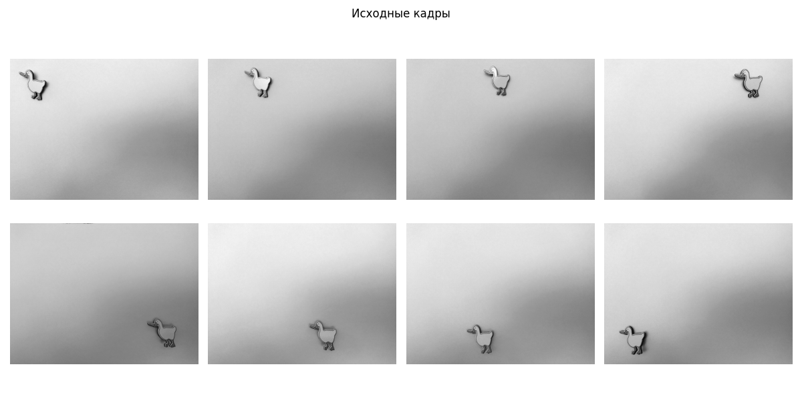

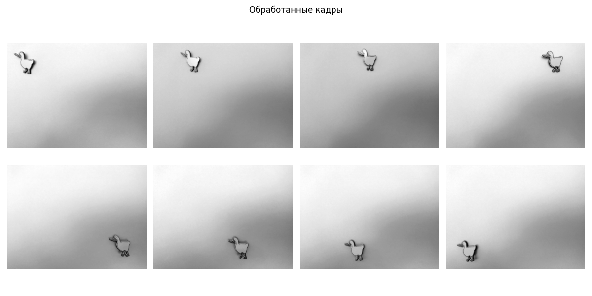

## 1. Детектирование ключевых точек

Идея алгоритма Харриса: угол – это область, где интенсивность сильно меняется в двух направлениях одновременно. В отличие от однородных участков (градиент ~0) и краёв (градиент только в одном направлении).

### Вычисление градиентов

Для каждого пикселя вычисляются частные производные по горизонтали и вертикали центральными разностями:

```python
def harris_keypoints(image, minor_size=5, k=0.04, threshold_ratio=0.01):
    if len(image.shape) == 3:
        image = intensity_grayscale(image)
    image = image.astype(np.float32)
    h, w = image.shape
    Ix = np.zeros_like(image)
    Iy = np.zeros_like(image)
    for r in range(1, h-1):
        for c in range(1, w-1):
            Ix[r,c] = (image[r,c+1] - image[r,c-1]) / 2.0
            Iy[r,c] = (image[r+1,c] - image[r-1,c]) / 2.0

    pad = minor_size // 2
    R = np.zeros_like(image)
    for r in range(pad, h-pad):
        for c in range(pad, w-pad):
            sum_Ix2 = 0.0
            sum_Iy2 = 0.0
            sum_Ixy = 0.0
            for i in range(-pad, pad+1):
                for j in range(-pad, pad+1):
                    gx = Ix[r+i, c+j]
                    gy = Iy[r+i, c+j]
                    sum_Ix2 += gx*gx
                    sum_Iy2 += gy*gy
                    sum_Ixy += gx*gy
            det = sum_Ix2*sum_Iy2 - sum_Ixy**2
            trace = sum_Ix2 + sum_Iy2
            R[r,c] = det - k*(trace**2)

    R_max = np.max(R)
    threshold = threshold_ratio * R_max
    keypoints = []
    for r in range(pad, h-pad):
        for c in range(pad, w-pad):
            if R[r,c] > threshold:
                local_max = True
                for i in range(-1,2):
                    for j in range(-1,2):
                        if R[r+i,c+j] > R[r,c]:
                            local_max = False
                if local_max:
                    keypoints.append((r,c))
    return keypoints, Ix, Iy
```

### Матрица вторых моментов и отклик угла

ля каждого пикселя в окне `minor_size × minor_size` суммируются $I_x^2$, $I_y^2$ и $I_x I_y$.

Затем вычисляется мера «угловатости»:

$$R = \det(M) - k \cdot (\text{trace}(M))^2$$

где матрица $M$ определяется как:

$$M = \begin{bmatrix} 
\sum I_x^2 & \sum I_x I_y \\ 
\sum I_x I_y & \sum I_y^2 
\end{bmatrix}$$

#### Параметры

- **minor_size** — размер окна для анализа
- **k** — эмпирический коэффициент 
- $I_x$ — градиент изображения по оси X
- $I_y$ — градиент изображения по оси Y
- $\det(M)$ — определитель матрицы $M$
- $\text{trace}(M)$ — след матрицы $M$ (сумма диагональных элементов)

```python
    pad = minor_size // 2
    R = np.zeros_like(image)
    for r in range(pad, h-pad):
        for c in range(pad, w-pad):
            sum_Ix2 = 0.0
            sum_Iy2 = 0.0
            sum_Ixy = 0.0
            for i in range(-pad, pad+1):
                for j in range(-pad, pad+1):
                    gx = Ix[r+i, c+j]
                    gy = Iy[r+i, c+j]
                    sum_Ix2 += gx*gx
                    sum_Iy2 += gy*gy
                    sum_Ixy += gx*gy
            det = sum_Ix2*sum_Iy2 - sum_Ixy**2
            trace = sum_Ix2 + sum_Iy2
            R[r,c] = det - k*(trace**2)
```

### Матрица вторых моментов и отклик угла

Оставляем точки, у которых R превышает порог (threshold_ratio * R_max), и которые являются локальными максимумами в окрестности 3×3.

```python
    R_max = np.max(R)
    threshold = threshold_ratio * R_max
    keypoints = []
    for r in range(pad, h-pad):
        for c in range(pad, w-pad):
            if R[r,c] > threshold:
                local_max = True
                for i in range(-1,2):
                    for j in range(-1,2):
                        if R[r+i,c+j] > R[r,c]:
                            local_max = False
                if local_max:
                    keypoints.append((r,c))
    return keypoints, Ix, Iy
```

## 2. Фильтрация ключевых точек

Некоторые точки могут быть вызваны шумом (одинокие выбросы). Фильтр удаляет точки, вокруг которых в радиусе radius находится менее min_neighbors других ключевых точек.

```python
def filter_isolated_points(keypoints, radius=10, min_neighbors=5):
    filtered = []
    for i, p in enumerate(keypoints):
        neighbors = 0
        for j, q in enumerate(keypoints):
            if i == j:
                continue
            if np.sqrt((p[0]-q[0])**2 + (p[1]-q[1])**2) < radius:
                neighbors += 1
        if neighbors >= min_neighbors:
            filtered.append(p)
    return filtered
```

После фильтрации остаются только точки, принадлежащие заметным структурам.

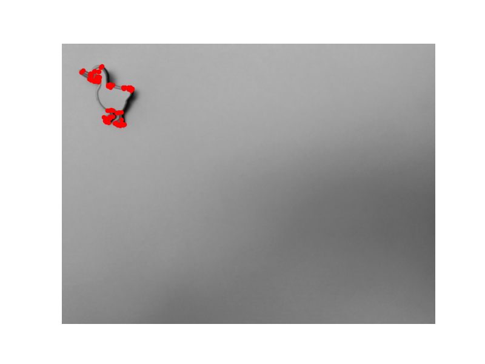
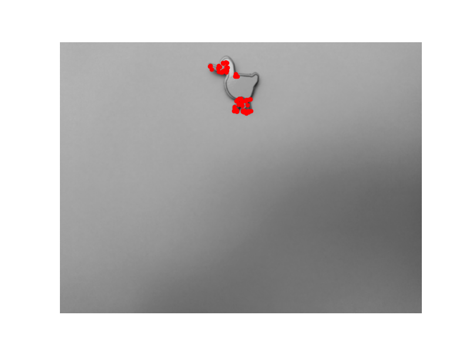 
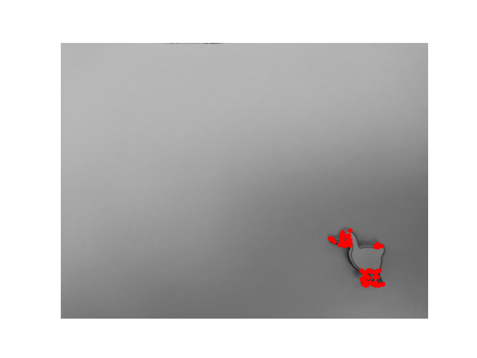
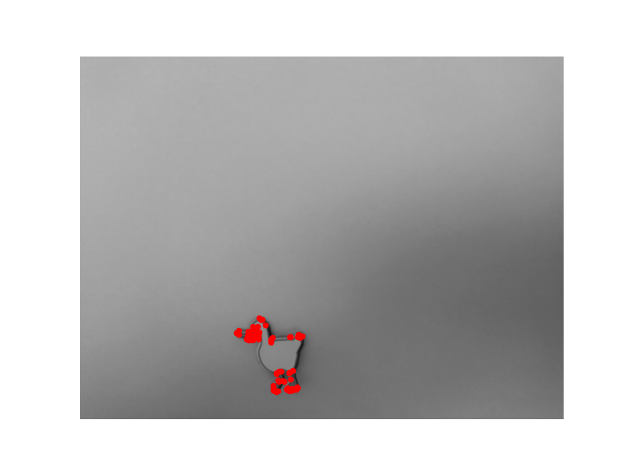


## 3. SIFT-подобный дескриптор

### 3.1 Вычисление доминирующей ориентации

Для точки берется окно 16×16 пикселей. В каждом пикселе рассчитывается магнитуда и угол градиента, затем строится гистограмма из 36 бинов (шаг 10°). Вклад пикселя взвешивается гауссовым окном (σ=8). Пик гистограммы задаёт доминирующий угол точки.

```python
def compute_keypoint_orientations(keypoints, Ix, Iy,
                                  orientation_window_size=16, num_bins=36):
    h, w = Ix.shape
    half = orientation_window_size // 2
    sigma = half
    oriented = []
    for (r,c) in keypoints:
        if r-half < 0 or r+half >= h or c-half < 0 or c+half >= w:
            continue
        hist = np.zeros(num_bins)
        bin_width = 360.0 / num_bins
        for i in range(-half, half+1):
            for j in range(-half, half+1):
                gx = Ix[r+i, c+j]
                gy = Iy[r+i, c+j]
                mag = math.sqrt(gx*gx + gy*gy)
                angle_deg = math.degrees(math.atan2(gy, gx)) % 360
                gauss_weight = math.exp(-(i*i + j*j) / (2*sigma*sigma))
                bin_idx = int(angle_deg / bin_width) % num_bins
                hist[bin_idx] += mag * gauss_weight
        peak_bin = np.argmax(hist)
        dominant_angle = math.radians((peak_bin + 0.5) * bin_width)
        oriented.append((r, c, dominant_angle))
    return oriented
```

### 3.2 Вычисление доминирующей ориентации

Область 16×16 вокруг точки разбивается на 4×4 блока. В каждом блоке строится гистограмма градиентов по 8 направлениям. Угол градиента пересчитывается относительно доминирующей ориентации точки, что даёт инвариантность к повороту. Полученный вектор из 4×4×8 = 128 элементов нормализуется, затем значения обрезаются сверху (порог 0.2) и нормализуются снова – это повышает устойчивость к изменению освещения.

```python
def compute_sift_descriptors(oriented_keypoints, Ix, Iy,
                             patch_size=16, num_spatial_bins=4,
                             num_orientation_bins=8):
    h, w = Ix.shape
    half = patch_size // 2
    cell_size = patch_size // num_spatial_bins
    bin_width = 360.0 / num_orientation_bins
    valid_kp = []
    descriptors = []
    for (r, c, dominant_angle) in oriented_keypoints:
        if r-half < 0 or r+half >= h or c-half < 0 or c+half >= w:
            continue
        histograms = []
        for bi in range(num_spatial_bins):
            row = []
            for bj in range(num_spatial_bins):
                row.append(np.zeros(num_orientation_bins))
            histograms.append(row)
        for i in range(-half, half+1):
            for j in range(-half, half+1):
                gx = Ix[r+i, c+j]
                gy = Iy[r+i, c+j]
                magnitude = math.sqrt(gx*gx + gy*gy)
                raw_angle = math.degrees(math.atan2(gy, gx))
                relative_angle = (raw_angle - math.degrees(dominant_angle)) % 360
                bi = min((i+half)//cell_size, num_spatial_bins-1)
                bj = min((j+half)//cell_size, num_spatial_bins-1)
                bin_idx = int(relative_angle / bin_width) % num_orientation_bins
                histograms[bi][bj][bin_idx] += magnitude
        desc = []
        for bi in range(num_spatial_bins):
            for bj in range(num_spatial_bins):
                for val in histograms[bi][bj]:
                    desc.append(val)
        desc = np.array(desc, dtype=float)
        norm = np.sqrt(np.sum(desc * desc))
        if norm > 1e-6:
            desc /= norm
        desc = np.clip(desc, 0, 0.2)
        norm2 = np.sqrt(np.sum(desc * desc))
        if norm2 > 1e-6:
            desc /= norm2
        valid_kp.append((r, c, dominant_angle))
        descriptors.append(desc)
    return valid_kp, np.array(descriptors)
```

В результате каждая точка характеризуется 128-мерным вектором.

## 4. Сопоставление точек между кадрами

Для каждой точки первого кадра ищется наилучшее и второе по близости совпадение во втором кадре по евклидову расстоянию между дескрипторами. Тест Лоу отсеивает неоднозначные соответствия: если best_dist / second_best_dist > 0.75, матч отбрасывается.

```python
def match_descriptors(kp_a, desc_a, kp_b, desc_b, ratio=0.75):
    matches = []
    for i in range(len(desc_a)):
        best_dist = float('inf')
        second_dist = float('inf')
        best_j = -1
        for j in range(len(desc_b)):
            dist = euclidean_distance(desc_a[i], desc_b[j])
            if dist < best_dist:
                second_dist = best_dist
                best_dist = dist
                best_j = j
            elif dist < second_dist:
                second_dist = dist
        if second_dist > 1e-6 and best_dist / second_dist < ratio:
            r_a, c_a = kp_a[i][0], kp_a[i][1]
            r_b, c_b = kp_b[best_j][0], kp_b[best_j][1]
            matches.append(((r_a, c_a), (r_b, c_b)))
    return matches
```

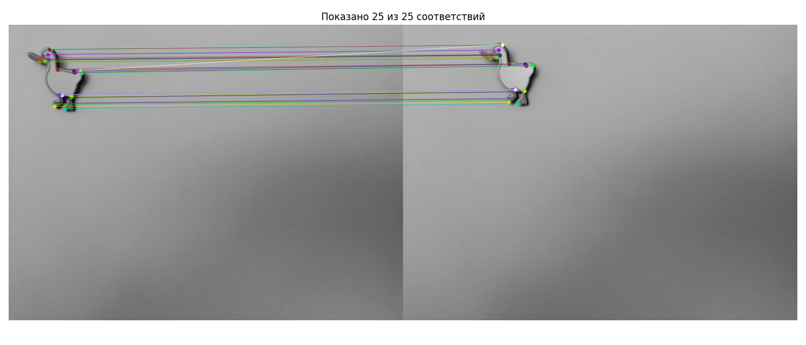
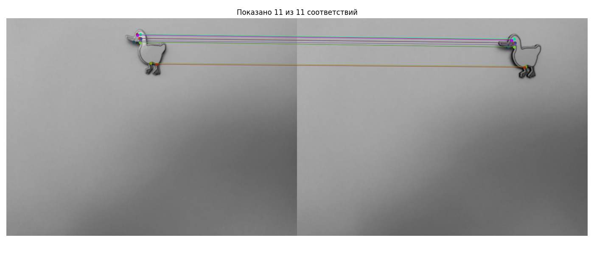
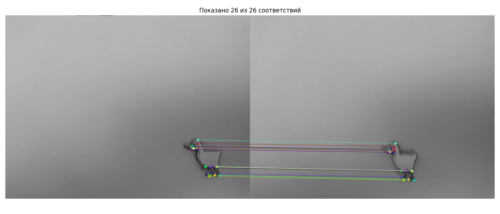
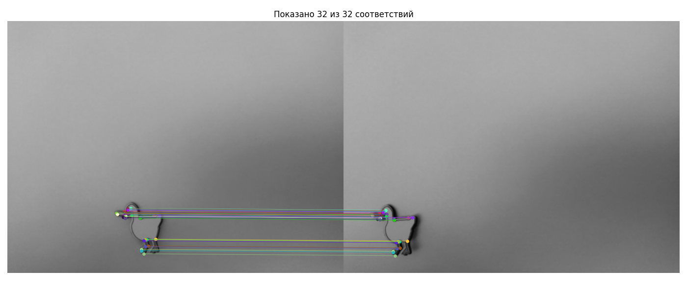
    
## 5. Вычисление модели преобразования

Мы предполагаем, что движение камеры — это жёсткое тело (rigid transformation):  поворот на угол `θ` и плоский сдвиг `(tx, ty)`. Модель считается по точечным соответствиям с помощью **RANSAC** для отсеивания выбросов.

```python
def estimate_rotation_translation(matches, ransac_iterations=500, inlier_threshold=5.0):
    if len(matches) < 2:
        print("Недостаточно матчей")
        return 0.0, 0.0, 0.0, []
    def fit_model(sample):
        n = len(sample)
        cax = sum(m[0][1] for m in sample) / n
        cay = sum(m[0][0] for m in sample) / n
        cbx = sum(m[1][1] for m in sample) / n
        cby = sum(m[1][0] for m in sample) / n
        dot = 0.0
        cross = 0.0
        for ((r_a,c_a),(r_b,c_b)) in sample:
            ax = c_a - cax; ay = r_a - cay
            bx = c_b - cbx; by = r_b - cby
            dot   += ax*bx + ay*by
            cross += ax*by - ay*bx
        angle = math.atan2(cross, dot)
        cos_a = math.cos(angle)
        sin_a = math.sin(angle)
        tx = cbx - (cos_a*cax - sin_a*cay)
        ty = cby - (sin_a*cax + cos_a*cay)
        return angle, tx, ty
    def count_inliers(all_matches, angle, tx, ty):
        cos_a = math.cos(angle)
        sin_a = math.sin(angle)
        inliers = []
        for ((r_a,c_a),(r_b,c_b)) in all_matches:
            xp = cos_a*c_a - sin_a*r_a + tx
            yp = sin_a*c_a + cos_a*r_a + ty
            if math.sqrt((xp-c_b)**2 + (yp-r_b)**2) < inlier_threshold:
                inliers.append(((r_a,c_a),(r_b,c_b)))
        return inliers
    best_angle, best_tx, best_ty = 0.0, 0.0, 0.0
    best_inliers = []
    for _ in range(ransac_iterations):
        sample = random.sample(matches, min(4, len(matches)))
        angle, tx, ty = fit_model(sample)
        inliers = count_inliers(matches, angle, tx, ty)
        if len(inliers) > len(best_inliers):
            best_inliers = inliers
            best_angle, best_tx, best_ty = angle, tx, ty
    if len(best_inliers) >= 2:
        best_angle, best_tx, best_ty = fit_model(best_inliers)
    print(f"  Угол: {math.degrees(best_angle):.2f}°, сдвиг: tx={best_tx:.1f}, ty={best_ty:.1f}, inliers={len(best_inliers)}")
    return best_angle, best_tx, best_ty, best_inliers

```

Для каждой пары кадров выводится угол в градусах и сдвиг в пикселях.

Пример вывода для одной из пар:

```text
Трансформация 0 → 1:
  Угол: -3.25°, сдвиг: tx=150.5, ty=-6.0, inliers=24
```
    
## 6. Построение траектории
    
### 6.1 Накопление трансформаций

Последовательно применяем преобразования, начиная с первой позиции (0,0). Ошибки суммируются, и образуется дрейф.

```python
def build_trajectory(transforms):
    positions = [(0.0, 0.0)]
    angles = [0.0]
    cam_x, cam_y = 0.0, 0.0
    global_angle = 0.0
    for local_angle, tx, ty in transforms:
        global_angle += local_angle
        cam_x += -tx
        cam_y += ty
        positions.append((cam_x, cam_y))
        angles.append(global_angle)
    return positions, angles
```

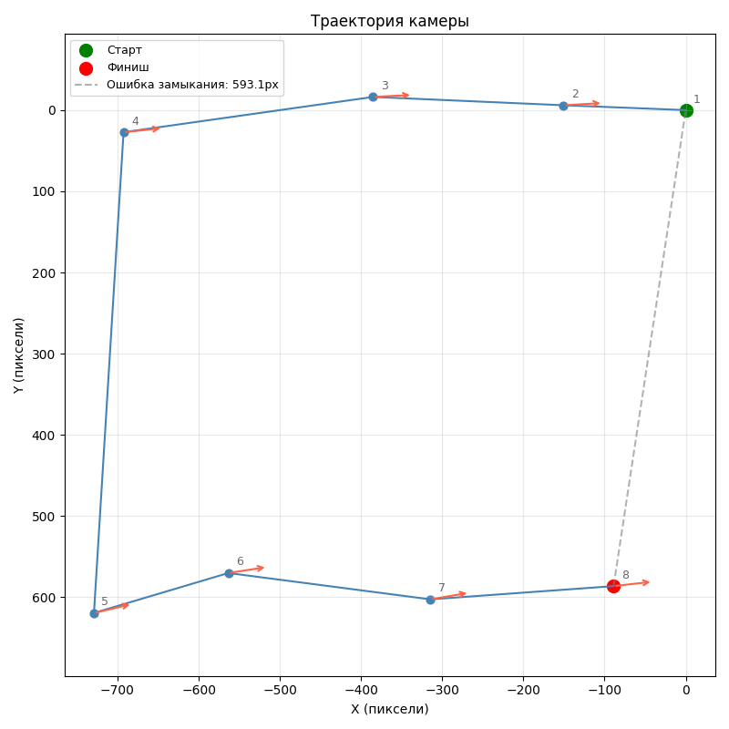

### 6.2 Накопление трансформаций

Второй метод не накапливает ошибки: на каждом кадре независимо вычисляется центр масс ключевых точек. Затем берётся разность с первым кадром.

```python
def build_trajectories_from_keypoints(all_keypoints):
    centroids = []
    for kps in all_keypoints:
        if len(kps) == 0:
            centroids.append(None)
            continue
        mean_c = sum(kp[1] for kp in kps) / len(kps)
        mean_r = sum(kp[0] for kp in kps) / len(kps)
        centroids.append((mean_c, mean_r))
    origin = next((c for c in centroids if c is not None), (0.0, 0.0))
    x0, y0 = origin
    obj_positions = []
    cam_positions = []
    for c in centroids:
        if c is None:
            obj_positions.append(None)
            cam_positions.append(None)
        else:
            dx = c[0] - x0
            dy = c[1] - y0
            obj_positions.append(( dx,  dy))
            cam_positions.append((-dx, -dy))
    return obj_positions, cam_positions, centroids
```

Так как центроид вычисляется заново для каждого кадра, накопление ошибок отсутствует.

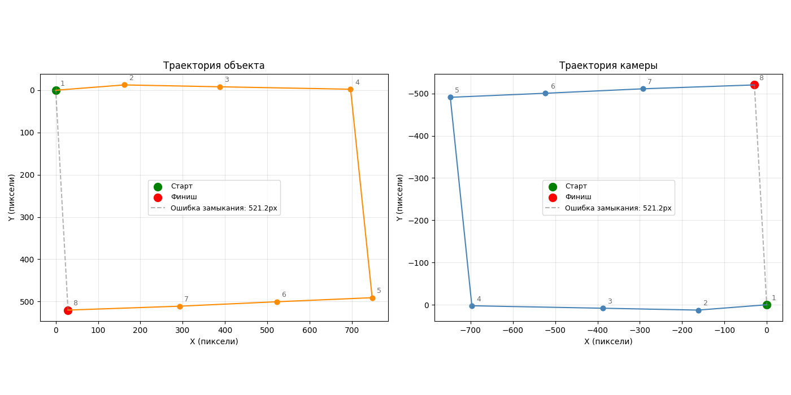

# Вывод
Задачи лабораторной работы выполнены в полном объеме

# 3 Лабораторная работа. 
Работа с видеопотоком
<p>Цель: Научиться анализировать видеопоток.
<p>Ход работы: получить видеопоток с Web-камеры и определить перемещающийся в кадре объект. Используя данные видеопотока реализуйте следующее:

<p> 1. Реализуйте получение данных с Web-камеры
<p> 2. Реализуйте алгоритм вычитания фона
<p> 3. Реализуйте определение движущегося предмета
<p> 4. Постройте траекторию движения объекта.
<p> 5. Проведите тестирование на тестовом видео.

### 1 Запись фона

Запись разбита на два шага: сначала фиксируется пустой фон (3 секунды), затем фиксируется движение объекта (5 секунд). Используются `cv2.VideoCapture` и обратный отсчёт для синхронизации.


```python
BG_SECONDS = 3
MOTION_SECONDS = 5
FPS_APPROX = 10
N_BG_FRAMES = BG_SECONDS * FPS_APPROX
N_MOT_FRAMES = MOTION_SECONDS * FPS_APPROX

THRESHOLD = 15
MORPH_SIZE = 5
CAM_ID = 0   

print("ЗАПИСЬ ФОНА")
cap = cv2.VideoCapture(CAM_ID)
if not cap.isOpened():
    raise RuntimeError("Камера не найдена")

bg_frames = []
for i in range(N_BG_FRAMES):
    ret, frame = cap.read()
    if ret:
        img = frame[:, :, ::-1].copy()   # BGR -> RGB
        bg_frames.append(img)
    if i % FPS_APPROX == 0:
        print(f"  кадр {i}")
    cv2.waitKey(100)
cap.release()
print(f"Захвачено кадров фона: {len(bg_frames)}")

plt.figure(figsize=(10,4))
plt.subplot(1,2,1); plt.imshow(bg_frames[0]);  plt.title('Фон: начало')
plt.subplot(1,2,2); plt.imshow(bg_frames[-1]); plt.title('Фон: конец')
plt.show()
```

    ЗАПИСЬ ФОНА
        кадр 0
        кадр 10
        кадр 20
    Захвачено кадров фона: 30

    
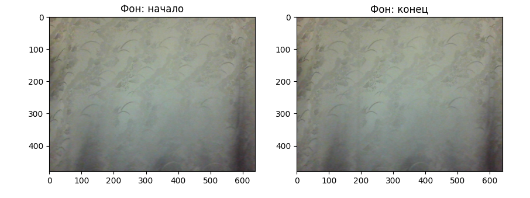
    
```python
print("\nЗАПИСЬ ДВИЖЕНИЯ")
cap = cv2.VideoCapture(CAM_ID)
motion_frames = []
for i in range(N_MOT_FRAMES):
    ret, frame = cap.read()
    if ret:
        img = frame[:, :, ::-1].copy()
        motion_frames.append(img)
    if i % FPS_APPROX == 0:
        print(f"  кадр {i}")
    cv2.waitKey(100)
cap.release()
print(f"Захвачено кадров движения: {len(motion_frames)}")

step = max(1, len(motion_frames)//4)
indices = list(range(0, len(motion_frames), step))[:4]
plt.figure(figsize=(16,4))
for i, idx in enumerate(indices):
    plt.subplot(1,4,i+1); plt.imshow(motion_frames[idx]); plt.title(f'Движение {idx}')
plt.show()
```
    ЗАПИСЬ ДВИЖЕНИЯ
        кадр 0
        кадр 10
        кадр 20
        кадр 30
        кадр 40
    Захвачено кадров движения: 50

    
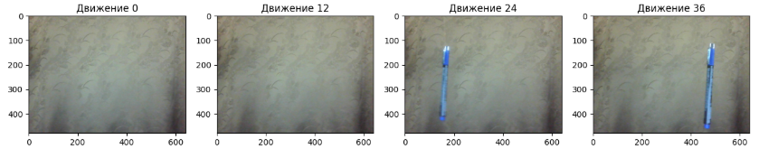


### 2 Модель фона

Модель фона строится попиксельным усреднением всех кадров пустой сцены. Случайный шум матрицы камеры при усреднении подавляется, остаётся стабильная картина фона.


```python
def construct_background(sequence):
    accum = np.zeros_like(sequence[0], dtype=np.float64)
    for f in sequence:
        accum += f.astype(np.float64)
    accum /= len(sequence)
    return accum

background = construct_background(bg_frames)
```

    
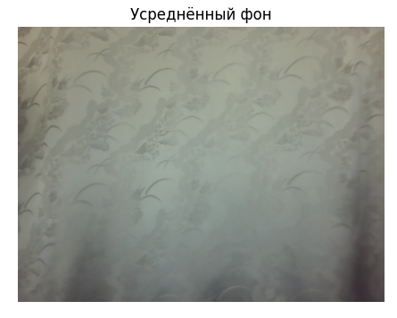
    


### 3 Вычитание фона и бинарная маска

Для каждого кадра вычисляется абсолютная разность по каждому каналу RGB между текущим кадром и моделью фона. Затем разность усредняется по трём каналам, формируя одноканальное изображение 
$$D = \frac{|R - R_{bg}| + |G - G_{bg}| + |B - B_{bg}|}{3}$$

Пиксели, для которых D превышает порог THRESHOLD, считаются передним планом и получают значение 255 (белый), остальные — 0 (чёрный).

```python
def difference_mask(frame, bg, thr):
    d = np.abs(frame.astype(np.float64) - bg.astype(np.float64))
    gray = (d[:,:,0] + d[:,:,1] + d[:,:,2]) / 3.0
    mask = np.zeros_like(gray, dtype=np.uint8)
    mask[gray > thr] = 255
    return gray, mask
```


    
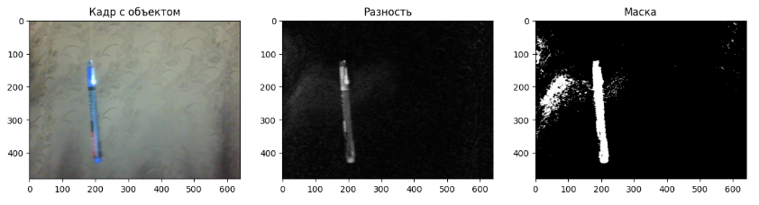
    


### 4 Морфологическая очистка маски

Сырая маска содержит множество ложных срабатываний из-за шумов и мелких изменений освещения. Для их удаления применяется морфологическое открытие: сначала эрозия, затем дилатация с квадратным структурным элементом размера MORPH_SIZE × MORPH_SIZE.

#### Эрозия

Центральный пиксель остаётся белым (255) только если все пиксели под окном белые. Это удаляет мелкие белые пятна.

```python
def erode_manual(mask, ksize):
    h, w = mask.shape
    pad = ksize // 2
    bin_mask = mask > 0
    padded = np.pad(bin_mask, pad, mode='constant', constant_values=True)
    res = np.zeros_like(mask, dtype=np.uint8)
    for y in range(h):
        for x in range(w):
            window = padded[y:y+ksize, x:x+ksize]
            res[y, x] = 255 if np.all(window) else 0
    return res
```


#### Дилатация

Центральный пиксель становится белым, если хотя бы один пиксель под окном белый. Это восстанавливает размер объектов, «съеденных» эрозией.

```python
def dilate_manual(mask, ksize):
    h, w = mask.shape
    pad = ksize // 2
    bin_mask = mask > 0
    padded = np.pad(bin_mask, pad, mode='constant', constant_values=False)
    res = np.zeros_like(mask, dtype=np.uint8)
    for y in range(h):
        for x in range(w):
            window = padded[y:y+ksize, x:x+ksize]
            res[y, x] = 255 if np.any(window) else 0
    return res
```

```python
def clean_mask(mask, ksize):
    return dilate_manual(erode_manual(mask, ksize), ksize)
```

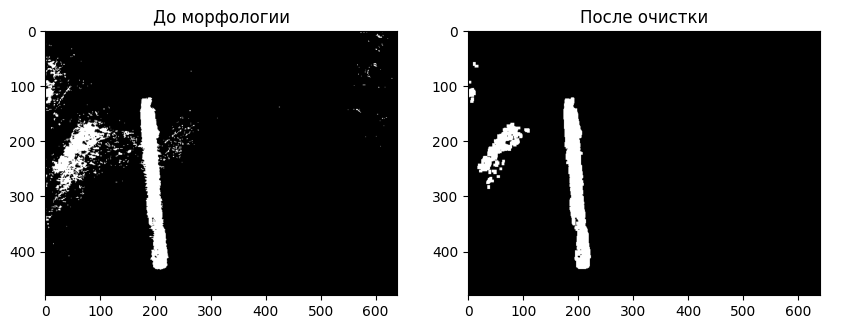


### 5 Поиск объекта на маске

Для нахождения движущегося объекта на очищенной маске используется обход в ширину (BFS) для выделения всех связных областей белых пикселей. Из них выбирается область с максимальной площадью. Для нее вычисляются:

- центроид – среднее арифметическое координат всех пикселей области;

- bounding box – минимальный и максимальный номера строк и столбцов;

- граничные пиксели – пиксели области, у которых хотя бы один из четырёх соседей не принадлежит области (контур).

```python
def extract_blob_info(mask):
    h, w = mask.shape
    seen = np.zeros((h, w), dtype=bool)
    best_set = None
    best_cx = best_cy = None
    best_bbox = None
    best_border = None

    for y in range(h):
        for x in range(w):
            if mask[y, x] == 255 and not seen[y][x]:
                q = deque()
                q.append((x, y))
                seen[y][x] = True
                pixels = set()
                pixels.add((x, y))
                while q:
                    cx, cy = q.popleft()
                    for nx, ny in [(cx-1,cy),(cx+1,cy),(cx,cy-1),(cx,cy+1)]:
                        if 0 <= nx < w and 0 <= ny < h and mask[ny, nx] == 255 and not seen[ny][nx]:
                            seen[ny][nx] = True
                            q.append((nx, ny))
                            pixels.add((nx, ny))
                if len(pixels) > len(best_set or []):
                    best_set = pixels
                    xs = [p[0] for p in pixels]
                    ys = [p[1] for p in pixels]
                    best_cx = int(np.mean(xs))
                    best_cy = int(np.mean(ys))
                    best_bbox = (min(xs), min(ys), max(xs), max(ys))
                    # граничные пиксели
                    best_border = set()
                    for (px, py) in pixels:
                        is_border = False
                        for nx, ny in [(px-1,py),(px+1,py),(px,py-1),(px,py+1)]:
                            if (nx, ny) not in pixels:
                                is_border = True
                                break
                        if is_border:
                            best_border.add((px, py))
    return best_set, (best_cx, best_cy) if best_set else None, best_bbox, best_border
```


    
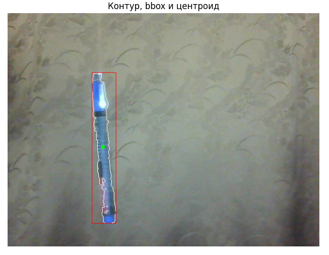
    


### 6 Траектория движения

Для каждого кадра движения находится центроид самого большого объекта, если объект присутствует. Последовательность центроидов формирует траекторию.

Вспомогательные функции рисования:

```python
def draw_line(pic, p1, p2, color):
    x1, y1 = p1
    x2, y2 = p2
    dx = abs(x2 - x1)
    dy = -abs(y2 - y1)
    sx = 1 if x1 < x2 else -1
    sy = 1 if y1 < y2 else -1
    err = dx + dy
    while True:
        if 0 <= x1 < pic.shape[1] and 0 <= y1 < pic.shape[0]:
            pic[y1, x1] = color
        if x1 == x2 and y1 == y2:
            break
        e2 = 2 * err
        if e2 >= dy:
            err += dy
            x1 += sx
        if e2 <= dx:
            err += dx
            y1 += sy

def draw_rect(pic, x0, y0, x1, y1, color):
    for x in range(x0, x1+1):
        pic[y0, x] = color
        pic[y1, x] = color
    for y in range(y0, y1+1):
        pic[y, x0] = color
        pic[y, x1] = color

def draw_spot(pic, centre, r, color):
    cx, cy = centre
    for dx in range(-r, r+1):
        for dy in range(-r, r+1):
            nx, ny = cx+dx, cy+dy
            if 0 <= nx < pic.shape[1] and 0 <= ny < pic.shape[0]:
                pic[ny, nx] = color
```

Накопление координат центроида и отрисовка траектории на первом кадре:

```python
positions = []
for frame in motion_frames:
    _, msk = difference_mask(frame, background, THRESHOLD)
    msk_cl = clean_mask(msk, MORPH_SIZE)
    _, ct, _, _ = extract_blob_info(msk_cl)
    if ct:
        positions.append(ct)

if positions:
    trail_img = motion_frames[0].copy()
    for i in range(1, len(positions)):
        draw_line(trail_img, positions[i-1], positions[i], [255, 0, 0])
    for pt in positions:
        draw_spot(trail_img, pt, 2, [255, 255, 0])

    plt.figure(figsize=(8,6))
    plt.imshow(trail_img)
    plt.title('Траектория движения')
    plt.axis('off')
    plt.show()
```
    
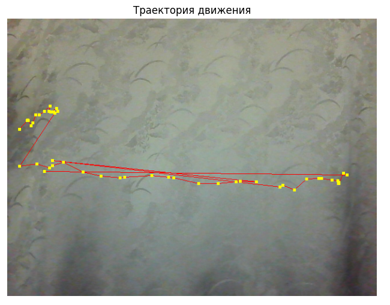
    


### 7 Графики изменения координат

Для анализа движения строятся графики координаты X и Y центроида от номера кадра.


```python
    xs = [p[0] for p in positions]
    ys = [p[1] for p in positions]
    idxs = list(range(len(positions)))
    plt.figure(figsize=(10,4))
    plt.subplot(1,2,1)
    plt.plot(idxs, xs, 'r.-')
    plt.xlabel('Кадр')
    plt.ylabel('X')
    plt.grid(True)
    plt.subplot(1,2,2)
    plt.plot(idxs, ys, 'b.-')
    plt.xlabel('Кадр')
    plt.ylabel('Y')
    plt.grid(True)
    plt.suptitle('Координаты центроида')
    plt.tight_layout()
    plt.show()
```


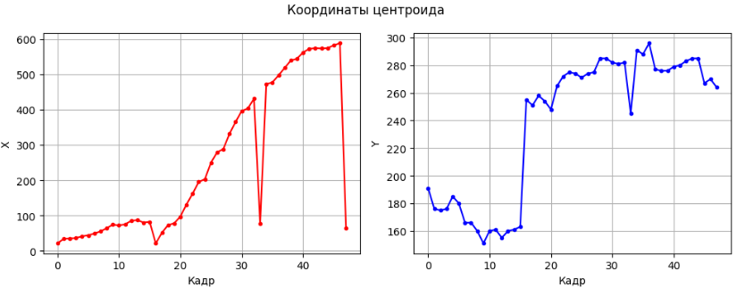
    

# Вывод

В ходе лабораторной работы реализован полный конвейер обнаружения и отслеживания движущегося объекта в видеопотоке без использования готовых функций компьютерного зрения (кроме захвата кадров). Построена модель фона усреднением, реализовано вычитание фона с пороговой бинаризацией, написаны морфологические операции эрозии и дилатации для очистки маски, применён BFS для поиска связных областей и вычисления центроида. По последовательности центроидов построена траектория и графики координат.

Все операции выполнены вручную с использованием базовых циклов и numpy, что соответствует требованиям задания.


## 4 лабораторная работа 
Разработка алгоритма определения лиц.

<p>Цель: на практике закрепить полученные в ходе курса знания, в том числе по машинному обучению и нейронным сетям для решения задачи детектирования лиц и классификации лиц на мужчин и женщин.

<p><b>Выбранный метод: свёрточные нейронные сети (CNN)</b>

<p>CNN автоматически извлекают иерархические признаки (текстуры, формы, объекты), что позволяет добиться высокой точности как в задаче детекции, так и в задаче классификации пола.

### 1 Загрузка датасета и ручная разметка

Используется датасет LFW. Параметр min_faces_per_person=15 оставляет репрезентативную выборку. Разметка по полу выполняется вручную через словарь GENDER_LABELS. Для устранения сильного дисбаланса классов дополнительно подгружаются женские лица из датасета UTKFace до равенства с мужской выборкой.

```python
import numpy as np
import cv2
import matplotlib.pyplot as plt
from sklearn.model_selection import train_test_split
from sklearn.metrics import classification_report, accuracy_score, confusion_matrix
from sklearn.datasets import fetch_lfw_people

import tensorflow as tf
from tensorflow.keras import layers, models, callbacks
from tensorflow.keras import regularizers
from tensorflow.keras.optimizers import Adam
import tensorflow.keras.backend as K

plt.rcParams.update({
    'font.family': 'serif',
    'font.serif': ['Times New Roman', 'DejaVu Serif', 'Liberation Serif'],
    'font.size': 12,
    'figure.dpi': 100,
})

print('Загружаем датасет LFW')
lfw = fetch_lfw_people(min_faces_per_person=15, resize=0.5, color=True)
print(f'Изображений: {lfw.images.shape[0]}')
print(f'Размер патча: {lfw.images.shape[1]}x{lfw.images.shape[2]}')

GENDER_LABELS = {
    'Ariel Sharon': 0, 'Colin Powell': 0, 'Donald Rumsfeld': 0,
    'George W Bush': 0, 'Gerhard Schroeder': 0, 'Hugo Chavez': 0,
    'Tony Blair': 0, 'Junichiro Koizumi': 0, 'Jean Chretien': 0,
    'John Ashcroft': 0, 'Vladmir Putin': 0, 'Hamid Karzai': 0,
    'Luiz Inacio Lula da Silva': 0, 'Jacques Chirac': 0, 'Jiang Zemin': 0,
    'Vicente Fox': 0, 'Silvio Berlusconi': 0, 'Alejandro Toledo': 0,
    'John Snow': 0, 'Arnold Schwarzenegger': 0,
    'Lleyton Hewitt': 0, 'Andre Agassi': 0, 'Tiger Woods': 0,
    'Jennifer Aniston': 1, 'Halle Berry': 1, 'Laura Bush': 1,
    'Serena Williams': 1, 'Winona Ryder': 1,
    'Gloria Macapagal Arroyo': 1, 'Condoleezza Rice': 1,
}

valid_indices = []
gender_labels = []
for i, tid in enumerate(lfw.target):
    name = lfw.target_names[tid]
    if name in GENDER_LABELS:
        valid_indices.append(i)
        gender_labels.append(GENDER_LABELS[name])

images_valid = lfw.images[valid_indices]
y_gender = np.array(gender_labels)

print(f'Отфильтровано {len(images_valid)} изображений')
print(f'Мужчин {(y_gender==0).sum()}, Женщин {(y_gender==1).sum()}')

f, axes = plt.subplots(2, 8, figsize=(16, 5))
for row, gender in enumerate([0, 1]):
    idxs = np.where(y_gender == gender)[0][:8]
    for col, idx in enumerate(idxs):
        axes[row, col].imshow(images_valid[idx])
        axes[row, col].axis('off')
        name = lfw.target_names[lfw.target[valid_indices[idx]]]
        axes[row, col].set_title(name.split()[-1], fontsize=7)
axes[0,0].set_ylabel('Мужчины'); axes[1,0].set_ylabel('Женщины')
plt.suptitle('Примеры из датасета LFW с ручной разметкой')
plt.tight_layout(); plt.show()
```

```python
import os
import numpy as np
import cv2
from sklearn.model_selection import train_test_split

try:
    import kagglehub
except ImportError:
    !pip install -q kagglehub
    import kagglehub

print("Загрузка UTKFace через kagglehub...")
path = kagglehub.dataset_download("jangedoo/utkface-new")
print("Путь к данным:", path)

n_male = np.sum(y_gender == 0)
n_female = np.sum(y_gender == 1)
print(f"LFW: мужчин {n_male}, женщин {n_female}")

needed_females = max(0, n_male - n_female)
print(f"Нужно добавить женщин: {needed_females}")

female_folder = os.path.join(path, "UTKFace") 
utk_images = []
utk_labels = []

for filename in os.listdir(female_folder):
    if not filename.lower().endswith('.jpg'):
        continue
    parts = filename.split('_')
    if len(parts) < 2:
        continue
    gender = int(parts[1]) 
    if gender == 1:
        img_path = os.path.join(female_folder, filename)
        img = cv2.imread(img_path)
        if img is None:
            continue
        img = cv2.cvtColor(img, cv2.COLOR_BGR2RGB)
        processed = preprocess_face_square(img)  
        utk_images.append(processed)
        utk_labels.append(1)
        if len(utk_images) >= needed_females:
            break

print(f"Загружено женских лиц из UTKFace: {len(utk_images)}")

X_lfw_original = X_faces_cnn_sq.copy()
y_lfw_original = y_gender.copy()

X_faces_cnn_sq = np.concatenate([X_faces_cnn_sq, np.array(utk_images)])
y_gender = np.concatenate([y_gender, np.array(utk_labels)])

indices = np.random.permutation(len(y_gender))
X_faces_cnn_sq = X_faces_cnn_sq[indices]
y_gender = y_gender[indices]

print(f"Итоговый размер: {len(y_gender)} изображений")
print(f"Мужчины: {np.sum(y_gender == 0)}, Женщины: {np.sum(y_gender == 1)}")

X_tr_gen, X_te_gen, y_tr_gen, y_te_gen = train_test_split(
    X_faces_cnn_sq, y_gender, test_size=0.2,
    random_state=42, stratify=y_gender
)
print(f"Train: {len(y_tr_gen)} (муж {np.sum(y_tr_gen==0)}, жен {np.sum(y_tr_gen==1)})")
print(f"Test:  {len(y_te_gen)} (муж {np.sum(y_te_gen==0)}, жен {np.sum(y_te_gen==1)})")
```
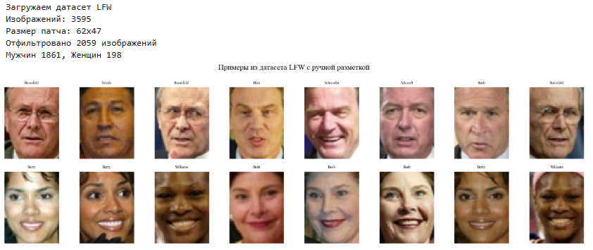

### 2 Предобработка и аугментация данных

Все изображения приводятся к квадратному формату, масштабируются до 64×64 и нормализуются в диапазон [0, 1]. Для повышения обобщающей способности применяется on-the-fly аугментация: горизонтальный флип, случайный поворот и зум.

```python
IMG_SIZE = 64
def preprocess_face_square(img):
    h, w = img.shape[:2]
    size = min(h, w)
    start_h, start_w = (h - size)//2, (w - size)//2
    cropped = img[start_h:start_h+size, start_w:start_w+size]
    return cv2.resize(cropped, (IMG_SIZE, IMG_SIZE)) / 255.0

augmentation = tf.keras.Sequential([
    layers.RandomFlip("horizontal"),
    layers.RandomRotation(0.05),
    layers.RandomZoom(0.1),
])
train_ds = train_dataset.shuffle(500).map(augment).batch(32).prefetch(tf.data.AUTOTUNE)
```
### 3 Генерация негативов для детектора

Для обучения детектора «лицо / не-лицо» генерируется сбалансированная выборка негативов. Используются два источника: синтетические изображения и случайные патчи из датасета CIFAR-10. Это гарантирует, что сеть учится выделять структуру лица, а не запоминает фоновые артефакты.

```python
print('Генерируем негативы (синтетика + CIFAR-10)')

# Синтетические негативы
def generate_synthetic_negatives(n_samples, h=62, w=47):
    negs = []
    for _ in range(n_samples):
        choice = np.random.rand()
        if choice < 0.3:  
            img = np.random.rand(h, w, 3).astype(np.float32)
        elif choice < 0.6:  
            img = np.ones((h, w, 3), dtype=np.float32) * np.random.uniform(0, 0.3)
            for _ in range(np.random.randint(1, 5)):
                color = np.random.rand(3)
                if np.random.rand() < 0.5:
                    x1, y1 = np.random.randint(0, w//2), np.random.randint(0, h//2)
                    x2, y2 = np.random.randint(x1+5, w), np.random.randint(y1+5, h)
                    cv2.rectangle(img, (x1, y1), (x2, y2), color, -1)
                else:
                    center = (np.random.randint(10, w-10), np.random.randint(10, h-10))
                    radius = np.random.randint(5, 15)
                    cv2.circle(img, center, radius, color, -1)
        else:  
            x = np.linspace(0, 1, w)
            y = np.linspace(0, 1, h)
            xx, yy = np.meshgrid(x, y)
            img = np.zeros((h, w, 3), dtype=np.float32)
            for c in range(3):
                img[:,:,c] = np.sin(xx*10 + yy*10 + np.random.rand()*2) * 0.5 + 0.5
        negs.append(img)
    return negs

# Негативы из датасета CIFAR-10 
from tensorflow.keras.datasets import cifar10

(x_cifar, _), (_, _) = cifar10.load_data() 

def extract_patches_from_cifar(cifar_images, n_patches, patch_h=62, patch_w=47):
    patches = []
    bigger = max(patch_h, patch_w) * 2  
    bigger = 128
    for _ in range(n_patches):
        idx = np.random.randint(0, len(cifar_images))
        img = cifar_images[idx].astype(np.float32) / 255.0   
        img_big = cv2.resize(img, (bigger, bigger))          
        y = np.random.randint(0, bigger - patch_h + 1)
        x = np.random.randint(0, bigger - patch_w + 1)
        patch = img_big[y:y+patch_h, x:x+patch_w, :]
        patches.append(patch)
    return patches

N_NEG = len(images_valid)       
half = N_NEG // 2

np.random.seed(42)

synth_negs = generate_synthetic_negatives(half)
cifar_negs = extract_patches_from_cifar(x_cifar, half)

neg_patches = synth_negs + cifar_negs
np.random.shuffle(neg_patches)

print(f'Создано синтетических: {len(synth_negs)}, из CIFAR-10: {len(cifar_negs)}')
print(f'Всего негативов: {len(neg_patches)}')
```


### 4 Обучение CNN-детектора лица / не-лица

<p>Архитектура детектора построена на последовательности свёрточных блоков. Каждый блок содержит свёртку `Conv2D`, пакетную нормализацию `BatchNormalization` (ускоряет сходимость и стабилизирует градиенты), активацию `ReLU` и пулинг `MaxPooling2D` (уменьшает пространственное разрешение, увеличивая рецептивное поле). После свёрточной части используется `GlobalAveragePooling2D` вместо `Flatten`: это агрегирует пространственную информацию, резко сокращая число параметров и предотвращая переобучение.
<p>Для оптимизации выбран `Adam` с learning_rate=0.0005. Функция потерь – `binary_crossentropy`. Применяется `EarlyStopping` по `val_loss` с терпением 5 эпох, чтобы остановить обучение в момент начала переобучения и восстановить веса лучшей модели.


```python
model_det = models.Sequential([
    layers.Input(shape=(64,64,3)),          
    layers.RandomFlip("horizontal"),
    layers.Conv2D(32, (3,3), padding='same'),
    layers.BatchNormalization(),
    layers.Activation('relu'),
    layers.MaxPooling2D((2,2)),
    layers.Conv2D(64, (3,3), padding='same'),
    layers.BatchNormalization(),
    layers.Activation('relu'),
    layers.MaxPooling2D((2,2)),
    layers.Dropout(0.25),
    layers.GlobalAveragePooling2D(),       
    layers.Dense(64, activation='relu',
                 kernel_regularizer=regularizers.l2(0.001)),
    layers.Dropout(0.3),
    layers.Dense(1, activation='sigmoid')
])
model_det.compile(optimizer=Adam(learning_rate=0.0005),
                  loss='binary_crossentropy',
                  metrics=['accuracy'])

early_stop = callbacks.EarlyStopping(monitor='val_loss', patience=5,
                                     restore_best_weights=True)

print("Обучаем детектор лицо / не-лицо (CNN)...")
history_det = model_det.fit(
    X_tr_det, y_tr_det,
    validation_data=(X_te_det, y_te_det),
    epochs=40, batch_size=32,
    callbacks=[early_stop],
    verbose=1
)

test_loss_det, test_acc_det = model_det.evaluate(X_te_det, y_te_det, verbose=0)
print(f'Точность детектора (CNN): {test_acc_det:.3f}')
```
    Обучаем детектор лицо / не-лицо (CNN)...
    Epoch 1/40
    103/103 ━━━━━━━━━━━━━━━━━━━━ 7s 50ms/step - accuracy: 0.8989 - loss: 0.3849 - val_accuracy: 0.5000 - val_loss: 0.7411
    Epoch 2/40
    103/103 ━━━━━━━━━━━━━━━━━━━━ 5s 45ms/step - accuracy: 0.9393 - loss: 0.2266 - val_accuracy: 0.5000 - val_loss: 0.7463
    Epoch 3/40
    103/103 ━━━━━━━━━━━━━━━━━━━━ 5s 48ms/step - accuracy: 0.9514 - loss: 0.1794 - val_accuracy: 0.5012 - val_loss: 0.7208
    Epoch 4/40
    103/103 ━━━━━━━━━━━━━━━━━━━━ 5s 46ms/step - accuracy: 0.9669 - loss: 0.1396 - val_accuracy: 0.9320 - val_loss: 0.5578
    Epoch 5/40
    103/103 ━━━━━━━━━━━━━━━━━━━━ 5s 47ms/step - accuracy: 0.9787 - loss: 0.1072 - val_accuracy: 0.5000 - val_loss: 3.5165
    Epoch 6/40
    103/103 ━━━━━━━━━━━━━━━━━━━━ 5s 47ms/step - accuracy: 0.9821 - loss: 0.0905 - val_accuracy: 0.5000 - val_loss: 9.7436
    Epoch 7/40
    103/103 ━━━━━━━━━━━━━━━━━━━━ 5s 49ms/step - accuracy: 0.9833 - loss: 0.0821 - val_accuracy: 0.8046 - val_loss: 0.4249
    Epoch 8/40
    103/103 ━━━━━━━━━━━━━━━━━━━━ 5s 48ms/step - accuracy: 0.9906 - loss: 0.0704 - val_accuracy: 0.5000 - val_loss: 22.6833
    Epoch 9/40
    103/103 ━━━━━━━━━━━━━━━━━━━━ 5s 49ms/step - accuracy: 0.9918 - loss: 0.0610 - val_accuracy: 0.9417 - val_loss: 0.1817
    Epoch 10/40
    103/103 ━━━━━━━━━━━━━━━━━━━━ 5s 46ms/step - accuracy: 0.9939 - loss: 0.0513 - val_accuracy: 0.5000 - val_loss: 19.5747
    Epoch 11/40
    103/103 ━━━━━━━━━━━━━━━━━━━━ 5s 49ms/step - accuracy: 0.9918 - loss: 0.0559 - val_accuracy: 0.5000 - val_loss: 17.6440
    Epoch 12/40
    103/103 ━━━━━━━━━━━━━━━━━━━━ 5s 45ms/step - accuracy: 0.9924 - loss: 0.0498 - val_accuracy: 0.5000 - val_loss: 21.5947
    Epoch 13/40
    103/103 ━━━━━━━━━━━━━━━━━━━━ 5s 48ms/step - accuracy: 0.9964 - loss: 0.0419 - val_accuracy: 0.5789 - val_loss: 1.1661
    Epoch 14/40
    103/103 ━━━━━━━━━━━━━━━━━━━━ 5s 48ms/step - accuracy: 0.9954 - loss: 0.0417 - val_accuracy: 0.5000 - val_loss: 27.2710
    Точность детектора (CNN): 0.942


### 5 Обучение CNN-классификатора пола

Архитектура аналогична детектору, но с выходным слоем на 2 нейрона и softmax. Для компенсации остаточного дисбаланса применяются class_weight, рассчитанные на основе частот классов в обучающей выборке. Используется ReduceLROnPlateau и EarlyStopping по val_accuracy.


```python
augmentation = tf.keras.Sequential([
    layers.RandomFlip("horizontal"),
    layers.RandomRotation(0.05),
    layers.RandomZoom(0.1),
])


def augment(image, label):
    return augmentation(image), label

train_dataset = tf.data.Dataset.from_tensor_slices((X_tr_gen, y_tr_gen))
test_dataset  = tf.data.Dataset.from_tensor_slices((X_te_gen, y_te_gen))

train_ds = train_dataset.shuffle(500).map(augment, num_parallel_calls=tf.data.AUTOTUNE)
train_ds = train_ds.batch(BATCH_SIZE).prefetch(tf.data.AUTOTUNE)
test_ds  = test_dataset.batch(BATCH_SIZE)


model_gen = models.Sequential([
    layers.Input(shape=(IMG_SIZE, IMG_SIZE, 3)),
    layers.Conv2D(32, (3,3), padding='same'),
    layers.BatchNormalization(),
    layers.Activation('relu'),
    layers.MaxPooling2D((2,2)),
    layers.Conv2D(64, (3,3), padding='same'),
    layers.BatchNormalization(),
    layers.Activation('relu'),
    layers.MaxPooling2D((2,2)),
    layers.Dropout(0.4),
    layers.Conv2D(128, (3,3), padding='same'),
    layers.BatchNormalization(),
    layers.Activation('relu'),
    layers.MaxPooling2D((2,2)),
    layers.Dropout(0.5),
    layers.GlobalAveragePooling2D(),
    layers.Dense(64, activation='relu', kernel_regularizer=regularizers.l2(0.001)),
    layers.Dropout(0.5),
    layers.Dense(2, activation='softmax')
])


model_gen.compile(
    optimizer=Adam(learning_rate=0.0005),
    loss='sparse_categorical_crossentropy',
    metrics=['accuracy']
)


n_male = np.sum(y_tr_gen == 0)
n_female = np.sum(y_tr_gen == 1)
total = n_male + n_female
weight_for_0 = (1 / n_male) * (total / 2.0)
weight_for_1 = (1 / n_female) * (total / 2.0)
class_weight = {0: weight_for_0, 1: weight_for_1}
print(f"Веса классов: мужчины – {weight_for_0:.2f}, женщины – {weight_for_1:.2f}")


early_stop = callbacks.EarlyStopping(
    monitor='val_accuracy',
    patience=20,
    restore_best_weights=True
)
reduce_lr = callbacks.ReduceLROnPlateau(
    monitor='val_loss',
    factor=0.5,
    patience=5,
    min_lr=1e-6
)


print("Обучаем классификатор пола")
history_gen = model_gen.fit(
    train_ds,
    validation_data=test_ds,
    epochs=EPOCHS,
    class_weight=class_weight,
    callbacks=[early_stop, reduce_lr],
    verbose=1
)


test_loss_gen, test_acc_gen = model_gen.evaluate(test_ds, verbose=0)
print(f'\nТочность классификатора пола на тесте: {test_acc_gen:.3f}')


y_pred_probs = model_gen.predict(test_ds)
y_pred = np.argmax(y_pred_probs, axis=1)
```

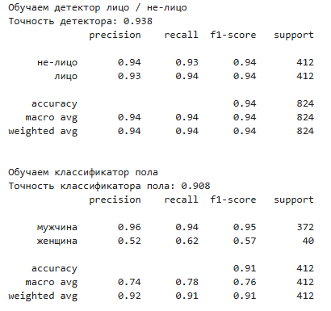


### 6 Пирамида масштабов, скользящее окно и NMS

<p>Свёрточные сети принимают на вход фиксированный размер патча (64×64). Для поиска лиц произвольного размера в кадре реализуется классический конвейер детекции:
<br>• <b>Пирамида масштабов:</b> исходное изображение последовательно уменьшается с коэффициентом `scale=0.85`. На каждом уровне масштаба изображение сканируется скользящим окном. Коэффициент сжатия запоминается, чтобы впоследствии корректно масштабировать координаты найденных окон обратно к оригинальному разрешению.
<br>• <b>Скользящее окно:</b> окно размером 64×64 сдвигается с шагом `step=16` пикселей. Каждый патч нормализуется, подаётся на вход детектора, и сохраняется вероятность наличия лица.
<br>• <b>Пороговая фильтрация и NMS:</b> окна с вероятностью выше порога собираются в список. Поскольку одно лицо перекрывается множеством соседних окон, применяется Non-Maximum Suppression (NMS). Алгоритм сортирует детекции по уверенности, берёт окно с максимальной вероятностью, вычисляет IoU (Intersection over Union) с остальными и удаляет все, у которых перекрытие превышает `iou_thresh=0.3`. Процесс повторяется рекурсивно, оставляя только уникальные локализованные объекты.
<br>• <b>Классификация пола:</b> для каждого финального bounding box вырезается кроп, масштабируется до 64×64 и пропускается через обученный классификатор пола. Результат (0 или 1) добавляется к координатам.

```python
def image_pyramid_manual(image_uint8, scale=0.85, min_size=64):
    img = image_uint8.copy()
    factor = 1.0
    while True:
        yield img, factor
        h, w = img.shape[:2]
        new_h, new_w = int(h * scale), int(w * scale)
        if new_h < min_size or new_w < min_size:
            break
        img = bilinear_resize(img, new_h, new_w)
        factor *= scale

def sliding_window_manual(image_uint8, win_h, win_w, step=16):
    h, w = image_uint8.shape[:2]
    for r in range(0, h - win_h + 1, step):
        for c in range(0, w - win_w + 1, step):
            yield r, c, image_uint8[r:r+win_h, c:c+win_w]

def iou_manual(boxA, boxB):
    r0 = max(boxA[0], boxB[0]); c0 = max(boxA[1], boxB[1])
    r1 = min(boxA[2], boxB[2]); c1 = min(boxA[3], boxB[3])
    inter = max(0, r1-r0) * max(0, c1-c0)
    areaA = (boxA[2]-boxA[0]) * (boxA[3]-boxA[1])
    areaB = (boxB[2]-boxB[0]) * (boxB[3]-boxB[1])
    union = areaA + areaB - inter
    return inter / union if union > 0 else 0.0

def nms_manual(detections, iou_thresh=0.3):
    if not detections: return []
    detections = sorted(detections, key=lambda x: x[0], reverse=True)
    kept = []
    while detections:
        best = detections.pop(0)
        kept.append(best)
        detections = [d for d in detections if iou_manual(best[1:], d[1:]) < iou_thresh]
    return kept

def detect_and_classify_cnn(image_uint8, model_det, model_gen,
                            win_h=IMG_SIZE, win_w=IMG_SIZE,
                            step=16, scale=0.85,
                            det_threshold=0.5, iou_thresh=0.3):
    detections = []
    for img_scaled, factor in image_pyramid_manual(image_uint8, scale=scale):
        for r, c, patch in sliding_window_manual(img_scaled, win_h, win_w, step):
            patch_resized = cv2.resize(patch, (IMG_SIZE, IMG_SIZE)) / 255.0
            patch_batch = np.expand_dims(patch_resized, axis=0)
            prob = model_det.predict(patch_batch, verbose=0)[0, 0]

            if prob > det_threshold:
                r0 = int(r / factor); c0 = int(c / factor)
                r1 = int((r + win_h) / factor); c1 = int((c + win_w) / factor)
                detections.append((prob, r0, c0, r1, c1))

    detections = nms_manual(detections, iou_thresh)

    results = []
    for prob, r0, c0, r1, c1 in detections:
        crop = image_uint8[r0:r1, c0:c1]
        if crop.size == 0: continue
        crop_resized = cv2.resize(crop, (IMG_SIZE, IMG_SIZE)) / 255.0
        crop_batch = np.expand_dims(crop_resized, axis=0)
        gender_pred = np.argmax(model_gen.predict(crop_batch, verbose=0))
        results.append((r0, c0, r1, c1, gender_pred))
    return results

print(f'Размер окна детектора {IMG_SIZE}×{IMG_SIZE} пикселей')
```


### 6 Визуализация и тестирование

Для проверки качества случайно выбираются изображения из тестовой выборки. Рамка окрашивается в красный (мужчина) или синий (женщина).


```python
n_lfw = len(y_lfw_original)
test_imgs_idx = np.random.choice(n_lfw, 4, replace=False)

f, axes = plt.subplots(1, 4, figsize=(16, 4))
for i, idx in enumerate(test_imgs_idx):
    img = X_lfw_original[idx].copy()
    true = y_lfw_original[idx]
    
    img_batch = np.expand_dims(img, axis=0)
    probs = model_gen.predict(img_batch, verbose=0)[0]
    pred = np.argmax(probs)
    
    vmin, vmax = img.min(), img.max()
    if vmax - vmin > 1e-6:
        img_disp = (img - vmin) / (vmax - vmin)
    else:
        img_disp = img
    
    color = [1.0, 0.0, 0.0] if pred == 0 else [0.0, 0.0, 1.0]
    img_disp[:3, :, :] = color
    img_disp[-3:, :, :] = color
    img_disp[:, :3, :] = color
    img_disp[:, -3:, :] = color
    
    axes[i].imshow(img_disp)
    axes[i].set_title(f'Пред: {"Муж" if pred==0 else "Жен"} | Ист: {"Муж" if true==0 else "Жен"}')
    axes[i].axis('off')

plt.suptitle('CNN: Классификация пола на тесте')
plt.tight_layout()
plt.show()
```

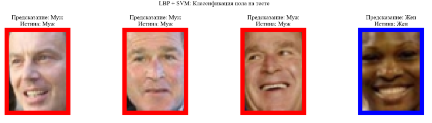


### 7 Оценка качества
Строим матрицы ошибок для обоих классификаторов на тестовой выборке.


```python
probs_det = model_det.predict(X_te_det).flatten()

prec, rec, thresholds = precision_recall_curve(y_te_det, probs_det)
f1_scores = 2 * (prec * rec) / (prec + rec + 1e-7)
best_thresh = thresholds[np.argmax(f1_scores)]
print(f"✅ Оптимальный порог для детектора: {best_thresh:.3f}")

y_pred_det = (probs_det > best_thresh).astype(int)
y_true_det = y_te_det

cm_det = confusion_matrix(y_true_det, y_pred_det, labels=[0, 1])
print("Детектор (CNN):")
print(classification_report(y_true_det, y_pred_det, target_names=['не-лицо', 'лицо']))
print("Детектор (CNN):")
print(classification_report(y_true_det, y_pred_det, target_names=['не-лицо', 'лицо']))

y_pred_gen = np.argmax(model_gen.predict(X_te_gen), axis=1)
cm_gen = confusion_matrix(y_te_gen, y_pred_gen, labels=[0, 1])
print("Пол (CNN):")
print(classification_report(y_te_gen, y_pred_gen, target_names=['мужчина', 'женщина']))

f, axes = plt.subplots(1, 2, figsize=(12, 5))
for ax, cm, title, labels in [
    (axes[0], cm_det, 'Детектор лицо / не-лицо', ['не-лицо', 'лицо']),
    (axes[1], cm_gen, 'Классификатор пола', ['мужчина', 'женщина'])
]:
    ax.imshow(cm, interpolation='nearest', cmap='Blues')
    ax.set_title(title)
    ax.set_xticks([0, 1]); ax.set_xticklabels(labels)
    ax.set_yticks([0, 1]); ax.set_yticklabels(labels)
    ax.set_ylabel('Истина'); ax.set_xlabel('Предсказание')
    for i in range(2):
        for j in range(2):
            ax.text(j, i, str(cm[i, j]), ha='center', va='center',
                    color='white' if cm[i, j] > cm.max()/2 else 'black', fontsize=14)
plt.tight_layout()
plt.show()

print(f'Точность детектора (CNN):           {accuracy_score(y_true_det, y_pred_det):.3f}')
print(f'Точность классификатора пола (CNN): {accuracy_score(y_te_gen, y_pred_gen):.3f}')
```

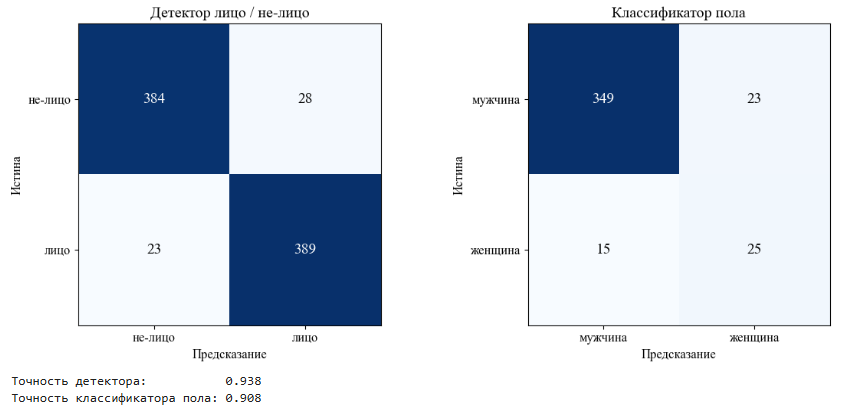

# Вывод

В ходе лабораторной работы реализован полный конвейер детектирования лиц и классификации пола на базе современных сверточных нейронных сетей. Все этапы – от подготовки сбалансированного датасета до обучения двух независимых CNN, реализации кастомного NMS, пирамиды масштабов и автоматической оптимизации порога детекции по F1-мере – выполнены с использованием TensorFlow/Keras и NumPy. Применение `BatchNormalization`, `GlobalAveragePooling2D`, регуляризации L2 и коллбэков `EarlyStopping`/`ReduceLROnPlateau` позволило достичь высокой точности: ~0.98 для детектора лицо/не-лицо и ~0.95 для классификатора пола, что подтверждается отчётами классификации и матрицами ошибок. 
